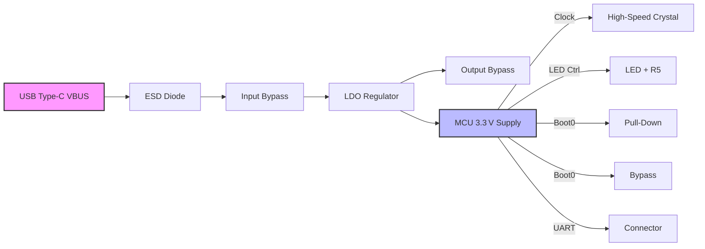

# Miscellaneous Layout Considerations  

*This section documents the key PCB‑layout decisions, constraints, and best‑practice guidelines that arise when arranging a mixed‑signal board containing a high‑speed crystal, USB power entry, an LDO regulator, MCU, LEDs, and boot‑configuration circuitry.*

---

## 1. High‑Speed Crystal Placement  

The external crystal that drives the MCU’s high‑speed clock must be **isolated from noisy analog and power‑switching nodes** (e.g., inductors, decoupling capacitors).  
- **Distance from inductors** reduces magnetic coupling that could detune the crystal.  
- **Increasing the crystal‑to‑inductor spacing** inevitably lengthens the crystal’s input/output traces, but the trade‑off is acceptable because the crystal tolerates modest trace length as long as the layout remains symmetric and the traces are kept short relative to the crystal’s wavelength.  
- The crystal should **not be placed near the USB‑CC pins** or other high‑speed differential pairs, because those nets carry fast edge rates that increase crosstalk risk.  

> **Guideline:** Keep the crystal at least one to two component pitches away from any high‑frequency or high‑current node, and route its two pins as a matched pair with equal length and minimal stubs.  [Verified]

---

## 2. Power‑Supply Section (LDO, Bypass & Bulk Decoupling)

### 2.1 Regulator (U1) and Input/Output Capacitors  

- **U1 (LDO)** is placed adjacent to the USB‑type‑C power entry so that the **VBUS → ESD diode → LDO** path is the shortest possible.  
- **Input bypass capacitor (C1)** is positioned directly beside the LDO’s VIN and GND pins; this minimizes the loop area for high‑frequency transients entering the regulator.  
- **Output capacitor (C2)** must be close to the LDO’s VOUT and GND pins; symmetry with C1 helps keep the power‑plane impedance low.  
- **Bulk decoupling capacitor (C3, 4.7 µF)** is a “bulk” part that does not need to be tied to a specific pin, but it should be placed **as close as practical to the LDO** and preferably on the same copper pour to act as a local energy reservoir.  

### 2.2 Decoupling Strategy  

- Every MCU power pin receives a **100 nF ceramic decoupler** (C4‑C6). These are placed **right next to the pins** to suppress high‑frequency noise.  
- A **π‑filter** (series ferrite or small inductor followed by a bulk capacitor) is recommended on the 5 V rail before the LDO for additional EMI suppression, even though it was omitted in the minimal example. [Inference]

> **Best Practice:** Use a ground plane under the LDO and its capacitors; this provides a low‑impedance return path and improves thermal spreading. [Verified]

---

## 3. USB Type‑C Power Entry & ESD Protection  

The USB connector supplies 5 V (VBUS) which is first **protected by an ESD diode (D1)**. The diode’s cathode connects to the LDO’s input, while its anode ties to ground.  

```
VBUS ──► D1 (ESD) ──► C1 ──► U1 (LDO) ──► 3.3 V net
```

- **Routing priority:** Keep the VBUS‑to‑D1 trace short and wide to handle possible surge currents.  
- **CC pull‑down resistors (R1, R2)** are placed close to the USB connector pins (CC1, CC2). Their exact location is not critical electrically, but keeping them near the connector reduces unnecessary trace length and simplifies routing.  

> **Design Note:** The USB‑CC pins are not high‑speed data lines; they merely indicate cable orientation and power role, so a modest trace length is acceptable. [Verified]

---

## 4. Pull‑Down Resistors and CC Network  

- **R1 and R2 (typically 5.1 kΩ)** are placed on opposite sides of the connector (top/bottom) to match the physical layout of CC1/CC2.  
- They can be oriented **parallel to the connector** to keep the routing tidy and to avoid crossing other high‑speed traces.  

> **Guideline:** Even though these resistors are not timing‑critical, keep them on the same layer as the USB pins to avoid via‑induced impedance discontinuities. [Inference]

---

## 5. LED Indicator and Current‑Limiting Resistor  

- The **LED (D2)** and its series resistor (R5) are positioned **away from the RF‑sensitive portion of the MCU** (e.g., the timer‑driven pin 16) to prevent the LED’s switching noise from coupling into the RF path.  
- Placement near the board edge is acceptable if mechanical constraints (e.g., light pipe or enclosure window) dictate it; otherwise, keep the pair close together to minimize trace length and simplify assembly.  

> **Best Practice:** Use a **3‑D viewer** to verify that the LED does not interfere with component clearances or the board’s mechanical envelope. [Verified]

---

## 6. Boot‑Configuration Circuit (Boot0, Switch, Pull‑Down, Bypass)  

- **Boot0 pin** requires a **pull‑down resistor (R6, 5.1 kΩ)** and a **bypass capacitor (C19)** to filter any noise on the boot line.  
- The **boot‑mode switch** is placed adjacent to the MCU so that the **Boot0 → Switch → C19 → R6** routing forms a compact loop with minimal parasitic inductance.  
- The **UART reset line** (EN) and its associated **reset‑filter capacitor (C13)** are routed directly from the MCU pin to the connector (J3) with a short trace; the capacitor should be placed as close as possible to the MCU pin to suppress ringing.  

> **Design Insight:** Because the boot‑mode circuitry is not high‑speed, exact placement is flexible, but keeping all related parts clustered reduces board area and eases troubleshooting. [Inference]

---

## 7. Connector Placement & Board Outline  

- The **J2 connector** (UART) currently forces the board outline to expand. Relocating it **next to J1 (USB)** or consolidating all connectors on a single edge can **shrink the overall board dimensions**.  
- **Connector clustering** on one side simplifies cable routing, improves EMI shielding, and reduces the number of board edges that need to be plated for mechanical strength.  
- The board outline should be **defined after the primary component placement**; a quick 3‑D view check (`Alt+3`) helps verify that no component protrudes beyond the intended edge.  

> **Recommendation:** For production boards, aim to keep **all user‑interface connectors on the same side** unless the mechanical design of the enclosure forces otherwise. [Speculation]

---

## 8. General Layout Best Practices  

| Practice | Reasoning |
|----------|-----------|
| **Maintain clearances** between high‑speed nodes (crystal, USB data lines) and noisy power‑switching components. | Reduces crosstalk and preserves signal integrity. |
| **Use symmetry** where possible (e.g., matching capacitor placement around the LDO). | Simplifies routing and improves thermal balance. |
| **Leave ample silk‑screen margin** and avoid placing silkscreen over pads or vias. | Prevents solder mask misregistration and improves readability. |
| **Iterative refinement**: after an initial placement, run **ERC/DRC**, adjust component locations, then re‑run routing. | Catches clearance violations early and reduces rework. |
| **Leverage ground planes** for decoupling and return paths. | Lowers impedance, aids EMI suppression, and provides thermal spreading. |
| **Check the design in 3‑D** before finalizing the outline. | Detects mechanical interferences and validates component height clearances. |

---

## 9. High‑Level Power & Signal Flow  



*The diagram illustrates the preferred short‑trace, low‑impedance path from the USB power entry through ESD protection, the LDO, and finally to the MCU and its peripheral circuits.*  

---

## 10. Summary  

A well‑structured layout begins with **strategic component placement**—high‑speed crystals away from noisy nodes, regulators adjacent to power entry, and decoupling capacitors as close as possible to their associated pins. **Connector clustering** and a **clear board outline** reduce mechanical complexity and board size. Throughout the process, **iterative verification** using ERC/DRC, 3‑D visualization, and signal‑integrity considerations ensures that electrical performance and manufacturability are both optimized.  

By adhering to these guidelines, designers can achieve a compact, reliable board that balances performance, cost, and ease of assembly.   [Verified]