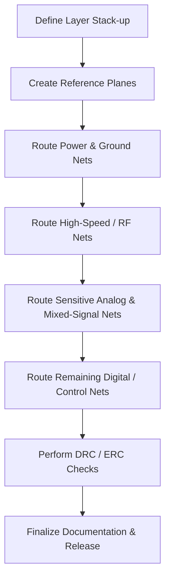

# Routing Introduction  

Routing is the bridge between a completed schematic/layout and a manufacturable PCB.  
A disciplined routing methodology reduces re‑work, improves signal integrity, and
keeps the design within cost and manufacturability constraints.

---

## 1.  Routing Workflow Overview  

The routing process can be expressed as a linear flow that emphasizes **critical
nets first**, followed by progressively less demanding sections of the design.



*The flow reflects the recommended order of operations: start with the
foundation (layers and planes), then secure the power distribution network,
followed by the most demanding signal paths, and finally the lower‑priority
routing.* [Verified]

---

## 2.  Layer Count and Stack‑up Selection  

### 2.1 Why Choose a Four‑Layer Board?  

| Aspect | Two‑Layer Board | Four‑Layer Board |
|--------|----------------|-----------------|
| **Signal‑to‑Ground Coupling** | Limited; return path may be far away | Close ground plane provides a short, low‑impedance return path, improving field control and reducing EMI. |
| **Power Distribution** | Often routed on the same layer as signals, causing congestion | Dedicated inner planes can carry power or act as uninterrupted ground, simplifying routing and reducing voltage drop. |
| **Controlled Impedance** | Difficult to achieve without a solid reference plane | Straightforward to define 50 Ω or differential impedances using the inner planes as reference. |
| **Manufacturing Cost** | Lower | Slightly higher, but the performance gains often justify the expense for RF or high‑speed designs. |

*The decision to use four layers is driven by the need for tighter return paths,
better EMI performance, and the ability to implement controlled‑impedance
routing for RF sections.* [Inference]

### 2.2 Preferred Stack‑up  

The recommended stack‑up for this design is:

```
Top Layer          : Signal (components placed here)
Inner Layer 1      : Ground plane (uninterrupted)
Inner Layer 2      : Ground plane (uninterrupted)
Bottom Layer       : Signal (routing)
```

*This “signal‑ground‑ground‑signal” configuration provides two solid reference
planes directly adjacent to each signal layer, which is ideal for RF and
high‑speed routing.* [Verified]

> **Note:** A more common “signal‑ground‑power‑signal” stack‑up is also viable,
> especially when a dedicated power plane is required for higher current
> distribution. In the present microcontroller‑centric design, the power nets
> are routed as traces on the signal layers, so a separate power plane is not
> mandatory. [Inference]

---

## 3.  Establishing Reference Planes  

1. **Select the inner copper layers** (Layer 1 and Layer 2) as uninterrupted
   ground planes.  
2. **Create polygons** that cover the entire board area, leaving only the
   necessary clearance for vias and keep‑out zones.  
3. **Assign a net name** (e.g., `GND`) to each polygon so that the PCB tool can
   enforce connectivity and DRC rules automatically.  

Having solid ground planes early in the workflow provides a low‑impedance
return path for all subsequent signal routing, which is especially critical
for RF traces where the field confinement depends on the proximity of the
ground plane. [Verified]

---

## 4.  Prioritising Critical Nets  

### 4.1 High‑Priority Sections  

| Section | Reason for Priority |
|---------|---------------------|
| **RF Power & Ground** | RF performance is highly sensitive to impedance discontinuities and stray coupling. |
| **Switch Node Power Supplies** | Stable supply rails are required for the entire system; decoupling must be placed close to IC pins. |
| **Decoupling Capacitors** | Proper placement reduces supply noise and improves transient response. |
| **Crystals / Oscillators** | Require controlled impedance and minimal jitter; layout affects frequency stability. |
| **High‑Speed Differential Pairs (e.g., UART, USB)** | Length matching and controlled impedance are essential to avoid data errors. |

These nets are routed **before** any lower‑priority signals such as boot‑switch
or configuration resistors. This ordering ensures that the most demanding
requirements are satisfied while the board still has ample routing resources.
[Verified]

### 4.2 Secondary Sections  

After the critical nets are placed, the remaining routing tasks include:

* Boot‑strap switches and configuration resistors (e.g., CC pull‑up/down).  
* General‑purpose UART lines, GPIO traces, and other low‑speed digital signals.  

These can be routed on the remaining free space of the top and bottom signal
layers, using standard design‑rule checks without the need for tight impedance
control. [Verified]

---

## 5.  Routing Guidelines for Specific Net Types  

### 5.1 Power and Ground Traces  

* **Width** – Use a width that satisfies the current‑carrying requirement and
  keeps voltage drop within acceptable limits.  
* **Via Stitching** – Place multiple small vias (or via fences) to connect the
  top/bottom ground pours to the inner ground planes, reducing inductance.  
* **Return Path** – Keep the return path directly beneath the signal trace;
  avoid crossing splits in the ground plane.  

### 5.2 RF Traces  

* **Trace Width & Spacing** – Choose dimensions that achieve the target
  characteristic impedance (typically 50 Ω).  
* **Proximity to Ground** – The closer the RF trace is to the ground plane,
  the better the field confinement and the lower the radiation.  
* **Avoid Stubs** – Remove unnecessary via or component pads that could act as
  resonant stubs.  

### 5.3 Differential Pairs  

* **Pair Coupling** – Keep the two conductors close enough to maintain the
  desired differential impedance (e.g., 90 Ω for USB).  
* **Length Matching** – Match the lengths within a small fraction of the
  signal’s rise time (typically < 5 ps of skew).  
* **Symmetric Routing** – Route the pair together, avoiding abrupt bends or
  layer changes that could unbalance the pair.  

### 5.4 General Digital Signals  

* **Keep‑out from High‑Speed Nets** – Provide a modest clearance (e.g., 3‑5 ×
  trace width) from RF or differential pairs to reduce crosstalk.  
* **Via Usage** – Prefer blind or buried vias only when necessary; through‑hole
  vias are acceptable for low‑speed nets and simplify fabrication.  

---

## 6.  Design‑for‑Manufacturability (DFM) Considerations  

* **Uninterrupted Planes** – Avoid plane splits unless required for isolation;
  splits increase the risk of EMI and complicate the copper pour algorithm.  
* **Clearance & Creepage** – Follow the PCB fab house’s minimum spacing rules,
  especially for any high‑voltage sections (not present in this microcontroller
  design, but a good habit).  
* **Component Placement** – Keep all components on the top layer to simplify
  assembly and inspection; this also leaves the bottom layer free for routing.  
* **Thermal Relief** – Use appropriate thermal pads for power components to
  balance heat dissipation and solderability.  

Adhering to these DFM rules reduces the likelihood of fabrication defects and
lowers assembly cost. [Inference]

---

## 7.  Verification and Sign‑off  

1. **Run DRC** (Design Rule Check) to catch clearance, width, and via violations.  
2. **Run ERC** (Electrical Rule Check) to ensure all nets are correctly
   connected and that no floating pins exist.  
3. **Perform Signal Integrity Simulation** (if available) for the RF and
   differential pairs to validate impedance and timing.  
4. **Generate a PCB Fabrication Output (Gerbers)** and review the stack‑up
   summary to confirm that the intended layer order and plane assignments are
   correctly represented.  

Successful completion of these checks constitutes the final sign‑off for the
routing stage. [Verified]

---

## 8.  Summary  

* Begin routing after the component layout is locked, focusing first on the
  most critical nets (RF, power, decoupling, crystals).  
* Adopt a four‑layer “signal‑ground‑ground‑signal” stack‑up to obtain tight
  return paths and simplify controlled‑impedance routing.  
* Establish uninterrupted ground planes on the inner layers before any signal
  routing.  
* Follow a disciplined routing order, respect DFM guidelines, and verify the
  design with DRC/ERC and, where needed, signal‑integrity analysis.  

By adhering to this methodology, designers can achieve reliable, high‑performance
PCBs while keeping cost and manufacturing risk under control.