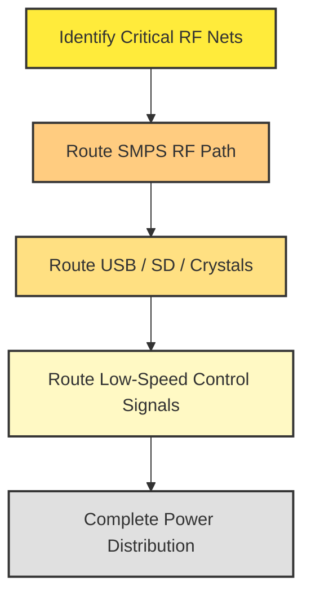

# 26 – RF Routing  

## Overview  

RF (radio‑frequency) and high‑speed signal routing demand the most stringent layout attention because any deviation from the intended geometry directly impacts impedance, return‑path integrity, and ultimately the performance of the power‑converter and communication interfaces. The recommended workflow is to **route the critical RF traces first**, then address lower‑speed signals, and finally complete the power distribution network. This ordering minimizes the need to re‑route already‑optimized high‑frequency paths and reduces the risk of creating unwanted stubs or length mismatches.  

> **Key principle:** *Treat RF routing as a constrained optimization problem – the solution is never “perfect” but can be made “good enough” by systematic prioritisation.* [Verified]

---

## 1. Prioritisation Strategy  

| Step | What to route | Rationale |
|------|---------------|-----------|
| **1️⃣** | Switch‑mode power‑supply (SMPS) RF path (top‑left) | Highest frequency, most sensitive to impedance discontinuities. |
| **2️⃣** | USB differential pair, SD‑card signals, crystal connections | Still high‑speed, but typically shorter and less demanding than the SMPS. |
| **3️⃣** | Low‑speed control pins (e.g., RESET, BOOT0) | Tolerant to longer routes and modest impedance variations. |
| **4️⃣** | Power rails (VCC, GND) | Can be routed after signal integrity is secured; use wider traces for current handling. |

The flowchart below visualises this decision process.  

---

## 2. Controlled‑Impedance Setup  

### 2.1 Determining the Target Width  

During board‑setup a **controlled‑impedance trace** was defined for the RF section with a width of **≈ 1.19 mm** (the exact value depends on the stack‑up and dielectric constant). This width yields the required characteristic impedance (typically 50 Ω for single‑ended RF lines).  

> The width is stored in the *pre‑defined sizes* list and can be reused via net classes. [Verified]

### 2.2 Net‑Class Configuration  

1. **Edit → Pre‑defined Sizes → Net Classes**.  
2. Create a class named *RF_Trace* and assign the 1.19 mm width.  
3. Apply the class to the relevant nets (SMPS output, filter input, UFL connector, etc.).  

When a trace is selected, the **track‑width indicator** in the lower‑left corner reflects the net‑class width, ensuring that the designer never unintentionally deviates from the impedance target.  

> Using net classes guarantees consistency across the entire RF network and simplifies later DRC checks. [Inference]

---

## 3. Layout Practices for the Pi‑Filter and RF Path  

### 3.1 Component Placement  

* **Pi‑filter (C15‑L3‑C16)** should be placed **as close as possible** to the SMPS output pin and the UFL connector.  
* The filter’s series inductor (L3) is the most critical element for impedance; keep the trace length **before and after** the inductor minimal and straight.  

> Short, straight sections minimise parasitic inductance and capacitance, preserving the designed filter response. [Verified]

### 3.2 Routing Geometry  

* **Horizontal routing** is preferred for the RF trace because it aligns with the board’s natural grid and reduces the number of bends.  
* When a vertical transition is unavoidable (e.g., to reach the connector), keep the vertical segment **as short as possible** and use a **90° bend with a generous radius** (or a 45° bend) to avoid impedance spikes.  

> Avoid “crude” routing that creates stubs (e.g., a trace that goes out and back in) because stubs act as resonant structures at RF frequencies. [Verified]

### 3.3 Stub Elimination  

A stub is any unused trace segment that terminates in an open circuit. In the RF domain, even a few millimetres of stub can introduce **reflection** and **standing‑wave** effects. The layout should therefore:

* **Terminate** every RF line at its intended load (filter, connector, or component pad).  
* **Remove** any excess copper that would otherwise form a dead‑end.  

> The practice of “no‑stub” routing is a cornerstone of high‑frequency PCB design. [Inference]

---

## 4. Transition from Large Pads to Thin RF Traces  

Large component pads (e.g., the SMPS output pad or the UFL connector’s ground pad) present a **wide, low‑impedance launch**. To preserve the controlled impedance:

1. **Taper** the trace width gradually from the pad size down to the 1.19 mm RF width.  
2. Use a **linear or exponential taper** over a length of at least **3–5 × the trace width** to avoid abrupt impedance steps.  

> Proper tapering reduces the risk of reflections at the pad‑to‑trace interface. [Inference]

---

## 5. Routing Order Summary  

Following this sequence ensures that the most sensitive paths are laid out on a clean canvas, free from the congestion that later‑stage routing can introduce.

---

## 6. Best‑Practice Checklist for RF Routing  

| ✅ | Practice |
|----|----------|
| **Impedance control** – Use the pre‑defined 1.19 mm width (or the width dictated by the stack‑up). |
| **Net‑class enforcement** – Assign all RF nets to the *RF_Trace* class. |
| **Horizontal dominance** – Keep the majority of the RF path horizontal; limit vertical hops. |
| **Minimal bends** – Use gentle 45° bends or mitered corners; avoid 90° right angles. |
| **Stub avoidance** – Ensure every trace ends at its intended load; delete unused copper. |
| **Component proximity** – Place the Pi‑filter directly adjacent to the SMPS output and connector. |
| **Pad‑to‑trace taper** – Implement a smooth width transition from large pads to the controlled‑impedance trace. |
| **DRC verification** – Run a final Design Rule Check with impedance and clearance rules enabled. |
| **Iterative review** – After routing lower‑speed signals, re‑inspect the RF path for accidental lengthening or added vias. |

Adhering to these guidelines yields a robust RF layout that meets both **signal‑integrity** and **manufacturability** requirements while keeping the design process efficient.  

---  

*Prepared by the PCB Design & Manufacturing Team – Chapter 26: RF Routing*