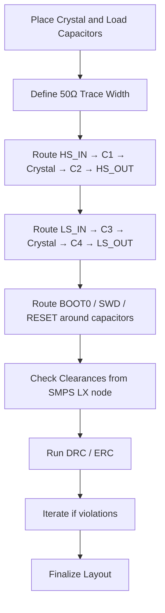

# 27 – Crystal Routing  

## 1. Overview  

The crystal oscillator is a critical timing source for most micro‑controller‑based designs. Its performance is highly dependent on the physical layout of the crystal, the load capacitors, and the associated MCU pins. This section consolidates the proven routing strategies, impedance considerations, and layout constraints required to achieve reliable oscillator operation while preserving signal integrity for surrounding high‑speed and power‑supply circuitry.  

---

## 2. Controlled‑Impedance Trace Selection  

| Parameter | Recommended Practice | Rationale |
|-----------|----------------------|-----------|
| Trace width | Use the same width that yields a 50 Ω single‑ended controlled‑impedance line (e.g., 0.19 mm in the reference stack‑up) for all crystal‑related signal traces. | A 50 Ω line provides a predictable impedance environment for the high‑speed (HS) crystal pins and simplifies DRC rule sets. It also allows reuse of the same width for other signal nets, reducing library complexity. [Verified] |
| Stack‑up | Maintain a solid reference plane directly beneath the crystal traces (typically the ground plane) to control the characteristic impedance and reduce EMI. | The proximity of the reference plane stabilizes the impedance and provides a low‑inductance return path. [Inference] |
| Length matching | For the HS crystal pair (HS_IN / HS_OUT) keep the trace lengths matched within a few mils; for LS pins the requirement is relaxed but still beneficial. | Mismatched lengths introduce phase error and can degrade oscillator start‑up. [Verified] |

---

## 3. Pad‑Exit Direction and Geometry  

1. **Avoid exiting the QFN pad on the wide side** – the preferred exit is on the narrow side of the pad, then routed vertically or horizontally. This reduces the effective pad capacitance seen by the crystal and eases routing around dense components. [Inference]  
2. **Maintain a consistent entry angle** – enter the crystal pad either vertically, horizontally, or at a 45° angle. Sharp, “triangular” angles should be avoided because they create impedance discontinuities and can concentrate electric fields, potentially exciting spurious modes. [Verified]  
3. **Keep a minimum clearance from high‑current structures** – the HS_IN/HS_OUT traces should stay to the right of the switching‑mode inductor (or any large power‑loop) to prevent coupling of magnetic noise into the crystal. A modest lateral offset (e.g., one trace width plus a design‑rule clearance) is sufficient. [Inference]  

---

## 4. Routing Topology  

### 4.1 High‑Speed (HS) Crystal Path  

```
HS_IN pad → 45°/vertical exit → 50 Ω trace → Load capacitor C1 → Crystal → Load capacitor C2 → HS_OUT pad
```

* The trace from the HS_IN pad to the first capacitor should be straight, with no unnecessary bends.  
* After the capacitor, the trace continues directly into the crystal pad, preserving the controlled impedance.  
* The return path follows the ground plane beneath the trace, completing a loop with minimal area.  

### 4.2 Low‑Speed (LS) Crystal Path  

```
LS_IN pad → short 45° exit → Load capacitor C3 → Crystal → Load capacitor C4 → LS_OUT pad
```

* For LS pins the same width and impedance rules apply, but the routing can be more flexible.  
* It is advantageous to rotate the load capacitors (90°) so that the LS trace can connect to the crystal without crossing other nets. This also frees space for the BOOT0, SWD, and RESET pins to be routed past the capacitors. [Inference]  

### 4.3 Interaction with Other Signals  

* **BOOT0, SWD, RESET** – By positioning the load capacitors on the outer side of the crystal, these control pins can be routed in the same layer without violating clearance rules.  
* **Switch‑Mode Power Supply (SMPS) node (LX)** – The switching node is a high‑frequency, high‑current point. All crystal‑related traces should be routed **as short as practicable** and kept **physically distant** from the LX node to minimize conducted and radiated interference. [Verified]  

---

## 5. Capacitor Placement and Rotation  

* **Proximity** – Load capacitors should be placed as close as possible to the crystal pins (typically within 0.5 mm) to reduce series inductance.  
* **Orientation** – Rotating the capacitors 90° can align their leads with the crystal trace direction, enabling a cleaner “straight‑through” routing path and avoiding a “U‑shaped” detour around the component. This also creates a more compact footprint, beneficial for high‑density QFN packages. [Inference]  

---

## 6. Avoiding Acute Angles and Maintaining Uniform Geometry  

* **Preferred angles** – 0°, 45°, and 90° are the only angles that should be used when changing direction.  
* **Prohibited structures** – Sharp “triangular” or “kinked” shapes that create abrupt width changes or acute angles should be eliminated. They act as impedance discontinuities and can cause signal reflections, especially for the HS crystal pair. [Verified]  

---

## 7. Design‑Rule‑Check (DRC) and Electrical‑Rule‑Check (ERC) Considerations  

| Rule | Typical Setting | Why it matters |
|------|-----------------|----------------|
| Minimum trace‑to‑trace clearance | ≥ 6 mil (or per fab spec) | Prevents shorts and maintains impedance control. |
| Minimum pad‑to‑trace clearance | ≥ 4 mil | Avoids accidental coupling to adjacent nets. |
| Minimum pad‑to‑high‑current node clearance | ≥ 2× trace width | Reduces EMI coupling from SMPS switching node. |
| Controlled‑impedance width/spacing | As defined by stack‑up calculator | Guarantees 50 Ω single‑ended lines. |
| Via size for crystal nets | ≤ 0.3 mm drill, plated | Keeps inductance low; avoid micro‑vias unless required. |

Running DRC/ERC after each major routing iteration catches violations early, reducing re‑work later in the layout cycle. [Verified]  

---

## 8. Recommended Layout Workflow  



*The flowchart illustrates the logical sequence from component placement through impedance‑controlled routing, clearance verification, and DRC/ERC validation.*  

---

## 9. Trade‑offs and Design Decisions  

| Decision | Benefit | Cost / Risk |
|----------|---------|-------------|
| Use 50 Ω single‑ended width for crystal traces | Simplifies impedance control; reusable for other signals | Slightly larger trace width may increase board area in dense designs. |
| Rotate load capacitors to align with trace direction | Cleaner routing, shorter trace lengths, easier placement of BOOT0/SWD | Requires careful footprint orientation; may affect component placement density. |
| Keep crystal traces away from SMPS LX node | Reduces EMI coupling, improves oscillator start‑up reliability | May force longer routing paths if the board is tightly packed. |
| Enforce 45°/90° routing angles only | Improves signal integrity, reduces reflections | May limit routing flexibility in congested regions. |

These trade‑offs are typical in mixed‑signal designs where timing accuracy and power‑noise immunity must coexist. [Inference]  

---

## 10. Summary of Best Practices  

1. **Select a 50 Ω controlled‑impedance trace width** for all crystal‑related nets.  
2. **Exit QFN pads on the narrow side** and use only 0°, 45°, or 90° bends.  
3. **Place load capacitors adjacent to the crystal** and rotate them to align with the trace flow.  
4. **Route HS and LS crystal pairs as straight as possible**, matching lengths for HS.  
5. **Maintain a clear separation from high‑current switching nodes** (LX) to limit noise coupling.  
6. **Run DRC/ERC after each routing stage** to catch clearance and impedance violations early.  
7. **Avoid acute angles and triangular structures**; prefer uniform geometry.  

Adhering to these guidelines yields a robust crystal implementation that meets timing specifications while coexisting harmoniously with high‑speed, RF, and power‑management subsystems.