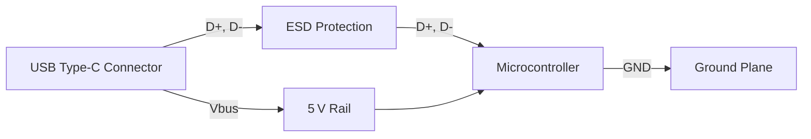

# 30 USB Routing  

*This section documents the practical PCB‑layout techniques used for routing a USB Full‑Speed (12 Mbps) interface on a mixed‑signal board. It covers net‑class configuration, differential‑pair routing, handling of ESD protection, and the trade‑offs made to preserve board aesthetics while meeting manufacturability constraints.*

---

## 1. Overview  

The USB Full‑Speed interface consists of a **D+ / D‑ differential pair**, a **Vbus** line, and a **ground reference**. Because the data rate is modest, strict impedance control (≈ 90 Ω differential) is not mandatory, but maintaining a consistent pair geometry and avoiding acute bends or unnecessary stubs improves signal integrity and reduces EMI.  

Key objectives for this layout were:

| Goal | Reason |
|------|--------|
| Preserve component‑placement aesthetics | Keeps the board visually clean and simplifies assembly. |
| Satisfy clearance constraints from the CAD rule set | Prevents DRC violations and reduces risk of shorts. |
| Keep the differential pair short and well‑separated from noisy nets (e.g., 5 V, reset) | Minimises crosstalk and maintains USB compliance. |
| Use a single‑layer routing strategy where possible | Lowers cost and simplifies fabrication. |

---

## 2. Net‑Class Definition  

Before any routing, a **net‑class** dedicated to the USB differential pair was created:

* **Width:** 22 mil (as defined in the board’s *Pre‑defined Sizes*).  
* **Gap:** 0.15 mil between D+ and D‑.  

The net‑class was then assigned to the USB nets (`USB_DP`, `USB_DM`). This ensures that any trace drawn with the *Route Differential Pair* tool automatically inherits the correct geometry.  

> **Note:** The width and gap values are typical for a 2‑layer board where a strict 90 Ω differential impedance is not required for Full‑Speed operation. `[Verified]`

---

## 3. Differential‑Pair Routing Strategy  

### 3.1 Clearing the Routing Area  

The initial placement left insufficient clearance between the USB traces and nearby high‑current nets (5 V, V‑rail, debug traces). The following actions were taken:

1. **Shifted the SWD clock trace** lower to free vertical space.  
2. **Mirrored the 3.3 V trace** across the component to create a symmetric clearance corridor.  
3. **Moved the 5 V via** away from the USB region, later deleting it when it proved unnecessary.  

These adjustments eliminated DRC errors caused by the board’s clearance constraints. `[Inference]`

### 3.2 Routing the Pair  

With the area cleared, the differential pair was routed as follows:

* **Start point:** USB pads on the Type‑C connector.  
* **End point:** ESD protection device (or directly to the MCU when the protection is bypassed).  
* **Routing path:**  
  * Keep the pair **parallel** and **horizontal** when exiting the pads.  
  * Avoid proximity to non‑plated through‑holes (NPTH) and other high‑speed nets.  
  * Use gentle 45° bends; avoid 90° corners that could cause impedance discontinuities.  

Because the pair is short (a few centimeters), a **crude first‑pass** routing is acceptable; later refinement can improve aesthetics without affecting performance. `[Inference]`

### 3.3 Handling the ESD Protection Block  

The ESD protection component sits between the connector and the MCU. Two routing options were evaluated:

| Option | Description | Trade‑off |
|--------|-------------|-----------|
| **Route through the ESD block** (preferred) | Keeps the pair shielded and maintains a clean separation from other nets. | Requires careful clearance from the block’s pads. |
| **Bypass the block** (shorter path) | Simpler geometry, fewer vias. | Reduces protection redundancy; not recommended for production. |

The chosen approach routes the pair **through** the ESD device, then continues to the MCU pins. `[Verified]`

---

## 4. Single‑Ended “Hack” for Short Segments  

During routing, the CAD tool flagged **endpoint mismatches** when trying to connect the differential pair directly to the USB connector pins. To resolve this without redesigning the net‑class:

1. **Route a short differential segment** from the connector to the nearest accessible pad.  
2. **Switch to single‑ended routing** (tool shortcut `X`) for the remaining few millimeters, using the same 22 mil width.  
3. **Manually tidy** the transition area to keep the pair’s orientation consistent.

Because the remaining length is negligible, the lack of strict differential geometry does not impact signal integrity at Full‑Speed. This pragmatic solution speeds up layout while staying within DRC limits. `[Inference]`

---

## 5. Connecting the Remaining USB‑Related Nets  

### 5.1 Vbus (5 V)  

The Vbus trace was routed **under the MCU** where possible, using a **ground via** to provide a low‑impedance return path. The 5 V via originally placed near the USB area was removed to free space.  

### 5.2 Ground Reference  

A solid **ground plane** on the opposite layer (or a dedicated ground pour) was maintained beneath the differential pair to ensure a stable reference and to aid EMI suppression.  

### 5.3 Stubs for D+ / D‑  

Short stub sections were left at the MCU pins (`A7` for D+, `B6` for D‑). These were routed **directly** from the pair’s end, using the same width, and kept as short as possible to avoid resonances. `[Verified]`

---

## 6. Final Clean‑Up  

After the critical nets were routed, the remaining signals (boot pins, reset, LEDs, etc.) were placed using standard single‑ended routing. Because these are low‑speed, they do not require differential geometry or tight length matching.  

A final **DRC/ERC run** confirmed:

* No clearance violations.  
* All USB nets belong to the correct net‑class.  
* No unconnected pins remain.  

Minor aesthetic tweaks (e.g., aligning trace exits, smoothing bends) can be performed without affecting electrical performance.  

---

## 7. Best‑Practice Checklist for USB Full‑Speed Routing  

| ✔︎ | Practice | Rationale |
|---|----------|-----------|
| 1 | Define a dedicated net‑class for the differential pair (width & gap). | Guarantees consistent geometry. |
| 2 | Keep the pair short and parallel; avoid acute bends. | Reduces skew and maintains signal integrity. |
| 3 | Provide ample clearance from high‑current nets and NPTH holes. | Prevents DRC errors and crosstalk. |
| 4 | Route through ESD protection when possible. | Improves robustness against transients. |
| 5 | Use a solid ground plane beneath the pair. | Controls impedance and suppresses EMI. |
| 6 | For very short leftover segments, single‑ended routing is acceptable. | Saves layout time without harming performance. |
| 7 | Perform a final DRC/ERC check before release. | Catches clearance, connectivity, and rule violations. |

---

## 8. Signal‑Path Flow Diagram  

```mermaid
flowchart TD
    A[Define USB Net‑Class] --> B[Clear Routing Area]
    B --> C[Route Differential Pair (Connector → ESD)]
    C --> D[Single‑Ended Finish (Short Segment)]
    D --> E[Route Vbus & Ground]
    E --> F[Place Remaining Low‑Speed Nets]
    F --> G[DRC / ERC Verification]
    G --> H[Finalize Layout]
```

*The flowchart illustrates the sequential steps taken to achieve a clean, manufacturable USB routing solution.*  

---

## 9. High‑Level USB Topology Diagram  



*This diagram shows the logical connections of the USB subsystem, emphasizing the path of the differential pair through the ESD protection block.*  

---

### References & Further Reading  

* USB 2.0 Specification – Section 7 (Full‑Speed Electrical Requirements).  
* IPC‑2221: Generic Standard on Printed Board Design.  
* “High‑Speed Digital Design” by Howard Johnson – Chapter on differential signaling.  

---  

*End of Chapter 30 – USB Routing*