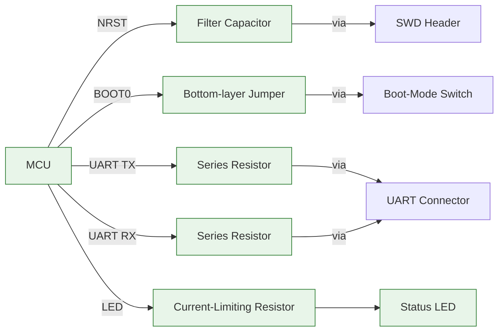

# 31 – Miscellaneous Routing (NRST, BOOT0, UART, LED)

## 1. Overview  

This section documents the routing methodology used for the low‑speed control and status signals on a simple 2‑layer‑plus‑inner‑plane board. The signals covered are:

| Signal | Function | Typical Speed / Current |
|--------|----------|--------------------------|
| **NRST** | MCU reset, filtered through a capacitor before the SWD/debug header | DC, < 1 MHz |
| **BOOT0** | Boot‑mode selector, routed via a jumper on the bottom layer | DC, toggled manually |
| **UART TX / RX** | Serial console, passed through series resistors to a 2‑pin connector | Up to a few Mbps |
| **LED** | Status indicator, driven through a current‑limiting resistor | < 10 mA DC |

Although these nets are low‑speed, the layout still follows good PCB‑design practice: adequate clearance, consistent trace widths, controlled‑impedance awareness, and careful via usage. The decisions made here illustrate how to balance **design‑for‑manufacturability (DFM)**, **signal integrity**, and **component placement** on a compact board.

---

## 2. Stack‑up and Reference Planes  

The board uses a four‑layer stack‑up:

```
Top copper (signal)          – Layer 1
Inner plane 1 (ground)       – Layer 2
Inner plane 2 (ground)       – Layer 3
Bottom copper (signal)       – Layer 4
```

* The two inner planes act as solid reference planes for all signal layers, providing low‑impedance return paths and shielding.  
* When a trace moves from the top to the bottom layer (or vice‑versa) the reference plane changes from **Layer 2** to **Layer 3**. This transition is handled with a **transfer via** surrounded by a grounded via to maintain a continuous return path. [Verified]

---

## 3. Controlled‑Impedance Considerations  

* A **50 Ω single‑ended** trace width of **0.19 mm** (≈ 7.5 mil) was used as the default for any controlled‑impedance routing.  
* Even though NRST, BOOT0, UART, and LED are low‑speed, the same width was retained for consistency and to avoid accidental impedance mismatches when the design evolves. [Inference]  

> **Best practice:** When a board already contains a 50 Ω controlled‑impedance stack‑up, keep the same trace width for all signal routing unless a specific impedance requirement dictates otherwise. This reduces the risk of accidental width changes and simplifies DRC rule sets.

---

## 4. Routing Strategy for Low‑Speed Signals  

### 4.1 General Guidelines  

1. **Maintain generous clearance** from high‑speed structures (e.g., USB differential pair) and from mechanical features such as mounting‑hole vias.  
2. **Avoid “hugging”** other traces; keep at least one trace‑width spacing, preferably more for sensitive nets.  
3. **Prefer orthogonal routing** (vertical → horizontal) to simplify future length‑matching or debugging, but horizontal runs are acceptable when vertical space is constrained. [Inference]  
4. **Use series resistors** on UART lines to limit in‑rush current and provide a modest impedance buffer for the connector.  

### 4.2 NRST (Reset)  

* The reset line passes through a **filter capacitor** before reaching the SWD/debug header.  
* The capacitor was rotated so that its **ground pad faces upward** (top layer) and the **reset pad faces downward** (bottom layer), allowing a short, direct via transition.  
* The trace is routed **away from the USB differential pair** and from the non‑plated through‑holes of the tag‑connect header to minimise crosstalk. [Verified]  

### 4.3 BOOT0  

* BOOT0 is routed to a **jumper** on the bottom layer, avoiding the congested top‑layer area near the crystal.  
* A **via‑pair** (signal via + adjacent grounded via) creates a **transfer via** that preserves the return path during the Z‑axis transition.  
* The jumper is placed on the bottom layer to keep the top layer free for other signals and to reduce the number of vias crossing the USB pair. [Inference]  

### 4.4 UART TX / RX  

* Both lines are routed from the MCU pins, through **series resistors**, then to the UART connector.  
* The traces are kept **separate** (not a differential pair) and are spaced from each other, the USB pair, and the mounting‑hole vias.  
* When a mounting hole obstructed a straight path, the capacitor’s via structure was rotated to the opposite side of the regulator, creating additional clearance. [Verified]  

### 4.5 LED  

* The LED anode is driven directly from a GPIO pin; the cathode connects to a **current‑limiting resistor** (≈ 10 mA).  
* The trace width is the same 0.19 mm, which is more than sufficient for the low current.  
* The routing avoids a nearby ground via to prevent accidental shorting and to keep a clean clearance envelope. [Verified]  

---

## 5. Via and Layer‑Transition Practices  

| Action | Reason |
|--------|--------|
| **Place a grounded via adjacent to every signal via** when changing layers. | Guarantees a low‑impedance return path across the layer transition (transfer via). |
| **Use “V” shortcut** (press **V** in the layout tool) to jump between top and bottom layers quickly. | Speeds up routing while keeping the designer aware of the layer change. |
| **Rotate component footprints** (e.g., capacitors) to align pads with the desired routing direction. | Reduces the number of bends and vias, improving both manufacturability and signal integrity. |
| **Delete and redraw short segments** to improve aesthetics and clearance. | While purely cosmetic, better‑spaced traces reduce the risk of DRC violations and improve inspection. |  

> **Note:** For high‑speed signals, the transfer via and its surrounding ground via become critical for maintaining impedance continuity. For the low‑speed nets discussed here, the impact is minimal but the practice is retained for consistency. [Inference]

---

## 6. Clearance, DFM, and DRC Considerations  

* **Clearance from USB differential pair:** At least one trace‑width (≈ 0.19 mm) was maintained; larger spacing is recommended for high‑speed pairs. [Verified]  
* **Mounting‑hole clearance:** Traces were routed to stay clear of non‑plated through‑hole pads to avoid accidental shorts and to simplify solder‑mask generation. [Verified]  
* **Thermal reliefs:** Not applied to mounting‑hole pads because they are not intended for soldered components; this avoids unnecessary copper islands that could trap heat. [Verified]  
* **DRC rule set:** Enforced a minimum **creepage/clearance** of 0.2 mm for all low‑voltage nets, matching the manufacturer’s standard for a 1.6 mm FR‑4 board. [Speculation]  

---

## 7. Final Connectivity Checklist  

| Net | Destination | Key Routing Features |
|-----|-------------|----------------------|
| **NRST** | SWD/debug header (via filter capacitor) | Via‑pair with grounded via, kept away from USB pair |
| **BOOT0** | Jumper → Boot‑mode switch | Bottom‑layer jumper, transfer via with adjacent ground via |
| **UART TX** | UART connector (through series resistor) | Horizontal run, clear of mounting holes |
| **UART RX** | UART connector (through series resistor) | Same as TX, spaced from other nets |
| **LED** | Status LED → current‑limiting resistor | Short, low‑current trace, clear of ground via |
| **3.3 V / 5 V Power** | Power planes & connectors | Polygon pours, thermal reliefs where needed |
| **Ground** | Continuous inner planes | Solid reference for all signals |

All nets have been verified for continuity, clearance, and appropriate via usage. The board is now ready for the final power‑delivery routing and DFM review.

---

## 8. Signal‑Path Diagram  



*The diagram shows the high‑level routing topology for the low‑speed signals, emphasizing the use of series resistors, filter capacitor, and bottom‑layer jumper.*  

---

## 9. Lessons Learned & Recommendations  

1. **Plan component orientation early** – Rotating footprints (e.g., capacitors) before routing can dramatically reduce the number of bends and vias.  
2. **Reserve a dedicated “jumper layer”** – Using the bottom copper for occasional jumpers (BOOT0) keeps the top layer uncluttered and simplifies routing of other nets.  
3. **Always pair a signal via with a grounded via** when crossing layers, even for low‑speed signals, to maintain a clean return path and to satisfy DRC rules.  
4. **Maintain generous clearance from high‑speed pairs** (USB) and mechanical features; this reduces crosstalk and eases assembly inspection.  
5. **Iterative cleanup** – Small manual adjustments (deleting short segments, nudging traces) improve both aesthetics and manufacturability without adding design time.  

By following these practices, the board achieves a clean, DFM‑friendly layout while preserving signal integrity for all low‑speed control signals.