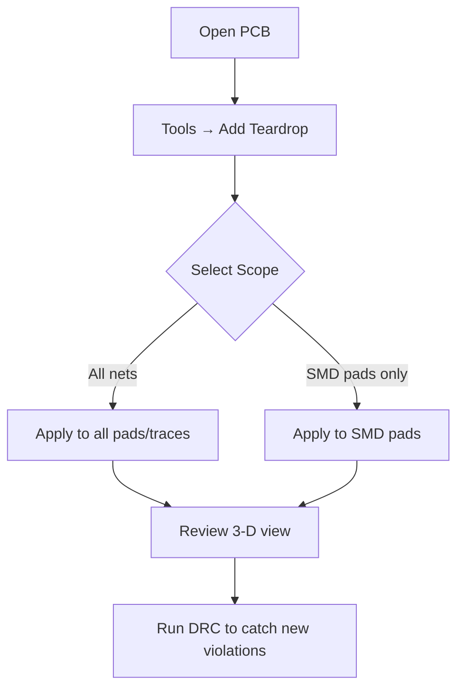

# Clean‑Up: Silkscreen, Teardrops & Non‑Functional Pads  

When a PCB layout is mechanically complete, the final “clean‑up” stage is essential to guarantee **design‑for‑manufacturability (DFM)**, **design‑for‑assembly (DFA)**, and signal‑integrity compliance before the Design Rule Check (DRC) is run. The activities below address three common sources of downstream problems:

* **Silkscreen placement** – avoid overlaps with holes, pads, or copper features.  
* **Teardrop (or fillet) insertion** – smooth the transition between wide pads and narrow traces.  
* **Removal of non‑functional copper** – eliminate pads and copper islands that are not electrically connected.

---

## 1. Silkscreen Hygiene  

### 1.1 Why it matters  
Silkscreen text or reference designators that sit directly on a via, pad, or component hole can be **masked during solder‑mask exposure**, causing the silk to be partially or completely removed during fabrication. This not only degrades documentation on the board but can also hide critical warnings (e.g., polarity marks).  

### 1.2 Practical clean‑up steps  

| Action | Recommended setting | Rationale |
|--------|--------------------|-----------|
| **Check clearance** between silkscreen and any copper feature (pads, vias, holes). | Minimum clearance ≥ silk line width (typically 0.15 mm). | Prevents mask erosion and ensures legibility. |
| **Shift silkscreen** away from through‑hole pads that have a large drill diameter. | Use the PCB editor’s “Move” tool or edit the layer directly. | Avoids silk being printed inside the drilled hole. |
| **Use the 3‑D viewer** to spot hidden silkscreen under components. | Rotate and zoom to view the top side from the component’s perspective. | Detects cases where a silkscreen line is obscured by a tall component. |
| **Set solder‑mask expansion to zero** (or a minimal value) and let the manufacturer apply their own mask‑clearance rules. | *Board Setup → Solder Mask → Expansion = 0* | Simplifies the internal DRC and delegates fine‑tuning to the fab, which can adjust openings based on their process window. [Verified] |

> **Tip:** If you prefer tighter control, manually adjust mask openings after the “zero‑expansion” step and discuss the values with the fab. This adds time but yields a board that matches the designer’s intent exactly. [Inference]

---

## 2. Teardrops (Fillets)  

### 2.1 Function  
A teardrop widens the copper at the junction of a **pad‑to‑trace** or **via‑to‑trace** transition. This reduces stress concentration during thermal cycling and can improve manufacturability by providing a larger copper area for solder wicking.  

### 2.2 When to use them  

| Situation | Recommendation |
|-----------|----------------|
| **High‑speed or RF traces** where the width changes abruptly (e.g., a 0.15 mm trace leaving a 0.5 mm pad). | Add teardrops **only if** the length of the transition is comparable to the wavelength or if the impedance discontinuity is critical. In many low‑speed designs (e.g., USB Full‑Speed) the effect is negligible. |
| **Mechanical stress points** (e.g., pads near board edges or under heavy components). | Use teardrops to mitigate delamination risk. |
| **Very short trace segments** where the added copper does not affect impedance. | Optional – they may increase DRC violations if clearance rules are tight. |

### 2.3 Global insertion workflow (Altium Designer example)  



*After insertion, re‑run the DRC. If new clearance errors appear, either adjust the teardrop parameters or remove them from the offending nets.*  

> **Observation:** In the referenced design, teardrops were added globally, but the engineer decided **not** to keep them because the impedance discontinuity of the short RF traces was deemed irrelevant. This illustrates the trade‑off between mechanical robustness and DRC cleanliness. [Verified]

---

## 3. Removing Non‑Functional Pads & Copper Islands  

### 3.1 Problem description  
Inner layers often contain **ground‑plane polygons** that include copper pads for vias that are not electrically connected (e.g., unused test points or “VP” pads). These pads create **unnecessary cutouts** in the polygon, increasing the risk of **slivers** (narrow copper bridges) and reducing the effective copper area, which can affect impedance and current‑carrying capability.

### 3.2 Automated clean‑up  

1. **Tools → Remove Unused Pad Shapes** – select *All layers* and optionally keep outer‑layer pads that are required for mechanical registration.  
2. **Re‑pour** the affected polygon (press **B** in Altium) to let the software recompute the copper fill without the removed pads.  

The result is a **smaller, cleaner cutout** in the ground plane, which improves:

* **Signal integrity** – fewer discontinuities in the reference plane.  
* **Manufacturability** – reduced chance of isolated copper islands that the fab might flag as “copper islands” errors.  

### 3.3 Layout adjustments after pad removal  

* **Increase spacing** between closely placed vias (e.g., 3.3 V power vias) to allow a continuous copper “sliver” to bridge the gap, further reducing polygon fragmentation.  
* Verify that the **reference layers** (typically the inner layers) remain solid planes; the outer layers can tolerate more cutouts because they are not primary reference planes.  

> **Note:** The bottom copper layer in the example is not a reference plane, so its fragmented polygon does not impact impedance; however, keeping it tidy still aids assembly and visual inspection. [Verified]

---

## 4. Final Verification  

### 4.1 Design Rule Check (DRC)  

* Run the **DRC** after each clean‑up operation (silkscreen move, teardrop insertion, pad removal).  
* Adjust the **severity** of rules (e.g., treat certain clearance violations as warnings) only after confirming that they do not compromise manufacturability or reliability.  

### 4.2 Electrical Rule Check (ERC)  

* Ensure that **all nets remain connected** after pad removal. The ERC will flag any net that lost its only connection point.  

### 4.3 Documentation  

* Update the **assembly drawing** to reflect any silkscreen changes.  
* Record the **mask‑expansion setting** (zero) and any manufacturer‑specific adjustments in the fabrication notes.  

---

## 5. Summary of Clean‑Up Workflow  

```mermaid
flowchart LR
    A[Layout & Routing Complete] --> B[Silkscreen Clearance Check]
    B --> C[Adjust Solder‑Mask Expansion (zero)]
    C --> D[Add/Remove Teardrops as Needed]
    D --> E[Remove Unused Pad Shapes]
    E --> F[Re‑pour Polygons & Verify Planes]
    F --> G[Run DRC & ERC]
    G --> H[Finalize Fabrication Documentation]
```

By systematically addressing silkscreen placement, teardrop usage, and non‑functional copper, the board is left in a state that maximizes **yield**, **reliability**, and **signal integrity** while minimizing the need for post‑fabrication fixes by the manufacturer.  

---  

*All recommendations are based on standard PCB engineering practice and reflect the specific considerations highlighted for a four‑layer board with mixed‑signal (USB Full‑Speed) and RF sections.*