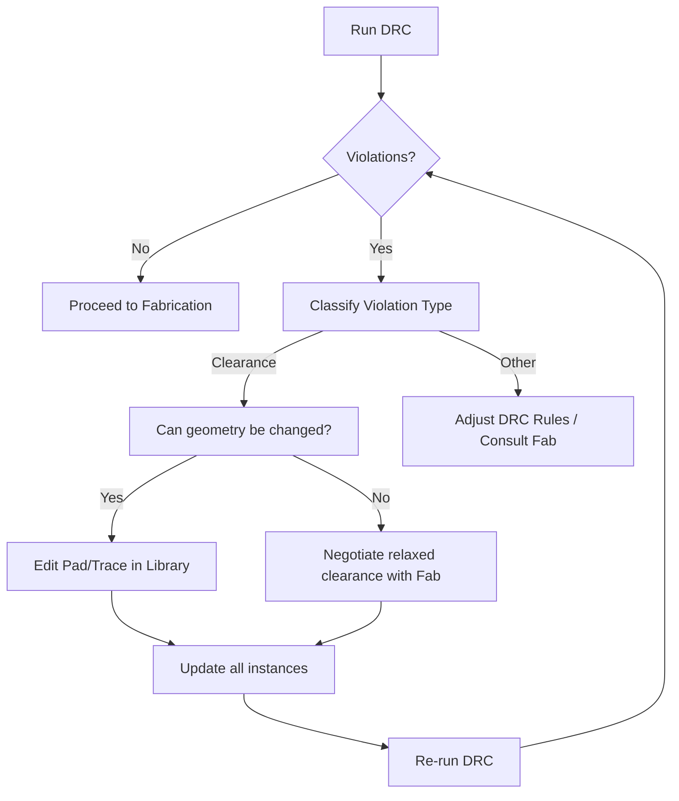

# Design Rule Check (DRC)

Design Rule Check (DRC) is the final gate that guarantees a board can be fabricated without violating the manufacturer’s geometric constraints. A systematic DRC workflow, combined with disciplined library management, prevents costly redesigns and improves overall yield.

---

## 1. Running the DRC

The DRC engine is launched from the toolbar (three check‑mark icons). After selecting **Run DRC**, the tool scans the entire layout and reports:

* **Errors** – hard violations that must be fixed before release.  
* **Warnings** – non‑critical issues that may be acceptable after engineering sign‑off.  
* **Unconnected items** – typically a separate Electrical Rule Check (ERC) concern.

In the example board the initial run produced eight errors, all of which were **clearance violations** around a USB connector. No unconnected items were found, which is a good sign that the schematic‑to‑layout netlist is intact. [Verified]

---

## 2. Interpreting Clearance Violations

The violations originated from a **non‑plated through‑hole (NPTH) mounting pin** that was placed too close to the copper pads of the USB connector. The design had a clearance constraint of **0.26 mm** (the transcript mentions “26 mm” but the context of typical PCB clearances makes 0.26 mm the realistic value). Some pads were even closer than the tighter **0.194 mm** limit that the manufacturer could tolerate. [Inference]

Clearance rules are a core part of **Design‑for‑Manufacturability (DFM)**. If a pad‑to‑hole distance falls below the specified rule, the fab house may reject the panel or incur additional rework cost.

---

## 3. Strategies for Resolving Violations

When a violation cannot be eliminated by moving the offending feature (e.g., the NPTH mounting hole is fixed by mechanical design), the designer has two primary avenues:

| Approach | Description | Typical Use‑Case |
|----------|-------------|------------------|
| **Relax the DRC constraint** | Reduce the required clearance in the rule set, trusting that the fab can still produce the board. | Early prototypes where cost and time outweigh strict DFM. |
| **Modify the copper geometry** | Change pad dimensions, shapes, or offsets to increase the actual clearance while keeping the electrical function unchanged. | Production designs where the fab’s minimum clearance must be respected. |

In practice, the second approach is preferred because it preserves the original design intent and avoids hidden risks in the manufacturing process. [Inference]

### 3.1 Adjusting Pad Geometry in the Library

Rather than editing each instance of the footprint, the pad modification should be performed **once in the component library**. This ensures that every future board that uses the same part inherits the corrected geometry, eliminating repeat violations.

Typical steps (as demonstrated in the example):

1. **Select the offending pad** and press **E** to open the **Options Editor**.  
2. Reduce the pad length (e.g., from **1.15 mm** to **1.00 mm**).  
3. Compensate the pad’s centre offset by half the change (≈ 0.505 mm) so the pad’s outer edge remains aligned with the original footprint.  
4. Save the library entry and propagate the change to all instances.

After updating all affected pads, a subsequent DRC run reported **zero errors and zero warnings**. [Verified]

### 3.2 Negotiating Clearance with the Manufacturer

If the original footprint is a standard part supplied by the component vendor, it is worthwhile to **consult the PCB fab** before altering the library:

* Verify the fab’s **minimum NPTH‑to‑copper clearance** for the chosen panel material and finish.  
* Request a **custom footprint** if the standard one violates the fab’s rules.  
* Document any agreed‑upon exceptions in the fabrication notes to avoid later surprises.

This collaborative approach often yields a “good enough” solution without the need for geometry changes, especially for low‑volume or rapid‑prototype runs. [Inference]

---

## 4. Post‑DRC Clean‑up

Once the board passes DRC, a few additional checks improve reliability and manufacturability:

* **Trace spacing** – verify that all signal traces respect the clearance rules, especially high‑speed or RF lines.  
* **Teardrops** – add them at pad‑to‑trace junctions to reduce stress concentration during thermal cycling.  
* **Unused pad removal** – delete any copper that is not electrically connected to avoid accidental shorts.  
* **Plane voids under RF** – create copper voids beneath sensitive RF sections to minimise dielectric loading and improve antenna performance.  
* **3‑D verification** – use the 3‑D viewer to confirm that pad modifications have not introduced mechanical interference with components or enclosures.

These steps are part of a comprehensive **Design‑for‑Assembly (DFA)** and **Signal‑Integrity (SI)** review that follows the DRC pass. [Inference]

---

## 5. DRC Workflow Diagram

The following flowchart captures the decision process from the initial DRC run to a clean, manufacturable board.

*The loop continues until **B** evaluates to “No”, indicating a clean DRC pass.* [Verified]

---

## 6. Key Takeaways

1. **Run DRC early and often** – catching clearance issues before routing is complete saves redesign effort.  
2. **Prefer library‑level fixes** – a single corrected footprint eliminates recurring violations across projects.  
3. **Communicate with the fab** – understanding the manufacturer’s true capabilities can prevent unnecessary design compromises.  
4. **Complement DRC with post‑checks** – spacing, teardrops, plane voids, and 3‑D verification round out a robust DFM/DFA strategy.  

By integrating these practices into the PCB development flow, engineers can deliver boards that meet both electrical performance targets and manufacturing tolerances with confidence. [Inference]