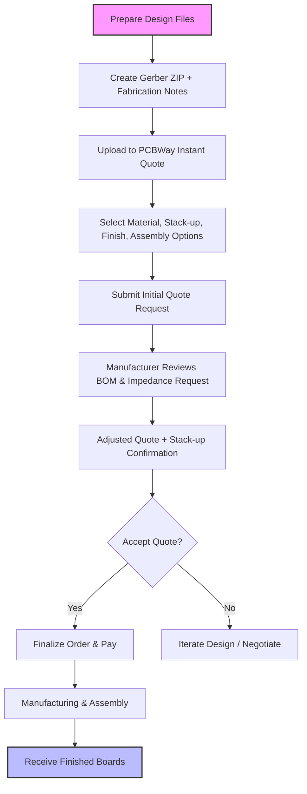

# 40 – Ordering  

This section describes the complete workflow for ordering a fabricated PCB (and optional assembly) with a typical low‑cost contract manufacturer such as **PCBWay**. It covers the required deliverables, the configuration of the quoting system, the decisions that affect cost and manufacturability, and the feedback loop that ensures the final stack‑up and impedance meet the design intent.

---

## 1. Required Documentation Package  

| Document | Purpose | Typical Format |
|----------|---------|----------------|
| **Gerber archive** | Complete definition of copper, solder mask, silkscreen, drill data, and board outline. | ZIP containing individual Gerber files (`.gbr`, `.drl`, etc.). |
| **Fabrication notes** | Human‑readable list of special requirements (e.g., layer order, impedance control, material spec). | Plain‑text or PDF referenced in the quote. |
| **Bill of Materials (BOM)** | Parts list for assembly services. | CSV, Excel, or PDF. |
| **Centroid (pick‑and‑place) file** | X‑Y coordinates, rotation, and reference designators for every surface‑mount component. | `.cpl` or `.txt` (Altium “Centroid”). |
| **Assembly drawing** | Visual guide for component orientation, polarity, and any mechanical constraints. | PDF or DXF. |
| **Impedance control file (optional)** | Target differential‑pair impedance and any required trace width/spacing tables. | Text file placed in the same ZIP as the Gerbers. |

> **Why a single ZIP?** Most online quoting portals accept one compressed archive; this guarantees that the manufacturer receives a self‑contained package and reduces the chance of missing files. [Verified]

---

## 2. Using PCBWay’s Instant Quote  

### 2.1 Uploading Files  

1. Navigate to **PCBWay → Instant Quote**.  
2. Click **“Quick Order PCB” → Add Files** and select the Gerber ZIP.  
3. The system automatically extracts the board outline, detects the **board size** and **layer count** (e.g., 4‑layer). [Verified]

### 2.2 Selecting Material & Stack‑up  

| Parameter | Typical Choice | Impact |
|-----------|----------------|--------|
| **Base material** | FR‑4 (TG ≈ 150 °C) | Sufficient for most hobbyist and low‑frequency commercial designs. [Verified] |
| **Minimum trace spacing** | 5 mil (0.127 mm) | Standard DFM rule; tighter spacing raises cost and may require tighter tolerance on the fab. [Verified] |
| **Minimum via/through‑hole diameter** | 0.3 mm | Below this many manufacturers charge extra for micro‑vias. [Verified] |
| **Solder mask colour** | Green (cheapest) | Green is the default low‑cost option; other colours add a small surcharge. [Verified] |
| **Silkscreen colour** | White (cheapest) | White silkscreen is typically the lowest‑cost option; other colours may be premium. [Verified] |
| **Surface finish** | Hot‑Air Solder Leveling (HASL) | Simple, inexpensive finish; suitable when fine‑pitch or RoHS‑critical solderability is not required. [Verified] |
| **Via treatment** | Lead‑free, tented | Tented vias protect the copper from solder wicking; lead‑free complies with RoHS. [Verified] |

> **Impedance control** – Enable the *Impedance Control* checkbox and add a short note such as “*Please see `impedance_control.txt` in the Gerber archive*”. This flags the fab house to treat the board as a controlled‑impedance design. [Verified]

### 2.3 Assembly Options  

| Option | Description | Typical Use‑Case |
|--------|-------------|------------------|
| **Turnkey (PCBWay sources parts)** | Manufacturer purchases all components from its own supply chain. | Fastest lead‑time; ideal when parts are standard and readily available. [Verified] |
| **Customer‑supplied parts** | You ship the parts to the fab house. | Required for custom, obsolete, or tightly‑controlled components. |
| **Mixed sourcing** | Some parts sourced by the fab, others supplied by you. | Useful when only a few parts are non‑standard. |

Select **Turnkey** for a fully managed flow unless you have special component constraints. [Verified]

### 2.4 Quantity & Board Type  

* **Quantity** – Enter the number of assembled boards (e.g., 5).  
* **Board type** – Choose “single‑piece” for individual boards or “panelized” if you want multiple copies on a single panel. Panelization can reduce handling cost for small boards. [Inference]

---

## 3. Manufacturer Feedback Loop  

After the initial quote, the fab house will review the **BOM**, **centroid file**, and **impedance request**. They will then:

1. **Return an adjusted quote** that includes component cost, any special handling (e.g., X‑ray inspection for fine‑pitch parts), and potential changes to the stack‑up. [Verified]  
2. **Provide a stack‑up summary** (e.g., copper‑prepreg‑core‑prepreg‑copper) with recommended trace widths for the target impedance. [Verified]  
3. **Suggest trace‑width adjustments** if the requested impedance cannot be met with the current geometry. You may accept the manufacturer’s suggestion or manually adjust the layout and resend the Gerbers. [Verified]

> **Best practice:** Initiate a **capability inquiry** *before* finalizing the layout. Knowing the fab’s minimum trace/space, available dielectric materials, and impedance calculation methods lets you design within realistic constraints, reducing the need for costly redesigns later. [Inference]

---

## 4. Best Practices for a Smooth Order  

### 4.1 Fabrication Notes (DFM)  

* Explicitly list **layer order** (e.g., `Top → Core1 → Core2 → Bottom`).  
* State **impedance targets** and reference the accompanying text file.  
* Include any **special tolerances** (e.g., “no solder mask on high‑frequency pads”).  
* Provide **clearances** for high‑voltage nets if applicable.  

### 4.2 Early Communication  

* Share the **stack‑up proposal** with the fab early to confirm that the chosen prepreg thicknesses can achieve the desired differential‑pair impedance.  
* Ask for a **sample calculation** (trace width vs. impedance) to validate your design rules.  

### 4.3 DFM / DFA Checklist  

| Check | Why it matters |
|-------|----------------|
| Minimum **trace/space** compliance | Prevents extra cost for tighter tolerances. |
| **Via tenting** vs. open vias | Tented vias reduce solder wicking on fine‑pitch components. |
| **Component placement** (clearance to board edge, keep‑out zones) | Avoids mechanical damage and eases pick‑and‑place. |
| **Silkscreen readability** (minimum line width) | Ensures markings survive soldering and inspection. |
| **Thermal relief** for through‑hole pads | Improves solderability and reduces board warpage. |

### 4.4 Post‑Order Verification  

* Once the fab returns the **final stack‑up** and **impedance report**, cross‑check the values against your simulation results.  
* If the manufacturer adjusts trace widths, update the layout and regenerate the Gerbers before the final production run.  

---

## 5. Process Flow Diagram  

*The flowchart captures the end‑to‑end ordering sequence, from file preparation to receipt of the assembled boards.* [Inference]

---

## 6. Summary  

Ordering a PCB with an online fab house is straightforward when the **documentation package** is complete and the **design rules** align with the manufacturer’s capabilities. Key take‑aways:

* **Provide a single, well‑named ZIP** containing Gerbers, centroid data, BOM, assembly drawing, and any impedance‑control files.  
* **Explicitly state layer order and impedance requirements** in the fabrication notes; this prevents misinterpretation.  
* **Select cost‑effective defaults** (green mask, white silkscreen, HASL finish) unless performance or branding dictates otherwise.  
* **Leverage turnkey assembly** for rapid prototyping, but be prepared to supply or approve parts for specialized components.  
* **Engage the fab early** to confirm stack‑up feasibility and obtain trace‑width recommendations, reducing costly redesign cycles.  

Following these practices yields a reliable quote, minimizes lead‑time surprises, and ensures that the manufactured board meets both electrical performance and manufacturability expectations.