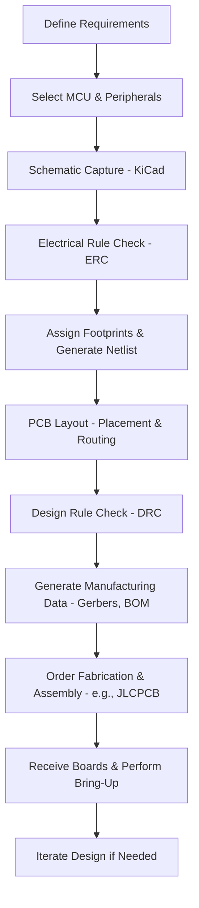

# Introduction  

This chapter outlines the fundamental considerations for designing a custom microcontroller board with KiCad 9, using the Texas Instruments **MSPM0** family as a reference design. The board combines a low‑power MCU, a USB‑C power/communication interface, and a UART‑to‑USB bridge, and serves as a generic template that can be adapted to a wide range of applications.

---

## Target Microcontroller and Architecture  

The core of the reference board is an **MSPM0** microcontroller from Texas Instruments. Unlike the more common STM32‑based designs, the MSPM0 offers a Cortex‑M0+ core with a focus on ultra‑low power consumption and integrated peripheral sets that are well‑suited for battery‑operated or energy‑harvesting devices.  

* **Key implications for PCB design**  
  * The MCU operates at low frequencies (typically ≤ 48 MHz), so high‑speed signal‑integrity constraints are modest, but careful placement of the external crystal and decoupling network remains critical for stable operation.  
  * Power‑domain isolation is minimal; a single 3.3 V rail can feed both the MCU and most peripheral ICs, simplifying the power‑plane layout.  

[Verified]

---

## Core Supporting Subsystems  

### Power Supply and USB‑C Interface  

A **USB‑Type C** connector supplies the primary 5 V (or 3.3 V after regulation) to the board. The connector also provides the data lanes for the UART‑to‑USB bridge.  

* **Design notes**  
  * Route the VBUS trace with a generous copper width and include a **polyfuse** or **resettable PTC** for over‑current protection.  
  * Place a **bulk decoupling capacitor** (≥ 10 µF) close to the regulator input to absorb transients from the USB source.  
  * For USB 2.0 high‑speed (480 Mbps) the differential pair should be routed as a 90 Ω differential pair with controlled impedance; on a standard 2‑layer board this can be approximated by maintaining a constant spacing and keeping the pair short and parallel to a solid ground plane.  

[Inference]

### UART‑to‑USB Bridge  

A dedicated **UART‑to‑USB converter IC** sits on the left side of the board, interfacing the MCU’s UART pins to the USB‑C data lines.  

* **Placement strategy**  
  * Locate the bridge as close as possible to the USB‑C connector to minimize the length of the high‑speed USB traces.  
  * Keep the MCU UART pins short and route them on the same layer to avoid unnecessary vias, which can introduce impedance discontinuities.  

[Inference]

### Decoupling and Crystal  

The MSPM0 requires a set of **bypass/decoupling capacitors** and an **external crystal** for its clock source.  

* **Decoupling**  
  * Place a 0.1 µF ceramic capacitor within 1 mm of each power pin of the MCU and peripheral ICs.  
  * Add a larger bulk capacitor (≥ 1 µF) near the regulator output to support transient load changes.  

* **Crystal**  
  * The crystal should be positioned close to the MCU’s oscillator pins, with minimal trace length (≤ 5 mm) and matched trace widths to maintain a balanced load.  
  * Provide a pair of load capacitors as specified in the MCU datasheet, placed symmetrically around the crystal.  

[Verified]

### Programming Interface (SWD)  

A **Serial Wire Debug (SWD)** header provides in‑system programming and debugging. The reference design uses a **no‑solder header from TAC Connect**.  

* **Best practice**  
  * Route the SWDIO and SWCLK signals as short, direct traces with a 45 ° or 90 ° angle to reduce stubs.  
  * Include a pull‑up resistor on SWDIO (typically 10 kΩ) to ensure a defined idle state.  

[Inference]

---

## KiCad 9 Design Workflow  

KiCad 9 offers an integrated flow from schematic capture to PCB layout and finally to manufacturing data export. The typical steps are:

1. **Create schematic libraries** – import or create footprints for the MSPM0, USB‑C connector, UART bridge, and other components.  
2. **Capture schematic** – connect power nets, define hierarchical blocks (e.g., power, communication, MCU).  
3. **Run ERC (Electrical Rule Check)** – verify connectivity, missing pins, and net conflicts.  
4. **Assign footprints and generate netlist** – ensure each symbol matches the intended physical package.  
5. **Layout PCB** – define board outline, stackup, and place components respecting design rules (clearance, creepage).  
6. **Run DRC (Design Rule Check)** – catch spacing violations, unconnected pads, and copper‑area issues.  
7. **Generate fabrication outputs** – Gerbers, drill files, BOM, and assembly drawings for the chosen fab house (e.g., JLCPCB).  

[Verified]

---

## Design for Manufacturability & Assembly (DFM/DFA)  

* **Component selection** – Prefer standard 0603/0402 passive sizes and widely stocked IC packages to reduce assembly cost and lead time.  
* **Panelization** – When ordering from low‑cost fab houses, enable automatic panelization to share a common copper pour and reduce per‑board handling.  
* **Silkscreen readability** – Use a minimum font height of 0.5 mm and avoid placing text over copper pours to prevent solder mask adhesion issues.  
* **Via and pad design** – Use through‑hole vias for power and ground connections; avoid micro‑vias on a 2‑layer board as they increase cost without benefit for this design.  

[Inference]

---

## Trade‑offs and Best Practices  

| Aspect | Decision in Reference Design | Typical Trade‑off |
|--------|-----------------------------|-------------------|
| **Layer count** | 2‑layer board | Lower cost and easier fabrication vs. limited routing channels for high‑speed signals. |
| **Controlled impedance** | Approximate for USB 2.0 on 2‑layer | Acceptable for moderate data rates; true 90 Ω differential pairs require tighter stackup control, increasing cost. |
| **Component density** | Moderate (spaced for hand‑assembly) | Improves assembly yield and reworkability at the expense of board size. |
| **Power distribution** | Single 3.3 V rail with bulk decoupling | Simplifies layout but may limit ability to isolate noisy subsystems; adding separate analog rails would increase complexity and cost. |

[Inference]

---

## High‑Level Development Flow  

The following Mermaid diagram visualizes the end‑to‑end PCB development process described above.

[Verified]

---

### Summary  

This introductory chapter establishes a solid foundation for creating a custom MSPM0‑based board in KiCad 9. By adhering to the outlined power‑distribution strategies, decoupling practices, and DFM considerations, designers can produce a reliable, low‑cost prototype that is ready for fabrication with mainstream manufacturers such as JLCPCB. The concepts presented here—component placement, signal‑integrity awareness for USB, and a disciplined design workflow—are applicable to a broad class of microcontroller boards beyond the specific TI device used as an example.