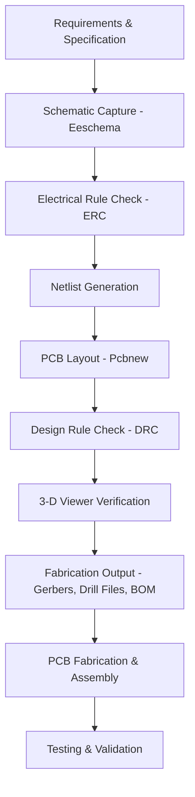

# KiCad 9 – Open‑Source PCB Design Environment  

## 1. Overview  

KiCad is a **free, open‑source PCB design suite** that provides a complete workflow from schematic capture to board layout, 3‑D visualization, and manufacturing data generation. The current stable release is **version 9**, which runs natively on **macOS, Linux, and Windows** platforms. Its permissive GPL license eliminates tooling costs and encourages community‑driven library development, making it a practical choice for hobbyists, startups, and even many professional projects. [Verified]

## 2. Installation & Version Management  

| Platform | Installation Method | Typical Path |
|----------|--------------------|--------------|
| Windows  | Installer (`.exe`) from the official download page | `C:\Program Files\KiCad\` |
| macOS    | `.dmg` package or Homebrew (`brew install --cask kicad`) | `/Applications/KiCad.app` |
| Linux    | Distribution packages (`apt`, `dnf`, `pacman`) or AppImage | `/usr/share/kicad/` or `~/AppImage/` |

* **Use the latest stable release (v9.x)** to benefit from bug fixes, updated footprint libraries, and improved DRC/ERC engines. [Inference]  
* Keep a **local copy of the installer** for offline deployment across a team, and document the exact version in the project’s README to guarantee reproducibility. [Best practice]

## 3. Project Structure in KiCad  

A KiCad project consists of a set of interrelated files that should be stored together in a version‑controlled directory:

```
my_project/
├─ my_project.pro          # Project file (metadata)
├─ my_project.sch          # Schematic (Eeschema)
├─ my_project.kicad_pcb    # PCB layout (Pcbnew)
├─ my_project.net          # Netlist (generated)
├─ my_project.lib          # Symbol library (optional)
├─ my_project.pretty/      # Footprint library (optional)
└─ docs/                   # Design notes, simulations, etc.
```

* **Version control (Git, Mercurial)** is strongly recommended. KiCad’s text‑based file formats diff cleanly, allowing collaborative review of schematic changes and layout revisions. [Inference]

## 4. Design Workflow  

The typical KiCad design flow aligns with industry best practices and can be visualized as follows:



* Each stage produces artifacts that feed the next step, ensuring traceability from high‑level requirements down to the manufactured board. [Verified]

## 5. Schematic Capture (Eeschema)  

* **Symbol Libraries** – KiCad ships with a comprehensive set of symbols, but custom symbols are often required for novel components. Create them in a dedicated library (`.lib`) and reference them via the **global library table** to keep the project portable. [Inference]  
* **Hierarchical Design** – For complex systems, break the schematic into hierarchical blocks (e.g., power, MCU, sensor interfaces). This improves readability and enables reuse of sub‑circuits across projects. [Best practice]  
* **ERC Settings** – Enable checks for unconnected pins, mismatched power nets, and missing decoupling. KiCad’s ERC engine can be customized per project to enforce design‑specific constraints (e.g., high‑voltage creepage). [Inference]

## 6. PCB Layout (Pcbnew)  

### 6.1 Stack‑up and Layer Planning  

* **Layer Count** – Choose the minimum number of layers that satisfy routing density, signal integrity, and cost targets. A typical 2‑layer board suffices for low‑speed analog or digital circuits; 4‑layer boards provide dedicated power and ground planes, reducing EMI and enabling controlled‑impedance routing. [Inference]  
* **Reference Planes** – Ground and power planes should be placed on adjacent internal layers to minimize loop area and improve return‑path continuity. This practice also aids in thermal dissipation. [Verified]

### 6.2 Design Rules  

* **DRC Configuration** – Set clearance, track width, via size, and annular ring rules according to the selected PCB manufacturer’s capabilities. KiCad allows per‑net class rules, enabling tighter constraints for high‑speed differential pairs while keeping relaxed rules for power nets. [Inference]  
* **Differential Pairs** – Define pair rules (spacing, length matching) for USB, Ethernet, or high‑speed serial links. KiCad’s **Length Tuning** tool can be used to balance skew within the tolerance specified by the component datasheet. [Speculation]  

### 6.3 Component Placement  

* **Thermal Considerations** – Place high‑power devices near copper pours or thermal vias to spread heat.  
* **Mechanical Constraints** – Use the 3‑D viewer to verify component clearance with enclosures, connectors, and mounting hardware. KiCad’s built‑in mechanical layers help document keep‑out zones. [Best practice]  

### 6.4 Routing Strategies  

* **Top‑Down vs. Bottom‑Up** – Begin routing critical signal nets (high‑speed, analog) before power distribution to preserve routing resources.  
* **Via Usage** – Prefer through‑hole vias for general routing; use blind or buried vias only when necessary (e.g., to reduce layer count or maintain a compact footprint) as they increase fabrication cost. [Inference]  

## 7. Verification  

* **DRC Pass** – Ensure the board passes all DRC checks before exporting manufacturing files.  
* **3‑D Model Review** – KiCad’s integrated 3‑D viewer can import STEP models from component manufacturers, allowing a visual inspection of mechanical fit and clearance. [Verified]  
* **Signal Integrity Checks** – For high‑speed designs, export the layout to a SI tool (e.g., HyperLynx, ADS) or use KiCad’s built‑in impedance calculator to verify trace geometry against target impedance. [Speculation]

## 8. Manufacturing Output  

KiCad can generate the full set of files required by PCB fabricators:

* **Gerber Files** – Layer images (copper, solder mask, silkscreen).  
* **Drill Files** – Excellon format for via and pad holes.  
* **Pick‑and‑Place Files** – Component placement data for assembly.  
* **Bill of Materials (BOM)** – Exportable as CSV or HTML for procurement.  

*Always verify the Gerber stack‑up with a Gerber viewer before submission to catch any inadvertent layer inversion or missing data.* [Best practice]

## 9. Common Pitfalls & Mitigation  

| Issue | Symptom | Mitigation |
|-------|---------|------------|
| Missing footprints | “Unconnected pad” warnings in DRC | Ensure every schematic symbol is linked to a valid footprint; use the **Assign Footprints** dialog. |
| Incorrect net classes | Impedance mismatches on high‑speed lines | Define and apply net classes early; double‑check DRC rule assignments. |
| Library version drift | Inconsistent component dimensions across team members | Store custom libraries within the project repository and lock versions via Git tags. |
| Over‑constrained DRC | False errors blocking routing | Review and relax non‑critical clearance rules; use per‑net overrides where appropriate. |

## 10. Tips for Working with KiCad 9  

* **Keyboard Shortcuts** – Familiarize yourself with the most used shortcuts (e.g., `E` for edit, `M` for move, `R` for rotate) to accelerate schematic and layout editing.  
* **Batch Export** – Use the **Plot** dialog’s “Generate drill files” and “Create gerber job file” options to produce a complete fabrication package in one step.  
* **Community Resources** – The KiCad forums, GitHub repositories, and the official **KiCad Library Convention** provide valuable guidance on symbol/footprint creation and best‑practice standards. [Inference]  
* **Regular Backups** – KiCad does not auto‑save; enable external backup tools or configure your IDE to commit changes after each major edit. [Best practice]

---

*This documentation captures the essential considerations for adopting KiCad 9 as a PCB design platform, outlining the workflow, best practices, and typical trade‑offs encountered in modern electronic hardware development.*