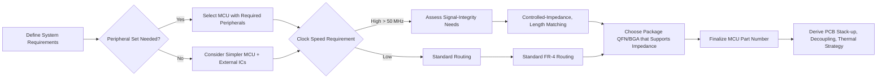

# MCU Choice

## Overview  

The design targets an **ARM Cortex‑M0+** microcontroller from Texas Instruments (TI). TI’s portfolio spans entry‑level MCUs, high‑performance digital‑signal‑processor (DSP) families, and everything in between. For this board we have selected the **MSPM0 G3507 SPTR** – a mid‑range part that balances cost, peripheral richness, and performance. The device offers a variety of on‑chip peripherals (ADCs, DACs, CAN, timers, UARTs, etc.) and is supported by TI’s free **Code Composer Studio (CCS)** development environment.  

Choosing the right MCU is a pivotal PCB decision because it dictates **package type, pin count, power budget, and the required board‑level support circuitry**. The following sections break down the key considerations, trade‑offs, and best‑practice guidelines that stem from this MCU selection.

---

## 1. System‑Level Requirements that Drive MCU Selection  

| Requirement | Influence on MCU Choice | PCB Implication |
|-------------|------------------------|-----------------|
| **Peripheral set** (e.g., ADC, CAN, UART) | Must be present on‑chip to avoid external ICs. | Fewer external components → reduced component density, simpler routing, lower BOM cost. |
| **Maximum clock frequency** | Higher frequencies enable faster processing but increase dynamic power and signal‑integrity demands. | May require controlled‑impedance routing for high‑speed interfaces, tighter length matching, and careful decoupling. |
| **Flash / RAM size** | Determines code size and data buffers that can be stored internally. | Larger memory often correlates with higher pin count and larger package footprints. |
| **Package type** (QFN, TSSOP, BGA, etc.) | Affects board‑space, thermal performance, and assembly method. | Determines pad layout, via count, and DFM considerations (e.g., solder paste stencil design). |
| **Cost target** | Drives selection toward lower‑priced parts with fewer features. | Simpler packages and fewer pins can reduce board size and assembly cost. |

> *“You can go all the way up to an 80 MHz core frequency part with a fair amount of flash memory, RAM, and quite a number of peripherals.”* [Verified]

---

## 2. PCB‑Level Consequences of the MSPM0 G3507 SPTR  

### 2.1 Package and Footprint  

The G3507 is offered in a **compact QNF (Quad-flat-no-lead)** package (typical 5 mm × 5 mm). This yields a dense pin grid that demands:

* **Accurate land pattern** – follow TI’s recommended pad dimensions and solder mask clearance.  
* **Via‑in‑pad** for power/ground pins to provide low‑inductance paths, with appropriate via filling or tenting to avoid solder wicking.  
* **Thermal pad** – connect to an internal copper pour tied to the ground plane for heat spreading.  

> *Inference:* Using a QFN reduces board area but raises assembly complexity, requiring precise stencil design and reliable solder reflow profiles. [Inference]

### 2.2 Power Distribution and Decoupling  

The Cortex‑M0+ core draws **dynamic current spikes** during active processing. To maintain a stable supply:

* Place **multiple small‑value (0.1 µF) ceramic decoupling capacitors** as close as possible to each VDD pin.  
* Add a **bulk decoupling capacitor** (e.g., 10 µF) near the MCU’s power entry point to absorb lower‑frequency transients.  
* Use a **continuous ground plane** beneath the MCU to provide a low‑impedance return path and improve EMI performance.  

> *Speculation:* The exact number and placement of decoupling caps follow standard practice for Cortex‑M0+ devices. [Speculation]

### 2.3 Signal Routing  

#### Analog Signals (ADC/DAC)  

* Keep analog traces **short, straight, and away from noisy digital lines**.  
* Provide a **separate analog ground pour** or a split‑plane strategy if the design is highly sensitive.  

#### High‑Speed Digital (CAN, UART)  

* CAN transceivers operate at up to 1 Mbps; maintain **controlled impedance (≈120 Ω differential)** for the CAN pair if the trace length exceeds a few centimeters.  
* UART lines are typically tolerant of standard FR‑4 trace geometry, but **avoid stubs** and keep the routing **symmetrical** to reduce skew.  

> *Inference:* Although the MCU’s CAN peripheral can drive a transceiver directly, board‑level termination and impedance control become important for reliable communication on longer cables. [Inference]

### 2.4 Thermal Management  

The QFN’s thermal pad should be **connected to a copper pour** that is linked to the board’s ground plane. For higher‑performance variants (e.g., 80 MHz parts), consider:

* **Thermal vias** beneath the pad to spread heat into inner layers.  
* **Heat sinking** or copper heat spreaders if the enclosure imposes tight temperature limits.  

> *Speculation:* The G3507’s typical power dissipation is modest, but the guidelines apply to any higher‑performance M0+ part. [Speculation]

---

## 3. Design‑for‑Manufacturability (DFM) and Design‑for‑Assembly (DFA)  

| DFM/DFA Aspect | Recommended Practice |
|----------------|----------------------|
| **Stencil design** | Use a **dual‑thickness stencil**: thinner for fine‑pitch QFN pads, thicker for larger power/ground pads. |
| **Solder paste** | Apply **high‑precision paste** to avoid bridging on the dense pin grid. |
| **Component placement** | Keep the MCU **central** to minimize trace lengths to peripheral connectors and to balance thermal distribution. |
| **Test points** | Provide **accessible test points** on key MCU pins (reset, SWDIO, SWCLK) for post‑assembly debugging. |
| **Panelization** | Allow **sufficient clearance** around the QFN for panel routing and handling. |

> *Inference:* These DFM/DFA measures are derived from standard industry practice for fine‑pitch QFN packages. [Inference]

---

## 4. Development Toolchain  

* **Code Composer Studio (CCS)** – free IDE fully supported by TI for the MSPM0 family.  
* **Device‑specific libraries** and **Peripheral Driver Library (PDL)** – accelerate firmware development and ensure correct peripheral configuration.  

> *“We will be referencing this data sheet … and Code Composer Studio … CC Studio is free to use.”* [Verified]

---

## 5. Decision Flow for MCU Selection  

The diagram below captures the logical flow from system requirements to the final MCU choice and its PCB ramifications.

> *Inference:* The flow reflects a typical MCU selection process that aligns with the considerations discussed in this chapter. [Inference]

---

## 6. Summary of Key Takeaways  

1. **Peripheral richness** directly reduces external component count, simplifying PCB layout and lowering BOM cost.  
2. **Clock frequency** influences signal‑integrity requirements; higher speeds may necessitate controlled‑impedance routing and tighter layout tolerances.  
3. **Package choice** (QFN for the G3507) drives pad layout, via strategy, and assembly precision.  
4. **Robust power distribution**—multiple decoupling caps per VDD pin and a solid ground plane—are essential for stable MCU operation.  
5. **DFM/DFA best practices** (stencil design, component placement, test points) ensure high yield and reliable assembly.  
6. **TI’s CCS toolchain** provides a free, fully supported development environment, streamlining firmware creation for the selected MCU.  

By adhering to these guidelines, the PCB design will be well‑aligned with the capabilities and constraints of the MSPM0 G3507 SPTR, delivering a balanced solution in terms of performance, cost, and manufacturability.
