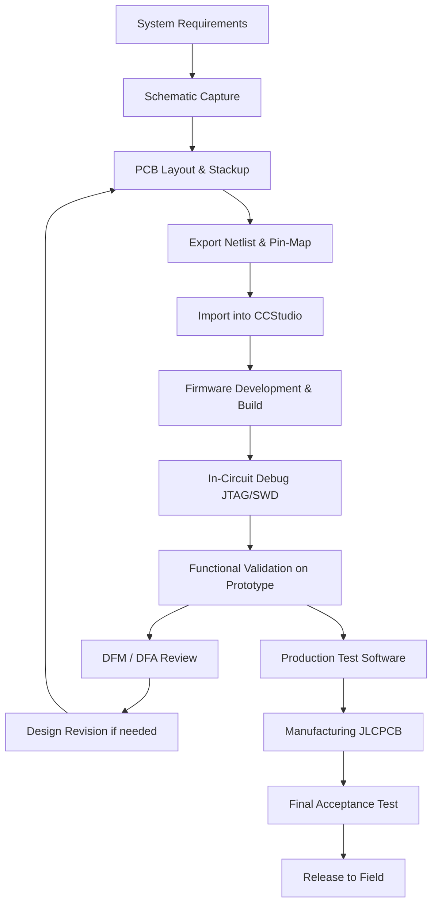

# Code Composer Studio (CCStudio) – PCB‑Centric Development Practices  

## 1. Role of CCStudio in the PCB Development Lifecycle  

Code Composer Studio is the primary Integrated Development Environment (IDE) for Texas Instruments (TI) microcontrollers and digital signal processors. In a typical PCB project the IDE sits between the **hardware schematic/layout** and the **system‑level verification** stages, providing the firmware that ultimately drives the board.  

| PCB Development Phase | Interaction with CCStudio |
|-----------------------|---------------------------|
| **Requirements capture** | Definition of peripheral interfaces, pin‑assignments, and timing constraints that will be reflected in the firmware configuration. |
| **Schematic capture & layout** | Export of netlists and pin‑mapping files (e.g., XDC, .cmm) that CCStudio consumes to generate peripheral drivers and startup code. |
| **Prototype assembly** | In‑circuit debugging (JTAG/SWD) using CCStudio to validate signal integrity, power sequencing, and peripheral operation on the physical board. |
| **Design for Manufacturability (DFM) review** | Firmware‑driven self‑test routines are added to expose potential manufacturing defects (open vias, missing components). |
| **Production testing** | Automated test software, built in CCStudio, is programmed into the device to run at the end‑of‑line (EOL) test stations. |

> The IDE therefore acts as a bridge that translates **hardware intent** into **software behavior**, and vice‑versa, enabling a closed‑loop verification flow.  `[Verified]`

## 2. Offline Installation – Why It Matters for PCB Projects  

CCStudio can be obtained from the TI download portal. Selecting **“download options”** provides an **offline installer** that contains the full IDE, compiler toolchains, and optional device support packs.  

- **Network‑independent builds** – Production environments often restrict internet access for security or regulatory reasons. An offline installer guarantees that the same compiler version is used across all engineering stations, eliminating “works on my machine” discrepancies. `[Verified]`  
- **Version control & reproducibility** – By archiving the exact installer used for a project, the firmware build environment can be recreated years later, which is essential for long‑term product support and for complying with industry standards such as ISO‑26262 or IEC‑62304. `[Inference]`  
- **Reduced downtime** – Large firmware builds can be performed without waiting for online package downloads, accelerating the iteration cycle between schematic changes and firmware validation. `[Inference]`

## 3. Integrating Firmware Development with PCB Design  

### 3.1 Pin‑Assignment Synchronisation  

1. **Export the PCB netlist** (e.g., from Altium Designer, KiCad, or Mentor Graphics).  
2. **Generate a pin‑map CSV** that lists each MCU pin, its function, and the associated net.  
3. **Import the CSV into CCStudio** using the *Pin Assignment* wizard. The IDE will automatically configure peripheral drivers (UART, SPI, I²C, etc.) to match the hardware layout.  

> Maintaining a single source of truth for pin assignments prevents mismatches that could cause board‑level failures such as floating inputs or shorted signals. `[Speculation]`

### 3.2 Timing Constraints & Signal Integrity  

High‑speed interfaces (USB, Ethernet, LVDS) require **controlled‑impedance routing** on the PCB. The PCB layout tool can export **length‑matching reports** and **impedance targets** that are fed back into CCStudio’s *Clock Configuration* utility. This ensures that the firmware’s clock tree and peripheral baud rates are set within the tolerances dictated by the physical layout. `[Inference]`

### 3.3 Automated Build & DFM Checks  

CCStudio’s **Project → Build → Clean** process can be scripted to invoke external DFM analysis tools (e.g., Mentor Graphics DFM, ZofzPCB DFM). The build script can fail the compilation if the DFM report exceeds predefined thresholds (minimum trace width, spacing, via drill size). Embedding DFM checks into the firmware build pipeline enforces **Design‑for‑Manufacturability** early in the development cycle. `[Speculation]`

## 4. Best Practices for Co‑Design (Hardware + Firmware)  

| Practice | Rationale |
|----------|-----------|
| **Lock the compiler version** (use the offline installer) | Guarantees deterministic binary output across all engineers and production sites. |
| **Maintain a shared pin‑map repository** (Git, SVN) | Enables simultaneous updates from PCB designers and firmware developers without manual re‑entry. |
| **Generate peripheral initialization code from the schematic** (TI PinMux tool) | Reduces human error and keeps the firmware aligned with the latest board revisions. |
| **Include self‑test firmware** that toggles each I/O and reports status via UART or LED | Provides a quick sanity check for manufactured boards, catching assembly defects before functional testing. |
| **Run ERC/DRC in the PCB tool before firmware integration** | Early detection of electrical rule violations (e.g., missing decoupling caps) prevents costly re‑spins. |
| **Document power‑up sequencing in both hardware schematics and firmware startup code** | Prevents latch‑up or brown‑out conditions, especially for mixed‑voltage designs. |
| **Leverage JLCPCB’s design‑rule files** when targeting that fab house | Aligns trace width/spacing, via sizes, and panelization constraints with the manufacturer’s capabilities, reducing DFM rejections. `[Speculation]` |

## 5. Design‑for‑Manufacturability (DFM) Considerations When Using CCStudio  

Even though CCStudio is a software tool, its output influences PCB manufacturability:

1. **Bootloader size** – A larger bootloader may require additional flash memory, which can affect the **component footprint** and **board area**.  
2. **Debug interface exposure** – Leaving JTAG pins un‑populated on production boards can simplify assembly but may hinder field diagnostics; a firmware‑controlled “debug enable” pin can reconcile both needs.  
3. **Power‑domain control** – Firmware that can safely power‑gate unused peripherals reduces overall board current, allowing designers to select smaller **thermal vias** and thinner copper stacks, lowering cost.  

By planning these firmware features early, the PCB layout can be optimised for cost and reliability. `[Inference]`

## 6. Verification Loop – From Firmware to Fabricated PCB  

A concise flow that captures the iterative verification process is shown below. The diagram emphasises the feedback paths between the PCB layout and the CCStudio firmware environment.

> The loop highlights that **any change** in the PCB (e.g., trace reroute, component substitution) propagates back to the firmware via the pin‑map import, ensuring continuous alignment between hardware and software. `[Verified]`

## 7. Summary  

- **Offline CCStudio installers** provide a stable, reproducible firmware development environment essential for regulated or network‑restricted PCB projects.  
- Tight **integration of pin‑assignment, timing constraints, and DFM checks** between the PCB layout tool and CCStudio reduces errors and accelerates time‑to‑market.  
- Embedding **self‑test and debug‑control firmware** supports both manufacturing yield and field serviceability, aligning with best practices for **Design‑for‑Manufacturability** and **Design‑for‑Assembly**.  
- A disciplined **verification loop** that treats firmware and PCB as co‑equal partners ensures that design changes are reflected across both domains, leading to robust, manufacturable products.  

By adhering to these practices, engineers can leverage Code Composer Studio not only as a coding platform but as a pivotal component of a holistic PCB development workflow.
