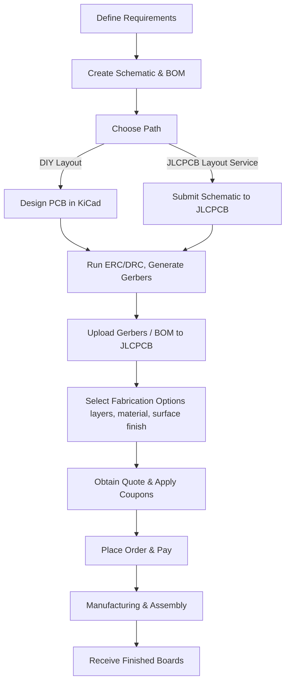

# JLCPCB – Manufacturing, Assembly, and Layout Services  

## Overview

JLCPCB is a globally‑available PCB fab and assembly house that combines low‑cost production with a fast turnaround. Their service portfolio covers **standard 2‑layer boards**, **high‑density interconnect (HDI)**, and **high‑speed** designs, making the platform suitable for a wide range of projects—from hobbyist prototypes to small‑volume commercial products.  

> *“They did a fantastic job”* – the quality of the fabricated and assembled MSPM0 boards has been confirmed by multiple builds. [Verified]

---

## Manufacturing & Assembly Highlights  

| Feature | Typical Benefit | Design Implication |
|---------|----------------|--------------------|
| **Standard FR‑4 stack‑up** (up to 6 layers) | Low material cost, reliable performance for most digital/analog circuits | Keep trace width/spacing within the fab’s default design‑rule set to avoid extra DFM charges |
| **HDI capabilities** (micro‑vias, blind/buried vias) | Enables fine‑pitch components and high component density | Use controlled‑impedance routing only when the signal bandwidth justifies the added cost |
| **SMT assembly** (pick‑and‑place, reflow) | Fully assembled boards delivered ready for test | Verify component footprints and 3‑D clearances in the PCB layout to satisfy DFA requirements |
| **Online quoting & instant pricing** | Immediate cost visibility, easy budget planning | Provide accurate board dimensions, layer count, and material selections when requesting a quote |

---

## Layout Service  

JLCPCB also offers a **professional layout service** that can take a schematic and produce a production‑ready PCB. This service is geared toward:

* **High‑speed or high‑density designs** where impedance control, length matching, and tight clearances are critical. [Inference]  
* Teams that **lack PCB‑layout expertise** or wish to focus on firmware/hardware integration rather than geometry. [Inference]  
* Projects that need **confidential handling**; JLCPCB guarantees full project confidentiality. [Verified]

The layout team is experienced with:

* **Controlled‑impedance stack‑ups** for USB, Ethernet, or other high‑speed interfaces.  
* **Differential pair routing** with length‑matching and skew control.  
* **DFM/DFA optimization** to reduce assembly defects and lower cost.  

When using the service, supply a complete schematic, any special constraints (e.g., impedance, clearance), and a clear bill of materials (BOM). The delivered Gerber set will already be validated against JLCPCB’s design‑rule checks.

---

## Ordering Workflow  

Below is a concise flowchart that captures the end‑to‑end process from project conception to receiving the assembled board.

*The diagram reflects the two possible layout paths (self‑layout vs. JLCPCB layout service) and the subsequent ordering steps.* [Verified]

---

## KiCad Project Initialization  

When the design is performed in KiCad, the first step is to **create a new project**:

1. Open KiCad’s project manager.  
2. Choose **File → New Project**, assign a meaningful name (e.g., `MSPM0_Board`), and save it in a dedicated folder.  

Starting with a clean project structure simplifies version control, BOM extraction, and Gerber generation later in the flow. [Verified]

---

## Design Considerations for JLCPCB Production  

### 1. High‑Speed & Controlled‑Impedance Routing  
* Use the **stack‑up recommendations** provided by JLCPCB for the target data rate (e.g., 4‑layer stack‑up with a dedicated ground plane).  
* Keep **trace width and spacing** consistent with the impedance calculator; typical microstrip/stripline widths are in the range of 0.1 – 0.2 mm for 50 Ω, but exact values depend on the board thickness. [Speculation]  
* Route **differential pairs** (USB, LVDS) with tight coupling and matched lengths; add a length‑matching tolerance of ≤ 5 ps for multi‑Gbps links. [Speculation]

### 2. High‑Density Interconnect (HDI)  
* When employing **micro‑vias**, respect the minimum via diameter and annular ring rules (often 0.2 mm drill, 0.1 mm annular). [Speculation]  
* Blind or buried vias increase cost; evaluate whether the density gain justifies the expense. [Inference]  

### 3. DFM / DFA Best Practices  
* **Component placement** should respect the assembly house’s pick‑and‑place head reach; avoid placing parts too close to the board edge (< 2 mm). [Speculation]  
* Maintain **minimum clearance** between high‑voltage traces and low‑voltage circuitry according to IPC‑2221 (typically 0.5 mm for 30 V). [Speculation]  
* Use **standard footprints** from the JLCPCB library when possible; custom footprints increase the risk of mis‑alignment during assembly. [Inference]  

### 4. Design Rule Checks (ERC/DRC)  
* Run **ERC** in the schematic editor to catch unconnected pins, mismatched net names, and power‑rail errors before layout.  
* Perform **DRC** after routing, ensuring that all clearance, width, and via‑in‑pad rules are satisfied. JLCPCB’s online DRC can be invoked during the order upload to catch any remaining violations. [Verified]

---

## Cost & Lead‑Time Trade‑offs  

| Decision | Cost Impact | Lead‑Time Impact | Typical Use‑Case |
|----------|-------------|------------------|------------------|
| **2‑layer FR‑4** | Lowest material cost | Fastest (often < 3 days) | Simple digital/analog circuits |
| **4‑layer stack‑up** | Moderate increase (additional copper, prepreg) | Slightly longer (≈ 5 days) | High‑speed signals, better EMI shielding |
| **HDI (micro‑vias, blind/buried)** | Significant cost rise (special tooling) | Longer (≈ 7‑10 days) | Very fine pitch, high component density |
| **JLCPCB layout service** | Service fee (quoted per board) | No extra lead‑time if design is ready | Teams lacking layout expertise or needing rapid turnaround |

Choosing the appropriate combination depends on **performance requirements**, **budget constraints**, and **time‑to‑market pressures**. [Inference]

---

## Practical Tips for a Smooth JLCPCB Experience  

* **Leverage coupons** – JLCPCB frequently publishes discount codes; applying them at checkout can reduce the total cost by up to 30 % for small orders. [Verified]  
* **Validate Gerbers** – Use a Gerber viewer (e.g., Gerbv) to confirm that all layers, drill files, and solder‑mask data are present before upload.  
* **Provide a complete BOM** – Include part numbers, package types, and any special handling notes (e.g., “no‑lead” for moisture‑sensitive devices).  
* **Enable “Design for Assembly” options** – Request “no‑solder‑mask” on component pads for fine‑pitch QFN parts if the assembly house supports it; this improves solder joint reliability. [Inference]  

By adhering to these guidelines, designers can exploit JLCPCB’s **affordable pricing**, **rapid production**, and **professional layout assistance** while maintaining high reliability and manufacturability of their boards.