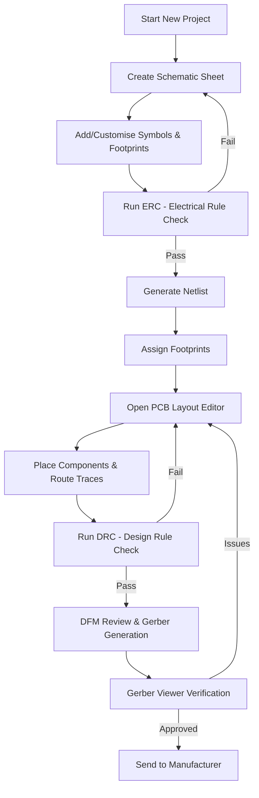

# 06 – Project and Schematic Creation  

## 1. Project Initialization  

When starting a new PCB design the first decision is **what the design will represent** – a single‑sheet schematic, a multi‑sheet hierarchy, or a complete board‑level project that includes both schematic and layout.  
Most modern EDA tools present the options in a logical order:

1. **Create a new schematic** – the natural entry point for any electronic design.  
2. **Create a custom schematic symbol** – required when the component library does not contain an exact match.  
3. **Open the PCB editor** – where footprints are assigned and the board is laid out.  
4. **Generate and view Gerber files** – the final manufacturing data set.  
5. **Access calculators** (e.g., trace‑width, impedance, component‑value) that aid in detailed design decisions.  

These steps reflect a **top‑down workflow** that keeps documentation, symbol/footprint creation, and verification tightly coupled.  

> **Best practice:** Create the project folder structure before opening the editor (e.g., `schematics/`, `footprints/`, `gerbers/`, `docs/`). This encourages version control and makes it easier to locate generated files later. [Verified]

---

## 2. Schematic Editor Basics  

### Navigation  

- **Zoom** – scroll wheel (or pinch gesture) to zoom in/out.  
- **Pan** – press‑and‑drag the middle mouse button to move the view.  
- **Selection** – left‑click and drag to create a selection box around components or wires.  

These navigation shortcuts are universal across most EDA platforms and enable rapid placement and editing of components.  

### Page Settings  

Every schematic sheet should contain a **title block** that records essential project metadata:

| Field | Typical Content | Reason |
|-------|----------------|--------|
| **Title** | Project name or part number | Immediate identification |
| **Date** | Current date (auto‑filled) | Traceability of revisions |
| **Revision** | Letter/number (e.g., “A”) | Change management |
| **Company / Designer** | Organization or individual name | Accountability |
| **Page Size / Orientation** | A4 portrait, A3 landscape, etc. | Compatibility with printing and documentation standards |

The title block is edited via the **Page Settings** dialog, where page size and orientation can also be adjusted to match the intended output format (e.g., A4 for hand‑drawn notes, A3 for large block diagrams).  

> **Tip:** If the design will be shared with external partners, adopt a standard title‑block template (e.g., IEC 61346) to avoid ambiguity. [Inference]

---

## 3. Component Selection and Library Management  

### Adding the Core MCU  

The central element of most embedded boards is the **microcontroller (MCU)**. After placing the MCU symbol, the surrounding circuitry must be added:

- **Power supply** – decoupling capacitors, voltage regulator, and bulk filtering.  
- **Programming interface** – typically a USB‑to‑UART bridge or SWD header.  
- **I/O peripherals** – generic pins, connectors, sensors, etc.  

### Custom Symbols & Footprints  

If a required part is missing from the default libraries:

1. **Create a custom schematic symbol** – define pins, electrical type, and graphical representation.  
2. **Create a matching footprint** – specify pad geometry, courtyard, and solder mask clearance.  

> **Why both are needed:** The symbol defines logical connectivity, while the footprint defines the physical pad layout that the PCB manufacturer will fabricate. [Verified]

> **Best practice:** Maintain a **single source of truth** by linking the custom symbol to its footprint through a unique library identifier. This prevents mismatches during netlist generation. [Inference]

### Design Rule Checks (ERC & DRC)  

- **ERC (Electrical Rule Check)** validates connectivity (e.g., unconnected pins, power‑net mismatches).  
- **DRC (Design Rule Check)** validates geometric constraints (e.g., minimum clearance, trace width).  

Running ERC early catches logical errors before any layout work begins, reducing re‑work cycles.  

> **Recommendation:** Configure ERC rules to flag missing decoupling caps on power pins of the MCU; this is a common source of stability problems. [Inference]

---

## 4. From Schematic to PCB  

Once the schematic is complete and ERC passes, the typical hand‑off sequence is:

1. **Generate a netlist** – a machine‑readable description of all connections.  
2. **Assign footprints** – either automatically (if the symbol already references a footprint) or manually for custom parts.  
3. **Open the PCB editor** – import the netlist and begin component placement.  
4. **Perform DFM review** – ensure component spacing, via sizes, and copper pours meet the chosen manufacturer’s capabilities.  
5. **Export Gerbers** – the final fabrication files, optionally reviewed with a Gerber viewer.  

> **Note:** Many tools allow a **single‑click transition** from schematic to layout, preserving netlist integrity and reducing human error. [Verified]

---

## 5. Recommended Development Flow  

The diagram below captures the high‑level flow from project creation to fabrication. It emphasizes the iterative nature of verification (ERC/DRC) and the feedback loop from Gerber review back to the schematic if errors are discovered.

*The flow is intentionally generic; specific tool‑chain steps (e.g., “Run Design Rule Check”) may be named differently in various EDA suites.* [Verified]

---

## 6. Key Takeaways  

| Aspect | Guideline |
|--------|-----------|
| **Title Block** | Populate with title, date, revision, and designer information on every sheet. |
| **Symbol/Footprint Consistency** | Use linked library entries; create custom parts only when necessary. |
| **Early Verification** | Run ERC immediately after placing the MCU and power circuitry. |
| **Documentation Discipline** | Keep revision letters/numbers sequential; archive previous revisions. |
| **Transition to Layout** | Generate a clean netlist, assign footprints, and import without manual netlist editing. |
| **Iterative Checks** | Treat DRC and Gerber review as loops that may send you back to schematic or layout. |

By adhering to these practices, designers ensure **traceability**, **manufacturability**, and **reliability** from the very first schematic sheet through to the final Gerber set. [Inference]