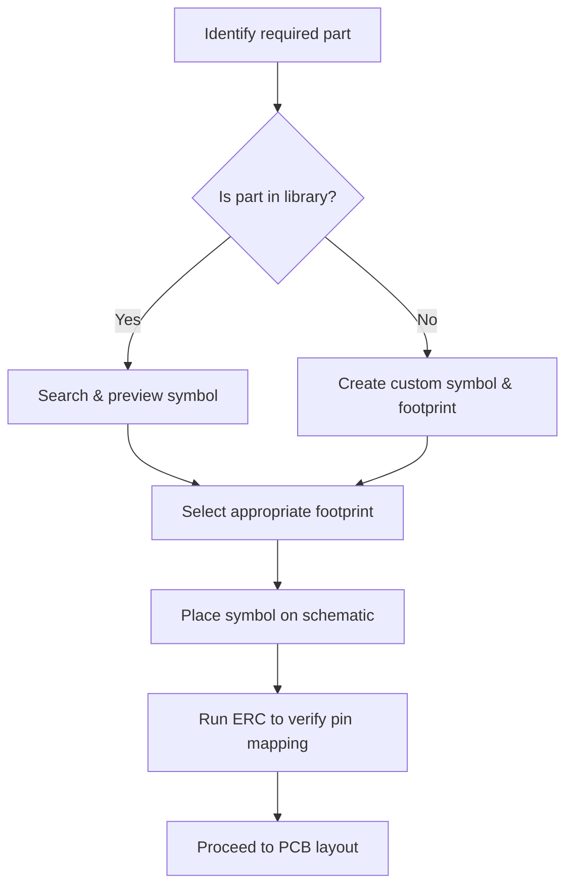

# Adding Components

## 1. Overview  

Adding parts to a KiCad schematic is performed through the **Place Symbol** tool (default hot‑key **A**) or by clicking the symbol‑library pane on the right side of the editor. KiCad ships with a comprehensive set of *symbol* and *footprint* libraries that cover passive components (resistors, capacitors, inductors) as well as many active devices (op‑amps, MCUs, memory). The workflow consists of locating the desired symbol, confirming the associated footprint(s), and inserting the part into the schematic with the correct pin mapping.  

> **Key point:** The symbol‑footprint association is established **once** (in the symbol editor or via the footprint chooser) and is then reused automatically whenever the part is placed. This eliminates the need to re‑select a footprint for each instance. [Verified]

---

## 2. Accessing the Symbol Library  

| Action | How to invoke |
|--------|---------------|
| Open the **Place Symbol** dialog | Press **A** or click the *“Place Symbol”* button on the right‑hand toolbar |
| Browse all available libraries | The dialog lists every library that is loaded in the current project (default KiCad libraries plus any user‑added ones) |
| Filter the list | Use the **search box** at the top of the pane; typing a partial name (e.g., `opamp`, `R`, `C`, `L`) instantly narrows the results |

The search function is case‑insensitive and matches both the *symbol name* and the *library name*, making it trivial to locate a part even in large libraries. [Verified]

---

## 3. Selecting Standard Parts  

### 3.1 Passive Components  

- **Resistors** – Type `R` in the filter to reveal several resistor symbols (single‑line, dual‑line, variable). Choose the one that matches the schematic convention of the project.  
- **Capacitors** – Type `C` to list ceramic, electrolytic, and tantalum symbols.  
- **Inductors** – Type `L` for standard and shielded inductor symbols.  

Each symbol preview includes a **footprint preview** button that displays the available land‑pattern options (e.g., 0603, 0805, 1206). Selecting the appropriate footprint at this stage ensures that the schematic and layout stay synchronized. [Verified]

### 3.2 Active Devices  

For more complex parts such as **operational amplifiers**, type the exact part number (e.g., `TL072`) to pull up the exact symbol and its associated footprints (SOIC‑8, TSSOP‑8, etc.). KiCad’s default libraries already contain many common op‑amps, microcontrollers, and memory devices.  

> **Best practice:** Prefer the *exact* device symbol (including package) rather than a generic “op‑amp” placeholder. This reduces the risk of pin‑mapping errors and simplifies ERC checks later in the design flow. [Inference]

---

## 4. Footprint Association & Verification  

When a symbol is placed, KiCad automatically assigns the *default* footprint that is stored in the symbol definition. The designer can override this choice in the **Footprint Chooser** dialog that appears after placement, or later via the **Properties → Footprint** field.  

### 4.1 DFM Considerations  

- **Pad size & spacing** – Verify that the chosen footprint meets the PCB fabricator’s minimum annular‑ring and clearance rules.  
- **Thermal relief** – For power‑handling parts (e.g., voltage regulators), enable thermal relief on copper pours to aid solderability.  
- **3‑D model** – Use the 3‑D preview to confirm that the component height will clear any mechanical constraints (e.g., enclosure, connector height).  

Running **ERC (Electrical Rule Check)** after all parts are placed catches mismatched pin numbers or missing power pins, while **DRC (Design Rule Check)** later in the layout stage validates that the selected footprints respect clearance and copper‑spacing rules. [Verified]

---

## 5. Creating Custom Symbols & Footprints  

When a required part is **not** present in the default libraries (e.g., a specific MCU variant), a custom symbol must be created:

1. **Create a new library** (File → New Symbol Library) and give it a meaningful name (e.g., `My_MCU`).  
2. **Add a new symbol** and draw the pin layout, matching the device’s datasheet pinout exactly.  
3. **Assign a footprint** – either select an existing footprint that matches the package or create a new one in the Footprint Editor.  
4. **Save and link** – the symbol now appears in the Place Symbol dialog and can be filtered like any other part.  

> **Trade‑off:** Custom symbols increase the maintenance burden (they must be kept up‑to‑date if the device revision changes) but they provide **exact pin mapping**, which dramatically reduces the chance of wiring errors in the final board. [Inference]

---

## 6. Recommended Workflow  

*The diagram illustrates the decision path from part identification to schematic insertion, emphasizing the ERC checkpoint before moving to layout.* [Speculation]

---

## 7. Best‑Practice Checklist  

| Area | Recommendation |
|------|----------------|
| **Library hygiene** | Keep a separate *project‑specific* library for custom parts; avoid editing the default KiCad libraries directly. |
| **Naming convention** | Use a consistent pattern such as `<Manufacturer>_<PartNumber>_<Package>` for both symbols and footprints. |
| **Pin mapping** | Double‑check the datasheet against the symbol pins; use the **Pin Table** view in the symbol editor for quick verification. |
| **Footprint selection** | Choose the smallest package that satisfies electrical and thermal requirements to reduce board size and cost. |
| **ERC/DRC** | Run ERC immediately after all parts are placed; run DRC after routing to catch clearance violations early. |
| **Version control** | Store symbol and footprint libraries in the same repository as the schematic and layout files to keep them synchronized. |

---

## 8. Summary  

KiCad’s built‑in symbol and footprint libraries streamline the addition of standard components, while the **filter‑search** capability makes locating the correct part fast and reliable. For devices not covered by the default libraries—such as a specific MCU—creating a **custom symbol** (and, if necessary, a custom footprint) is the recommended approach. Consistent library management, careful footprint selection, and early ERC/DRC checks are essential to maintain design integrity, improve manufacturability, and avoid costly revisions later in the PCB development cycle. [Verified]