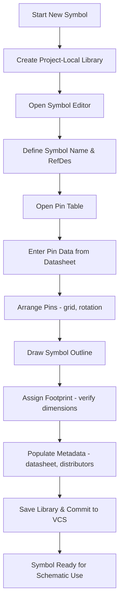

# Creating Schematic Symbols  

*This section describes a repeatable, high‑quality workflow for building schematic symbols in KiCad (or any comparable EDA tool). It covers library organization, pin entry, geometry, footprint association, and essential metadata. Following these practices reduces downstream ERC/DRC errors, improves design‑for‑manufacturability (DFM), and streamlines hand‑off to assembly houses.*

---  

## 1. Library Strategy  

| Library Scope | Typical Use | Advantages |
|---------------|------------|------------|
| **Project‑local** | Symbols needed only for a single board | Automatically bundled with the project; no risk of polluting a global library. |
| **Global** | Parts reused across many projects (e.g., common MCUs, connectors) | Central maintenance; one‑source of truth for the organization. |

> **Best practice:** Create a **project‑local library** for new or experimental parts, then promote to a global library only after the symbol has been validated. This keeps the global namespace clean and avoids accidental version drift.  [Verified]

---

## 2. Naming Conventions  

1. **Symbol name** – Use the full manufacturer part number (e.g., `MSP430G3507`). This guarantees uniqueness and makes searching intuitive.  
2. **Reference designator** – Default to the industry‑standard letter for the device class:  
   * `R` for resistors, `C` for capacitors, `U` (or `IC`) for integrated circuits, `J` for connectors, etc.  
3. **Pin numbers** – Preserve the numeric order from the datasheet (1 → N). This simplifies cross‑checking between schematic and layout.  

> Consistent naming eliminates ambiguity during ERC checks and when generating BOMs. [Verified]

---

## 3. Pin Definition Workflow  

### 3.1 Preferred Method – Pin Table  

1. Open the **Pin Table** (toolbar button or `P` shortcut).  
2. Click the **+** icon to add rows in bulk.  
3. Fill columns: **Number**, **Name**, **Electrical Type**, **Graphic Style**, **Length**.  

> Using the table is dramatically faster than invoking the single‑pin dialog 64 times for a 64‑pin MCU. [Verified]

### 3.2 Electrical Types  

| Electrical Type | Typical Use |
|-----------------|-------------|
| **Power Input** | VDD, VCC, VSSA – pins that must be driven by a supply. |
| **Power Output** | VCORE, VREF – pins that source internal regulators. |
| **Bidirectional** | General‑purpose I/O (GPIO), UART TX/RX, SPI MOSI/MISO. |
| **Passive** | Ground pins, test points. |
| **Open‑Drain** | I²C SDA, certain control lines. |
| **No Connect** | Unused pins that must remain floating. |

> Selecting the correct electrical type enables automatic ERC warnings for missing power pins or illegal connections. [Verified]

### 3.3 Geometry & Orientation  

* **Pin length** – 100 mil (≈2.54 mm) is a widely accepted default; it provides enough clearance for net labels while staying within typical DRC limits.  
* **Grid** – Adopt a **100 mil grid** for symbol creation. This aligns pins, text, and the symbol outline, simplifying later placement on the schematic sheet.  
* **Rotation** – Use `R` to rotate pins in 90° increments, arranging power pins at the top, ground at the bottom, and I/O on the sides for readability.  

> A uniform grid prevents “snapped‑off” pins that can cause ERC failures when the symbol is moved. [Verified]

---

## 4. Extracting Pin Data from the Datasheet  

1. Locate the **Pin Configuration** table (often in Section 6 of MCU datasheets).  
2. Verify the **package variant** (e.g., LQFP‑48) matches the physical part you will use.  
3. Record each pin’s **number**, **name**, and **function** (including alternate functions).  
4. Consult the **Pin Attributes** table (usually Section 6.2) for drive strength, 5 V tolerance, open‑drain capability, etc., and map these to the appropriate **Electrical Type** in the symbol editor.  

> Relying on the manufacturer’s official tables eliminates the risk of mismatched pin assignments that can cause functional failures. [Verified]

---

## 5. Symbol Outline  

* Draw a rectangle (or other shape) that encloses the pins.  
* Align the rectangle’s top‑left corner with the origin of the 100 mil grid – this provides a deterministic reference point for the symbol’s placement on the schematic.  
* Set the rectangle’s **border width** and **fill color** to the default “body background” for visual consistency.  

> A clean outline improves readability and ensures the symbol’s bounding box is correctly interpreted by the schematic viewer. [Verified]

---

## 6. Footprint Association  

1. Open **Symbol Properties** → **Footprint** field.  
2. Click the library chooser (book icon) and select the footprint that matches the exact **mechanical dimensions** of the package (e.g., `LQFP-48_7x7mm_P0.5mm`).  
3. **Cross‑check** the footprint dimensions against the datasheet’s **Mechanical Packaging** section (typically Section 12). Verify:  
   * Overall width/length (≈7 mm for a 0.5 mm pitch LQFP‑48).  
   * Pad size and spacing.  
   * Courtyard and silk‑screen clearance.  

> Different manufacturers may label the same package differently (e.g., “LQFP‑48” from TI vs. ST). Always confirm the footprint geometry rather than relying on the name alone. [Verified]

---

## 7. Enriching Symbol Metadata  

Populating the following fields dramatically eases BOM generation, component sourcing, and assembly communication:

| Field | Recommended Content |
|-------|----------------------|
| **Description** | Human‑readable summary (e.g., “MSP430G3507 48‑pin MCU, 16 MHz, 64 KB Flash, 8 KB RAM”). |
| **Datasheet URL** | Direct link to the PDF on the manufacturer’s site. |
| **Manufacturer** | `Texas Instruments` (or appropriate vendor). |
| **Manufacturer Part Number** | Exact part number (`MSP430G3507`). |
| **Distributor Links** | URLs to Mouser, Digi‑Key, etc. (at least two). |
| **LCSC Part Number** | Required for JLCPCB assembly orders. |
| **Value** | Usually left blank for ICs; can hold a short part‑type tag if desired. |

> Including these attributes enables automated BOM tools to fetch pricing, availability, and alternative parts without manual lookup. [Verified]

---

## 8. Saving & Version Control  

* Use **Save All** (toolbar) to write both the symbol and its library file.  
* Commit the library file to your project’s version‑control system (Git, SVN, etc.) alongside the schematic.  
* Tag releases when a symbol is promoted from project‑local to global.  

> Version‑controlled libraries guarantee that every team member works with the same symbol definitions, preventing “symbol drift” across revisions. [Verified]

---

## 9. Workflow Summary  

*The flowchart captures the essential steps from library creation to a fully‑qualified symbol ready for placement.*  

---

## 10. Key Takeaways  

| Aspect | Recommendation |
|--------|----------------|
| **Library Scope** | Begin with a project‑local library; promote only after validation. |
| **Naming** | Use full manufacturer part numbers; default to `U` for ICs. |
| **Pin Entry** | Prefer the Pin Table for bulk entry; set correct electrical types. |
| **Grid & Units** | Work on a 100 mil grid; keep pin length at 100 mil. |
| **Footprint** | Verify mechanical dimensions against the datasheet; do not rely on name alone. |
| **Metadata** | Fill description, datasheet link, manufacturer, and at least two distributor URLs plus LCSC part number. |
| **Version Control** | Save and commit libraries with every change. |

Adhering to these practices yields symbols that are **accurate**, **consistent**, and **assembly‑ready**, reducing the risk of costly redesigns and streamlining the entire PCB development lifecycle.   [Verified]