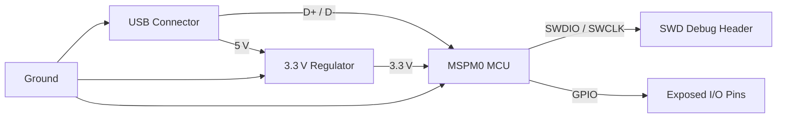

# Adding the MCU to the Schematic  

## 1. Placing the MCU Symbol  

When the custom MCU symbol (e.g., **MSPM0**) is ready, insert it into the schematic using KiCad’s *Add Symbol* command ( `A` ).  

* **Search & select** the newly‑created part and confirm the dialog.  
* The part is initially placed at the origin (0 , 0). KiCad automatically assigns the designator **U1** – the default “U?” placeholder is replaced once the part is placed.  
* **Grid management** – switch to a 100 mil grid (`N` → grid size = 100) and keep it throughout the schematic entry. This uniform grid simplifies component alignment, improves readability, and reduces the risk of accidental mis‑placement during later editing. [Verified]  

> **Tip:** Use the mouse wheel to zoom, the middle‑mouse button to pan, and `Esc` to cancel a placement command. Moving the designator (press `M`) to a clean location (e.g., top‑right of the symbol) keeps the schematic tidy. [Inference]

## 2. Defining the Immediate MCU Support Network  

With the MCU on the sheet, the next step is to add the circuitry that is **intrinsically required** for this device to operate:

| Sub‑system | Typical KiCad symbol | Reason for inclusion |
|------------|---------------------|----------------------|
| **Power & Ground** | `+5 V`, `GND` nets | Provides the primary supply rails; the MCU itself runs on 3.3 V, so a regulator is needed. |
| **USB Connector** | USB‑type‑A/B or micro‑USB | Serves as the data interface and the source of the 5 V nominal input. |
| **3.3 V Regulator** | LDO or buck converter | Steps the 5 V USB input down to the MCU’s VDD (3.3 V). |
| **SWD (Serial Wire Debug) Port** | Two‑wire header (SWDIO, SWCLK) + optional reset | Enables in‑system programming and debugging. |
| **I/O Expansion / Test Points** | Generic I/O pins, test‑point symbols | Exposes selected MCU pins for external peripherals or measurement. |

These blocks form the **core functional envelope** around the MCU and will be expanded later with peripheral circuitry (e.g., sensors, communication transceivers). [Inference]

## 3. Best‑Practice Guidelines for Schematic Entry  

### 3.1 Grid Consistency  
* **Maintain a 100 mil grid** for all component placement. Deviating from this grid can cause mis‑aligned pins, making the subsequent PCB layout more error‑prone. [Inference]

### 3.2 Designator Management  
* Allow KiCad to **auto‑annotate** designators (U1, C1, R1, …). After placement, move the text label away from the symbol body to avoid visual clutter. [Verified]

### 3.3 Power Net Naming  
* Use **canonical net names** (`+5V`, `+3V3`, `GND`) consistently across all sheets. This reduces ERC (Electrical Rule Check) warnings and clarifies power distribution early in the design. [Inference]

### 3.4 Decoupling Strategy (Implicit)  
* For every supply pin of the MCU, plan a **0.1 µF ceramic decoupling capacitor** placed as close as possible to the pin in the layout. Although not shown in the schematic, this is a standard requirement for reliable operation. [Speculation]

### 3.5 Signal Integrity Considerations (Implicit)  
* The **USB D+ / D‑** pair should be routed as a differential pair with controlled impedance (≈ 90 Ω differential) in the PCB layout. Adding the USB connector at the schematic stage reminds the designer to reserve appropriate routing resources later. [Speculation]

## 4. High‑Level Block Diagram  

The following Mermaid diagram captures the logical relationships among the primary blocks introduced in this chapter.

*Arrows indicate the direction of power or signal flow.* [Inference]

## 5. Next Steps After Symbol Placement  

1. **Add power rails** (`+5 V`, `+3.3 V`, `GND`) and connect them to the appropriate pins on the MCU symbol.  
2. **Insert the USB connector** and route its VBUS line to the regulator input.  
3. **Place the SWD header** and connect the SWDIO/SWCLK pins; optionally add a reset line.  
4. **Expose selected GPIOs** with generic pin symbols or test‑point markers, preparing for later peripheral integration.  
5. Run **ERC** to catch unconnected pins, net mismatches, or missing power connections before moving to PCB layout.  

Following these steps ensures a clean, well‑structured schematic that translates directly into a manufacturable PCB layout. [Inference]