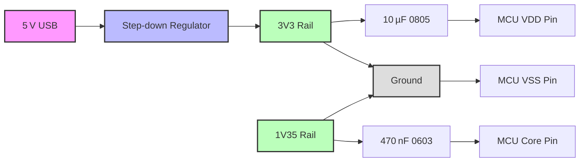

# MCU Power & Ground Connections  

This section documents the recommended workflow, component choices, and PCB‑level best practices for supplying power to a microcontroller (MCU) and establishing its ground reference. The guidance is written for KiCad but the principles apply to any modern EDA tool.

---

## 1. Overview  

A robust power distribution network (PDN) for an MCU consists of three essential elements:

1. **Ground reference (GND / VSS)** – a low‑impedance return path for all signals.  
2. **Primary supply rail (VDD)** – typically 3.3 V for the MSPM0 family, derived from an external regulator or USB‑bus.  
3. **Core rail (VCORE)** – an internally generated 1.35 V rail that powers the MCU’s core logic.  

Both rails require dedicated decoupling capacitors placed as close as possible to the MCU pins to suppress transients and maintain stability across the full operating voltage range (1.62 V – 3.6 V) [Verified].

---

## 2. Power Symbol Placement & Naming Conventions  

| Symbol | Recommended Net Name | Reason |
|--------|---------------------|--------|
| **VDD** | `3V3` (instead of `3.3V`) | The dot in “3.3V” can be lost in dense schematics; `3V3` is unambiguous [Verified]. |
| **VCORE** | `1V35` | Mirrors the MCU‑specified core voltage (1.35 V). |
| **GND** | `GND` (or `VSS`) | Standard 0 V reference. |

*Power symbols are inserted via the **Place → Power Symbol** command (shortcut **P**) and can be renamed by double‑clicking the symbol and editing the **Value** field [Verified].*  

### Hiding the Ground Symbol

When a schematic contains only a single ground net, the visual ground symbol can be hidden to reduce clutter:

1. Double‑click the ground symbol.  
2. Uncheck **Show value**.  

The net remains electrically connected; only the graphical representation is suppressed [Verified].

---

## 3. Ground Connection Strategy  

The MCU’s VSS pin (pin 7 on the MSPM0) is tied directly to the global ground net. Ensure that the ground symbol is placed **exactly on the pin** to avoid implicit net‑splits that could trigger ERC errors.  

*Best practice:* keep the ground plane continuous on the PCB layer stack‑up and avoid splitting it unless required for analog isolation [Inference].

---

## 4. Decoupling Capacitor Selection & Placement  

### 4.1 Required Values  

| Net | Recommended Decoupling | Value |
|-----|------------------------|-------|
| **VDD** | Bulk decoupling + high‑frequency bypass | **10 µF** (MLCC) |
| **VCORE** | High‑frequency bypass | **470 nF** (MLCC) |

These values are taken directly from the MSPM0 datasheet [Verified].

### 4.2 Capacitor Type & Dielectric  

* **Multilayer Ceramic Capacitors (MLCCs)** are the default choice for both bulk and bypass capacitors.  
* **Dielectric:** X5R or X7R – provide stable capacitance over temperature and voltage, suitable for decoupling [Verified].  
* **Tolerance:** 10 % is acceptable for PDN purposes; tighter tolerances rarely affect MCU stability [Inference].

### 4.3 Footprint Selection & Derating  

| Value | Recommended Imperial Package | Rationale |
|-------|------------------------------|-----------|
| 10 µF | **0805** (0.125 × 0.062 in) | Larger area reduces voltage‑bias derating and eases placement near the MCU [Inference]. |
| 470 nF | **0603** (0.06 × 0.03 in) | Small footprint sufficient for high‑frequency bypass; lower capacitance reduces size [Verified]. |

**Voltage rating rule of thumb:** select a capacitor with a rating at least **2×** the maximum DC voltage it will see (≥ 10 V for a 3.3 V rail). This provides margin for DC‑bias capacitance loss [Inference].

### 4.4 Placement Guidelines  

* Place each decoupling capacitor **as close as possible** to the corresponding MCU pin (ideally within 1 mm).  
* Route the capacitor leads directly to the power pin and the ground plane; avoid long traces that introduce inductance.  
* Use a **via‑in‑pad** for the ground side when possible to minimize loop area, but verify that the via does not violate the manufacturer’s minimum annular ring rules [Speculation].

---

## 5. Footprint & Part‑Number Management (Library Hygiene)  

KiCad’s built‑in symbols lack footprint, manufacturer, and distributor data. To avoid repetitive data entry:

1. **Create a custom schematic library** for each component family (e.g., `MLCC_0805`).  
2. Populate the following fields for every symbol:  
   * **Footprint** (e.g., `C_0805_2012Metric`).  
   * **Manufacturer Part Number**.  
   * **Distributor URLs** (e.g., Digi‑Key, Mouser).  
   * **LCSC Part Number** (useful for JLCPCB assembly).  
3. When a symbol is copied, all fields propagate automatically, eliminating manual re‑entry [Verified].

### DFM Considerations  

* Prefer **JLCPCB standard parts** (e.g., LCSC‑listed components) because they are stocked on the assembly line, reducing BOM cost and avoiding extra search fees [Verified].  
* Avoid exotic package sizes unless the electrical performance truly demands them; standard 0603/0805 parts are universally supported by pick‑and‑place machines [Inference].

---

## 6. Net Wiring & Junction Practices  

* **Power symbols** are connected to the MCU pins and decoupling capacitors using simple wires.  
* When three or more nets intersect, KiCad automatically creates a **junction dot**; this explicitly indicates a shared node and prevents ERC warnings [Verified].  
* For repetitive connections (e.g., multiple decoupling caps), use **copy‑paste** (`Ctrl C / Ctrl V`) followed by **mirroring** (`X` for X‑axis, `Y` for Y‑axis) to maintain symmetry and reduce layout time [Verified].

---

## 7. Replicating the Core Power Net  

The same workflow used for the 3.3 V rail applies to the 1.35 V core rail:

1. Place the `1V35` power symbol.  
2. Insert a 470 nF MLCC (0603).  
3. Connect the symbol, capacitor, and MCU core pin with wires, creating a junction dot.  
4. Mirror the assembly if multiple MCUs share the same core rail.

This ensures consistent decoupling across both rails and simplifies ERC validation [Verified].

---

## 8. External Power Sources & Clock Considerations (Brief)  

* **5 V USB input** → **step‑down regulator** → `3V3` rail. The regulator should be placed **upstream** of the bulk decoupling capacitor to keep the PDN stable under load transients.  
* For timing‑critical interfaces (USB, UART), an **external crystal** is recommended over the internal RC oscillator. The crystal and its load capacitors should be placed close to the MCU’s oscillator pins, respecting the manufacturer’s load‑capacitance formula [Inference].

---

## 9. Summary of Best Practices  

| Area | Recommendation |
|------|----------------|
| **Symbol naming** | Use `3V3` and `1V35` to avoid ambiguity. |
| **Ground handling** | Hide the ground symbol when only one ground net exists; keep the ground plane continuous. |
| **Decoupling** | 10 µF (0805) for VDD, 470 nF (0603) for VCORE; select voltage rating ≥ 2× rail voltage. |
| **Footprint selection** | Choose the smallest package that meets voltage and derating requirements; larger packages for higher capacitance. |
| **Library creation** | Store manufacturer part numbers, distributor links, and footprints in custom symbols; reuse via copy‑paste. |
| **Component sourcing** | Prefer JLCPCB/LCSC standard parts for cost‑effective assembly. |
| **Routing** | Keep power‑to‑capacitor traces short; use via‑in‑pad for ground where allowed. |
| **Mirroring** | Use X/Y mirroring to duplicate symmetric power networks quickly. |
| **External supplies** | Place regulators before bulk decoupling; add crystal for high‑precision timing. |

Following these guidelines yields a clean, manufacturable schematic and a reliable PDN that meets the MSPM0’s electrical requirements while minimizing BOM cost and layout effort.

---

## 10. Power‑Net Relationship Diagram  

*The diagram illustrates the hierarchical relationship between the external USB supply, the regulated 3.3 V rail, the internal 1.35 V core rail, their respective decoupling capacitors, and the MCU pins.*  

---  

*All recommendations are based on the MSPM0 datasheet specifications, standard PCB design practice, and proven KiCad workflow patterns.*