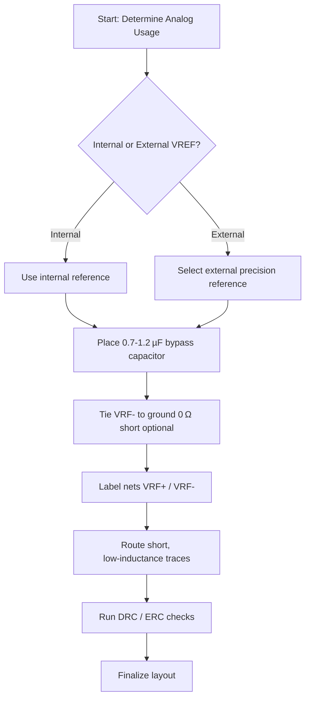

# Analog VREF – PCB Design Guidelines  

---  

## 1. Overview  

Modern mixed‑signal MCUs (e.g., the MSPM0 family) expose dedicated **VRF‑** and **VRF+** pins that feed the analog front‑end (ADC, DAC, comparators, op‑amps, etc.). Supplying a low‑noise, well‑regulated voltage to these pins is essential for achieving the full accuracy and noise performance of the on‑chip analog blocks. This section details the PCB‑level decisions, constraints, and best practices for handling the VRF reference network.

---  

## 2. Voltage‑Reference Options  

| Option | Description | Typical Voltage Range | Decoupling Requirement |
|--------|-------------|-----------------------|------------------------|
| **Internal reference** | The MCU generates a reference internally; the designer only provides a bypass capacitor. | 1.4 V – 2.5 V [Verified] |
| **External reference** | An external precision reference is injected on VRF+; VRF‑ is tied to ground. | 1.4 V – VDD (3.3 V in this design) [Verified] |

**Key trade‑off** – Using an external reference improves absolute accuracy and can lower the noise floor, but adds BOM cost and board‑space. For a demo board where ADC usage is minimal, the internal reference with a modest bypass capacitor is acceptable and reduces part count.  

---  

## 3. Decoupling & Bypass  

### 3.1 Recommended Capacitance  

The datasheet specifies a decoupling capacitor **0.7 µF – 1.2 µF** on the VRF pins [Verified]. This capacitor must be placed **as close as possible** to the VRF+ / VRF‑ pins to minimize loop inductance and ensure a low‑impedance supply at the analog frequencies of interest.

### 3.2 Practical Value Selection  

For a low‑cost demo board the designer may consolidate parts and use a **470 nF** (0.47 µF) ceramic capacitor already present in the BOM. Although this is ~½ of the nominal recommendation, it provides sufficient bypass for modest ADC activity and keeps the component list short.  

> **Design tip** – When the analog block is heavily used (high‑speed ADC, DAC, or precision comparators), select a capacitor at the upper end of the recommended range or parallel a 0.47 µF with a 0.1 µF to improve high‑frequency attenuation. [Inference]

### 3.3 Placement  

- Place the capacitor **directly adjacent** to the VRF pins (preferably on the same layer).  
- Keep the **trace length** from each pin to the capacitor ≤ 2 mm to reduce parasitic inductance.  
- Use a **ground pour** or solid ground plane under the capacitor to provide a low‑impedance return path.  

---  

## 4. Configurable Ground Connection (VRF‑)  

### 4.1 Why a 0 Ω “Resistor”  

VRF‑ is normally tied to the system ground. However, using a **0 Ω resistor footprint** (effectively a short) provides a **removable link**: the designer can later depopulate the part to disconnect the reference without redesigning the board. This is useful when switching between internal and external references or when troubleshooting.  

> **Inference** – The 0 Ω part acts as a “jump‑wire” that can be removed without affecting the netlist, simplifying design iteration.  

### 4.2 Implementation Steps (KiCad)  

1. Insert a 0 Ω resistor (e.g., **R603** 0603 footprint) between VRF‑ and the ground symbol.  
2. Assign a clear reference designator (e.g., **RVRF0**) and fill in manufacturer part number, footprint, and description.  
3. Route the short to the nearest ground plane.  

If the design never uses the analog peripherals, the 0 Ω link can be omitted entirely, further reducing BOM cost.  

---  

## 5. Net Naming & Documentation  

### 5.1 Importance of Explicit Net Labels  

Unnamed nets inherit autogenerated names such as `U1-PA21`, which are cryptic during layout, DRC, and design reviews. Assigning **human‑readable net labels** (e.g., `VRF+`, `VRF-`) improves:  

- **Readability** – Quick identification of power domains.  
- **Error detection** – ERC/DRC warnings are easier to interpret.  
- **Collaboration** – Reviewers can spot mis‑routed signals instantly.  

### 5.2 Procedure (KiCad)  

- Activate the **Place Net Label** tool (`L`).  
- Click on the wire segment and type the desired label (`VRF+` or `VRF-`).  
- Verify that the label appears in the **Netlist** panel and that all connected wires share the same net name.  

> **Speculation** – Consistent net naming also aids automated BOM generation scripts and downstream manufacturing data checks.  

---  

## 6. PCB Layout Considerations  

### 6.1 Power‑Plane Strategy  

- **Analog reference plane**: Keep VRF+ and VRF‑ on a **dedicated analog ground plane** or a well‑controlled analog region of the main ground plane to isolate them from noisy digital return currents.  
- **Separation**: Maintain at least a **few mils** of clearance between the analog reference traces and high‑frequency digital traces to reduce coupling.  

### 6.2 Trace Routing  

- Use **wide, short traces** for VRF+ and VRF‑ to lower resistance and inductance.  
- Avoid routing VRF+ under or over high‑speed digital lines; if unavoidable, place a **ground shield** (via‑stitched) between them.  

### 6.3 Via Usage  

- For a two‑layer board, a **through‑hole via** from VRF+ to the capacitor is acceptable.  
- In multi‑layer designs, consider a **blind via** to connect VRF+ directly to the analog plane, minimizing stub length.  

---  

## 7. Design‑for‑Manufacturability (DFM) & BOM Consolidation  

- **Component sharing**: Re‑using an existing 470 nF capacitor (C2) for the VRF bypass reduces part count and assembly time.  
- **0 Ω resistor**: Selecting a standard 0603 0 Ω part (already stocked) avoids special ordering.  
- **Footprint consistency**: Stick to a single package family (e.g., 0603) for all passive components in the analog reference network to simplify placement and solder paste generation.  

> **Inference** – Consolidating parts not only cuts cost but also reduces the risk of placement errors and improves yield.  

---  

## 8. Decision Flow for VRF Implementation  

---  

## 9. Summary  

- **VRF+ / VRF‑** pins supply the analog core; choose internal or external reference based on accuracy and cost requirements.  
- Provide a **0.7 µF – 1.2 µF** decoupling capacitor as close as possible to the pins; a 470 nF part is acceptable for low‑usage designs.  
- Use a **0 Ω resistor** to make the ground connection removable, facilitating design iteration.  
- **Explicit net labeling** (`VRF+`, `VRF-`) is essential for clear schematics, reliable routing, and efficient reviews.  
- Follow **layout best practices** (short, wide traces, analog‑ground isolation) and **DFM strategies** (part consolidation, consistent footprints) to achieve a robust, low‑cost board.  

By adhering to these guidelines, designers can ensure that the analog reference network delivers the required performance while keeping the PCB design simple, manufacturable, and cost‑effective.