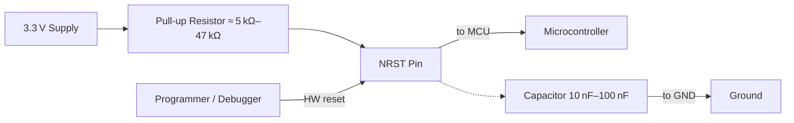

# NRST Pin – Reset Circuitry Design Guidelines  

The **NRST** (active‑low reset) pin is the primary means of placing the MCU into a known state. Proper implementation on the PCB ensures reliable power‑up, safe debugging, and protection against spurious resets caused by noise or ESD events.

---

## 1. Functional Overview  

| Signal | Default State | Action |
|--------|---------------|--------|
| **NRST** (active‑low) | High (logic 1) – MCU runs | Pull low → MCU enters reset |

A pull‑up to the core supply (**VDD**, typically 3.3 V) is required for the device to start. Without this bias the MCU will remain in reset indefinitely. A small bypass capacitor on the NRST line forms an RC low‑pass filter that controls the rise time of the pin and attenuates high‑frequency glitches.  

*The diagram shows the essential NRST network, including the optional debugger connection.*  

---

## 2. Pull‑Up Resistor Selection  

| Consideration | Guidance |
|---------------|----------|
| **Resistance range** | 4.7 kΩ – 100 kΩ is acceptable. Lower values give a faster rise time and stronger immunity to noise, while higher values reduce static power consumption. |
| **Typical value** | 5.1 kΩ is a good compromise for most designs, providing a quick reset release without excessive current draw. |
| **Zero‑Ω prohibition** | A direct short to VDD eliminates the RC time constant and prevents the debugger from pulling the pin low, defeating hardware reset capability. |
| **Placement** | Locate the resistor as close as possible to the NRST pin to minimise stray inductance and ensure the intended RC behaviour. |
| **Tolerance & temperature** | Use a resistor with a stable temperature coefficient (e.g., 1 % metal film) to keep the pull‑up value consistent across operating conditions. |

*The chosen value does not need to be exact; any value within the stated range will satisfy the MCU’s reset requirements.* **[Verified]**

---

## 3. Decoupling Capacitor on NRST  

| Parameter | Recommendation |
|-----------|----------------|
| **Capacitance** | 10 nF – 100 nF is typical. Larger values increase the RC time constant, delaying start‑up; smaller values provide less filtering. |
| **Dielectric** | X7R or C0G/NP0 for stable capacitance over temperature. |
| **Placement** | Directly adjacent to the NRST pin, preferably on the same side of the board as the MCU to minimise trace length. |
| **Purpose** | • Controls the rise time of NRST (RC = R × C).  • Suppresses high‑frequency transients and ESD spikes that could falsely trigger a reset. |

A 10 nF capacitor paired with a 5.1 kΩ pull‑up yields an RC of ~50 µs, which is fast enough for most applications while still providing noise immunity. **[Inference]**

---

## 4. Interaction with Debugger / Programmer  

During development the NRST line is often shared with the debugger’s reset driver. The pull‑up resistor must remain in place so that the debugger can actively pull the line low when a hardware reset is requested. A zero‑Ω jumper would short the line to VDD, rendering the debugger’s reset function ineffective. **[Verified]**

**Best practice:**  
- Route a dedicated trace from the NRST pin to the debug connector.  
- Keep this trace short and isolated from high‑speed or noisy signals.  
- Verify that the debugger’s driver can source enough current to overcome the pull‑up (typically a few milliamps).  

---

## 5. Power‑Supply Decoupling – Avoiding Parallel Large Capacitors  

The MCU datasheet often shows a 10 µF and a 0.1 µF capacitor placed in parallel on the VDD/VSS pins. While electrically correct, using two physically similar packages (e.g., 0603, 0805) can introduce resonances in the power‑distribution network (PDN) due to closely spaced resonant frequencies.  

**Recommended approach:**  

- Use a single, appropriately sized bulk capacitor (e.g., 10 µF) placed as close as possible to the VDD/VSS pins.  
- Complement with a small high‑frequency decoupler (0.1 µF) if needed, but select a package with a different parasitic profile (e.g., a ceramic chip vs. a tantalum) to spread resonant modes.  

This strategy reduces PDN ringing and improves overall stability. **[Inference]**

---

## 6. PCB Layout Tips for NRST  

1. **Trace Width & Clearance** – NRST is a low‑frequency control line; standard 6‑mil width with at least 6‑mil clearance to other signals is sufficient for most 2‑layer boards.  
2. **Ground Reference** – Keep the NRST trace on the same layer as the VDD pull‑up to avoid unnecessary vias; if a via is required, place it close to the MCU pin to minimise inductance.  
3. **Net Naming** – Use a clear, descriptive net label such as `NRST` or `RESET_N` to avoid confusion during ERC/DRC checks.  
4. **ESD Protection** – For harsh environments, consider adding a dedicated TVS diode to the NRST line (anode to ground, cathode to NRST) in parallel with the pull‑up. This provides an extra safety margin without affecting normal operation. **[Speculation]**  
5. **Design Rule Checks** – Ensure the NRST net is not inadvertently shorted to other power rails during ERC. Verify that the pull‑up resistor value is within the allowed range for the selected MCU part.  

---

## 7. Summary of Key Decisions  

| Decision | Rationale |
|----------|-----------|
| **Add pull‑up resistor (≈ 5 kΩ)** | Guarantees MCU start‑up and enables debugger‑initiated resets. |
| **Include 10 nF–100 nF capacitor** | Provides controlled rise time and filters ESD/glitch noise. |
| **Place components adjacent to NRST pin** | Minimises parasitic inductance and ensures predictable RC behaviour. |
| **Use a single bulk VDD decoupler** | Avoids PDN resonances that can arise from parallel, similarly sized caps. |
| **Label nets clearly** | Facilitates ERC/DRC and improves design readability. |

By adhering to these guidelines, the NRST circuitry will be robust, manufacturable, and compatible with standard debugging workflows. **[Verified]**