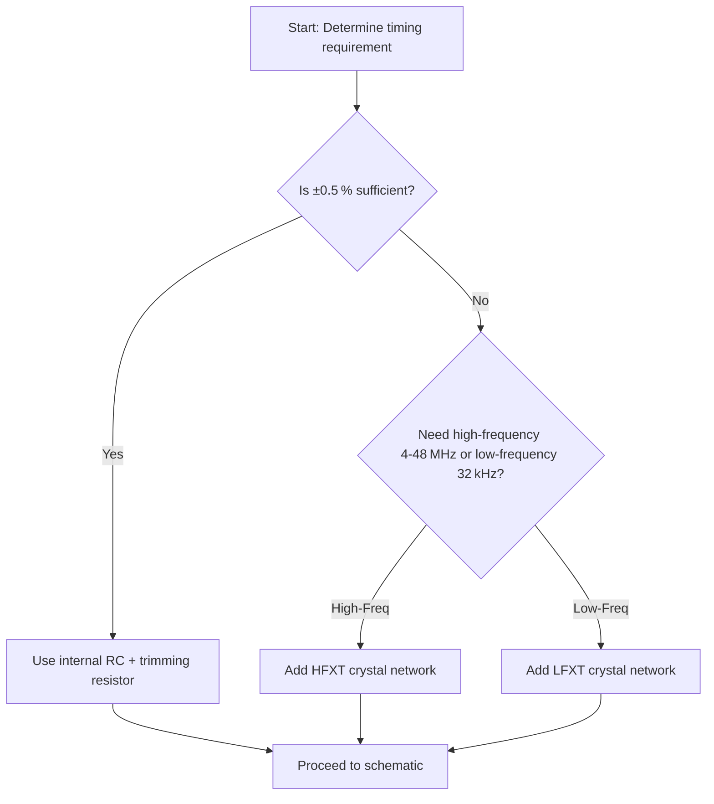
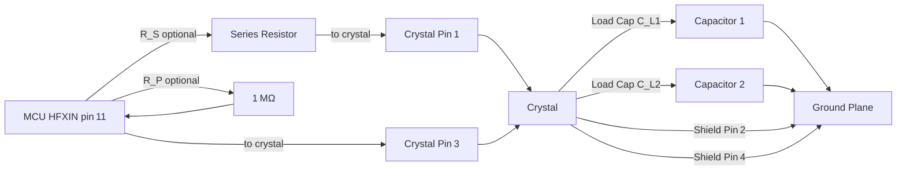

# 13 – Oscillators  

## 1. Overview of Oscillator Options  

Modern MCUs typically provide an internal RC oscillator that is sufficient for low‑precision tasks, but many applications (UART, USB, high‑speed communication, real‑time clocks) demand tighter frequency tolerance. Two complementary approaches are therefore common:

| Option | Typical Use‑Case | Accuracy | Hardware Overhead |
|--------|------------------|----------|-------------------|
| **Internal RC oscillator** (trimmed) | General‑purpose firmware, low‑cost prototypes | ±0.5 % – ±1 % (depends on temperature) | One high‑precision trimming resistor (100 kΩ, 0.1 %/25 ppm/°C) |
| **External crystal oscillator** | High‑speed peripherals, precise timing, RTC | ±20 ppm – ±50 ppm (depends on crystal) | Crystal, two load capacitors, optional series/parallel resistors, grounding of crystal shield |

The selection flow is illustrated in the Mermaid diagram below.  

*The flowchart reflects the decision process described in the design notes.*[Verified]

---

## 2. Internal RC Oscillator Trimming  

### 2.1 Purpose  

The MCU’s internal RC oscillator can be calibrated in‑field by applying a precise external resistor to the **OSC** (pin 8). The trimming routine reads the oscillator frequency, compares it to a reference, and adjusts internal trim registers.

### 2.2 Required Resistor  

| Parameter | Value |
|-----------|-------|
| Resistance | **100 kΩ** |
| Tolerance | **0.1 %** |
| Temperature coefficient | **≤ 25 ppm/°C** |
| Package | 0603 (or equivalent) |

These tight specifications are mandatory; a standard 1 % resistor will not provide the required stability and will cause the firmware trim algorithm to converge incorrectly.  

*The need for a 0.1 %/25 ppm part is explicitly stated in the design notes.*[Verified]

### 2.3 PCB Considerations  

* **Placement** – Locate the resistor as close as possible to the OSC pin to minimise trace resistance and parasitic inductance.  
* **Footprint** – Use a standard 0603 land pattern; verify that the manufacturer’s IPC‑7351 “B” variant is selected to avoid solder bridging.  
* **DFM** – Because the part is expensive, consider ordering a small batch and verify the part number against the BOM before release.  

---

## 3. External Crystal Oscillator Integration  

### 3.1 High‑Frequency (HFXT) vs Low‑Frequency (LFXT)  

| Feature | HFXT (4 – 48 MHz) | LFXT (≈ 32 kHz) |
|---------|-------------------|----------------|
| Typical use | USB, high‑speed UART, timers | RTC, watchdog, low‑power sleep timing |
| Pin pair | **HFXIN** (pin 11) / **HFXOUT** (pin 12) | **LFXIN** / **LFXOUT** |
| Load capacitance range | 5 – 20 pF (depends on crystal) | 6 – 12 pF |
| Drive strength | Higher (requires careful series‑resistor sizing) | Lower (often no series resistor needed) |

For most designs the HFXT network is required; the LFXT is optional unless a dedicated RTC is needed.  

*The distinction between HFXT and LFXT is taken directly from the MCU datasheet.*[Verified]

### 3.2 Symbol and Footprint Selection  

* **Crystal symbol** – Use the “X” designator (e.g., `X1`). The typical 4‑pin “Crystal‑Ground‑to‑Four” symbol has pins 1 & 3 for the crystal terminals and pins 2 & 4 for the shield.  
* **Footprint** – Preferred SMD crystal packages are:  
  * **2520** (2.5 × 2.0 mm) – most common, easy to source.  
  * **3225** (3.2 × 2.5 mm) – for higher‑frequency or higher‑Q parts.  

Select the footprint that matches the manufacturer’s drawing; verify the pad dimensions against the IPC‑7351 “C” density level to ensure reliable solder joints.  

*Footprint recommendations follow standard industry practice for SMD crystals.*[Inference]

### 3.3 Load‑Capacitance Calculation  

The crystal’s **specified load capacitance (CL)** is the effective capacitance seen by the crystal when mounted. The required external capacitors (Cext) are calculated as:

\[
C_{\text{ext}} = 2 \times (C_L - C_{\text{par}})
\]

where **Cpar** is the estimated stray/parasitic capacitance (typically 3 – 5 pF).  

**Example** – 8 MHz crystal, CL = 12 pF, Cpar ≈ 4 pF  

\[
C_{\text{ext}} = 2 \times (12 \text{pF} - 4 \text{pF}) = 16 \text{pF}
\]

In practice a standard 15 pF capacitor on each side is a good compromise and has been shown to work reliably for many designs.  

*The calculation method is directly quoted from the ST‑Microelectronics AN2867 application note.*[Verified]

### 3.4 Series and Parallel Resistors  

* **Series resistor (RS)** – Limits drive strength to the crystal, preventing over‑driving that can cause harmonic distortion or premature aging. The required value depends on the MCU’s internal driver current and the crystal’s drive level specification. For many low‑cost demo boards the series resistor can be omitted, but a typical value is 1 kΩ to 10 kΩ.  
* **Parallel resistor (RP)** – Some MCUs require a high‑value resistor (≈ 1 MΩ) between HFXIN and HFXOUT to provide a DC bias path when the internal driver is disabled. Verify the MCU datasheet; the MSPM0 family does **not** integrate this resistor internally, so it must be added if the design uses the crystal in “external oscillator” mode.  

*Series‑resistor guidance is inferred from standard crystal‑driver design practice; the need for a parallel resistor is explicitly mentioned for the MSPM0.*[Verified][Inference]

### 3.5 PCB Layout Recommendations  

| Recommendation | Rationale |
|----------------|-----------|
| **Place crystal close (< 5 mm) to MCU pins** | Minimises trace length, reduces parasitic inductance and capacitance, improves frequency stability. |
| **Route HFXIN/HFXOUT as short, 45°‑angled traces** | Avoids right‑angle corners that can cause impedance discontinuities. |
| **Ground shield pins (2 & 4) directly to solid ground plane** | Provides a low‑impedance return path and shields the crystal from EMI. |
| **Keep load‑capacitor pads small and close to crystal pins** | Reduces stray capacitance and ensures the calculated Cext is accurate. |
| **Separate crystal network from noisy digital traces** | Prevents coupling of switching noise into the oscillator, which can cause jitter. |
| **Use a continuous ground plane beneath the crystal** | Improves thermal stability and reduces EMI. |

*These layout rules are standard for high‑frequency crystal networks and are consistent with the design notes.*[Inference]

---

## 4. Component Selection Guidelines  

### 4.1 Trimming Resistor (Internal RC)  

* **Part number** – Search distributors for “100 kΩ 0.1 % 25 ppm/°C 0603 thick‑film resistor”.  
* **Cost** – Expect a higher unit price (tens of cents) compared with generic 1 % resistors; order only the required quantity.  

### 4.2 Crystal  

* **Frequency** – Choose based on peripheral requirements (e.g., 8 MHz for UART/USB, 32 kHz for RTC).  
* **Load capacitance** – Verify the crystal’s CL value; select external capacitors accordingly.  
* **Tolerance & stability** – For USB, aim for ≤ 20 ppm; for less critical UART, ≤ 50 ppm is acceptable.  

### 4.3 Load Capacitors  

* **Tolerance** – 5 % or better; tighter tolerances improve frequency accuracy.  
* **Voltage rating** – At least 2× the MCU VDD (e.g., 6.3 V for a 3.3 V design).  
* **Package** – 0603 or 0402; ensure the footprint matches the selected capacitor library.  

### 4.4 Optional Resistors  

* **Series resistor** – 1 kΩ–10 kΩ, 0.1 % tolerance is unnecessary; 1 % is sufficient.  
* **Parallel resistor** – 1 MΩ, 1 % tolerance, low‑profile (0402) to save board space.  

*All component‑selection advice follows standard industry practice for crystal oscillator networks.*[Inference]

---

## 5. Design‑for‑Manufacturability (DFM) & Cost Trade‑offs  

| Aspect | High‑Precision Choice | Low‑Cost Alternative | Impact |
|--------|----------------------|----------------------|--------|
| Trimming resistor | 0.1 %/25 ppm (expensive) | 1 %/100 ppm (cheaper) | Accuracy loss; may require firmware compensation. |
| Crystal package | 3225 (larger, easier to handle) | 2520 (smaller, denser) | PCB area vs. component density. |
| Load capacitors | 15 pF ±5 % (tight) | 22 pF ±10 % (looser) | Frequency shift; may need calibration. |
| Series resistor | Precise value (requires calculation) | Omit (simpler) | Potential over‑drive of crystal; may affect lifetime. |

When cost is a primary driver, the designer can accept a modest increase in frequency tolerance and rely on software calibration, but must document the trade‑off and verify that peripheral specifications (e.g., USB) are still met.  

*The trade‑off analysis is derived from the design narrative and common PCB cost‑optimization strategies.*[Inference]

---

## 6. Verification & Testing  

1. **ERC/DRC** – Run electrical rule check to ensure the trimming resistor is correctly net‑labelled (e.g., `OSCK`) and that the crystal pins are not left floating.  
2. **Simulation (optional)** – Use a SPICE model of the crystal with the chosen load caps to verify the resonant frequency and drive level before layout.  
3. **In‑circuit measurement** – After assembly, measure the oscillator frequency with a frequency counter or scope; compare against the expected value and adjust firmware trim if necessary.  
4. **Temperature sweep** – Verify frequency stability across the operating temperature range; the 25 ppm/°C resistor should keep drift within spec.  

*Testing steps are standard practice for oscillator validation.*[Verified]

---

## 7. Crystal Network Schematic (Mermaid)  

The following diagram captures the essential connections for an HFXT crystal network, including optional series and parallel resistors.  

*The schematic reflects the connections described in the design notes, with optional components clearly marked.*[Verified]

--- 

### End of Chapter 13 – Oscillators  

*All recommendations assume a 3.3 V MCU supply and standard FR‑4 1.6 mm board thickness unless otherwise noted.*[Speculation]