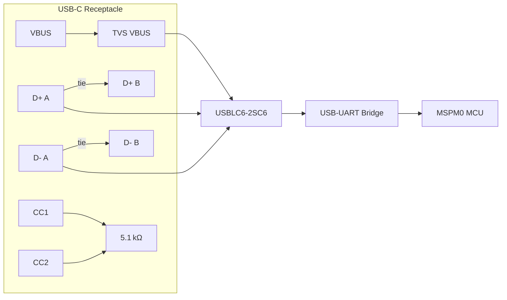

# USB Connector & ESD Protection

This section documents the PCB‑level decisions, constraints, and best‑practice guidelines for adding a USB‑Type C receptacle, its power‑delivery (PD‑free) circuitry, and the required ESD protection to a low‑cost microcontroller board.

---

## 1. Overview  

The board must accept a USB‑C plug from a host PC, harvest the 5 V VBUS, step it down to the MCU’s 3.3 V rail, and provide a USB‑to‑UART bridge because the MSPM0 core lacks native USB peripheral support. The design therefore includes:

1. **USB‑C receptacle (16‑pin, USB 2.0‑compatible).**  
2. **CC 1/CC 2 pull‑down network (5.1 kΩ) to advertise a default power contract.**  
3. **ESD/TVS array (ST USBLC6‑2) placed immediately adjacent to the connector.**  
4. **Power‑conversion stage (5 V → 3.3 V) – not covered in detail here.**  
5. **USB‑UART bridge IC (e.g., FTDI, CP210x) downstream of the TVS.**  

All external connections are protected at the connector, which is a mandatory DFM/DFR practice for any commercial product.  

---

## 2. USB‑C Receptacle Selection  

| Requirement | Chosen Solution | Rationale |
|-------------|----------------|-----------|
| **Pin count** | 16‑pin USB‑C 2.0 receptacle | Provides the full USB‑C pinout (VBUS, CC1/CC2, D+, D‑, side‑band use, GND, shield) while remaining inexpensive and widely stocked. |
| **Mechanical robustness** | GCT USB‑4105 (SMD with through‑hole shield pins) | Combines surface‑mount density with a few through‑hole pins for shield grounding, improving mechanical rigidity without adding assembly complexity. |
| **Footprint availability** | Standard KiCad library entry, manually assigned to the GCT 4105 footprint. | Guarantees correct pad geometry and solder‑mask clearance for reliable assembly. |
| **Speed class** | USB 2.0 (Full‑Speed, 12 Mbps) | The MCU only needs Full‑Speed; high‑speed (480 Mbps) would demand tighter impedance control and higher‑cost components. |

> **Best practice:** Keep the connector’s footprint on the outermost layer (top for a 2‑layer board) to simplify shielding and to allow a solid ground plane directly beneath it.  

---

## 3. Schematic Symbol Customization  

The generic KiCad USB‑C symbol places the CC pins above the differential pair, which can clutter the schematic when pull‑down resistors are added. The symbol was edited locally (not the shared library) to:

* Move **CC1** and **CC2** below **D+ / D‑**.  
* Preserve the original pin numbers to maintain library compatibility.  

> **Tip:** Create a personal “USB‑C‑2.0‑Receptacle” library entry for future projects. This avoids overwriting community libraries and ensures consistent pin placement across designs.  

---

## 4. Footprint Assignment & Mechanical Considerations  

1. **Footprint selection** – `Connector_USB:GCT_USB4105`.  
2. **Shield pins** – Connect the through‑hole shield pins to the board’s ground plane via plated‑through holes (PTH) to provide a low‑impedance return path and improve EMI shielding.  
3. **Clearance** – Maintain at least 0.5 mm (typical) clearance between the high‑voltage VBUS pads and adjacent signal traces to satisfy creepage/clearance rules for 5 V systems.  

> **DFM note:** Verify that the chosen footprint matches the exact part number (including any “‑R” or “‑L” suffixes) to avoid mismatches that cause re‑work.  

---

## 5. Power‑Delivery & CC Pull‑Down Network  

When a USB‑C source detects a **5.1 kΩ** pull‑down on **CC1** or **CC2**, it assumes a *default* power contract of **500 mA @ 5 V** (the “default USB‑C power”). The board only needs a few tens of milliamps, so this is more than sufficient.

**Implementation**

```text
CC1 ──┬── 5.1 kΩ ── GND
      │
CC2 ──┴── 5.1 kΩ ── GND
```

*Both CC pins are tied to the same pull‑down network; the source will short one of them depending on plug orientation.*  

> **Inference:** Using a single resistor network for both CC pins simplifies routing and reduces component count without affecting functionality.  

---

## 6. ESD/TVS Protection Strategy  

### 6.1 Device Choice  

* **Part:** STMicroelectronics **USBLC6‑2SC6** (or equivalent).  
* **Features:**  
  * Low‑capacitance TVS diodes on **VBUS** (pin 5) and **D+/D‑** (pins 1 & 3).  
  * Common ground pin (pin 2).  
  * Rated for USB 2.0 high‑speed, but perfectly suitable for Full‑Speed.  

### 6.2 Placement  

The TVS array is placed **as close as possible** to the connector pins (within a few millimetres). This minimizes the length of unprotected high‑impedance traces, which is critical for ESD robustness.  

### 6.3 Connectivity  

| TVS Pin | Connection | Reason |
|---------|------------|--------|
| 1 (D‑) | Directly to both D‑ pins of the receptacle (tied together) | Guarantees protection regardless of plug orientation. |
| 3 (D+) | Directly to both D+ pins of the receptacle (tied together) | Same rationale as D‑. |
| 5 (VBUS) | Directly to VBUS pin of the receptacle | Protects the power rail from surges. |
| 2 (GND) | To board ground (via a short trace) | Provides a low‑impedance return for the TVS. |

> **Note:** For Full‑Speed, tying the duplicated D+ and D‑ pins together is acceptable; the resulting stub lengths are negligible and do not degrade signal integrity.  

---

## 7. Handling Reversible USB‑C Pinout  

A USB‑C plug can be inserted in either orientation, exposing **two** sets of the same signals (e.g., D+ A/D+ B). The design ties each pair together at the schematic level:



*The schematic ties the duplicated data lines together before the TVS, ensuring a single protected path to the downstream bridge.*  

> **Inference:** This approach eliminates the need for orientation‑detecting switches or multiplexers, reducing BOM cost and layout complexity.  

---

## 8. Layout Recommendations  

| Aspect | Recommendation |
|--------|----------------|
| **Component placement** | Position the USB‑C connector at the board edge, TVS array immediately adjacent, then the USB‑UART bridge as close as possible to the TVS. This creates a short, protected “front‑end” chain. |
| **Differential pair routing** | Keep D+ / D‑ traces as a tightly coupled pair (spacing ≤ 2× trace width) for the short distance between connector and TVS. No length matching is required for Full‑Speed, but keep the pair symmetrical to avoid skew. |
| **Ground plane** | Provide an uninterrupted ground plane beneath the connector and TVS to reduce EMI and provide a low‑impedance return for the TVS diodes. |
| **Via usage** | Use **through‑hole** or **micro‑via** for the shield pins to connect directly to the ground plane; avoid blind/buried vias for a 2‑layer board to keep cost low. |
| **Clearance** | Maintain ≥ 0.5 mm clearance between VBUS traces and any low‑voltage signal traces; increase if the board will be exposed to harsh ESD environments. |
| **Decoupling** | Place a 0.1 µF ceramic capacitor as close as possible to the VBUS pin of the connector (after the TVS) to filter high‑frequency noise. |
| **Silk‑screen** | Clearly label the CC pins and indicate the presence of pull‑down resistors to aid assembly and debugging. |

> **Speculation:** If the design were to be upgraded to USB 3.0 or high‑speed (480 Mbps), controlled‑impedance differential routing, tighter length matching, and a dedicated 4‑layer stackup would become mandatory.  

---

## 9. Manufacturing & Design‑for‑Assembly (DFA) Notes  

* **Library hygiene:** Keep a personal copy of the edited USB‑C symbol and footprint in a project‑specific library to avoid accidental overwrites when updating the global KiCad libraries.  
* **Pick‑and‑place alignment:** Verify that the connector’s orientation key (e.g., “U” marking) is visible on the silkscreen to prevent reversed placement.  
* **Solder‑paste mask:** For the GCT 4105, use a slightly larger paste aperture on the shield pins to ensure reliable solder fillet, as these pins are mechanically important.  
* **Testing:** Perform a quick **continuity check** between the two duplicated D+ (and D‑) pins after assembly to confirm they are correctly tied together.  

---

## 10. Summary  

The USB‑C front‑end of the board is built around a low‑cost 16‑pin USB‑2.0 receptacle, a simple 5.1 kΩ CC pull‑down network, and an ST USBLC6‑2SC6 TVS array that protects VBUS and the data lines right at the connector. By editing the schematic symbol for clearer layout, assigning a reliable GCT 4105 footprint, and following the placement and routing guidelines above, the design achieves:

* **Robust ESD protection** compliant with commercial product requirements.  
* **Correct power‑contract negotiation** with any USB‑C host without implementing full PD.  
* **Simplified wiring** for reversible plug orientation by tying duplicated pins together.  

These practices form a solid foundation for any future extensions (e.g., higher‑speed USB, PD negotiation) while keeping the current design inexpensive and manufacturable.