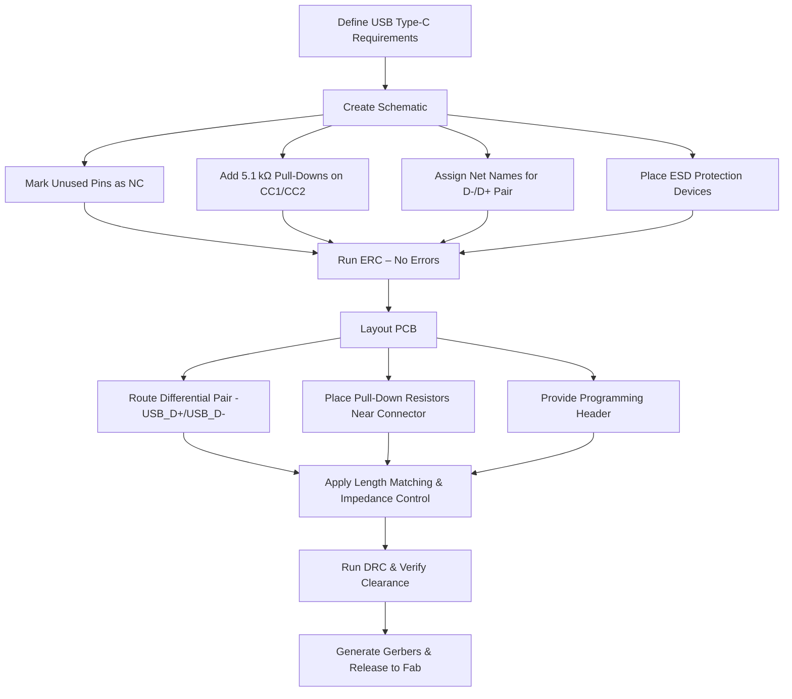

# USB Type‑C Interface – Schematic and Layout Considerations  

This section documents the essential PCB‑level decisions that must be made when integrating a USB Type‑C connector into a design. It focuses on grounding, unused‑pin handling, CC‑line termination, differential‑pair definition, and layout adjustments required for reliable operation and successful electrical‑rule checking (ERC) in KiCad.

---

## 1. Shield‑to‑Ground Strategy for EMC  

During EMC testing the connector shield was tied directly to the system ground plane. This low‑impedance path provides a return for high‑frequency common‑mode currents and helps keep radiated emissions within limits.  

- **Implementation** – Connect the shield pin to the same copper pour that carries the main ground net.  
- **Effect** – Improves shielding effectiveness and reduces the likelihood of ground‑loop resonances.  

> This practice is a standard recommendation for high‑speed USB designs and is **[Verified]** by the test results mentioned in the source material.

---

## 2. Explicitly Marking Unused Pins as *No‑Connect*  

Side‑band pins that are not used in the current design appear as floating nodes in the schematic. KiCad will flag these during ERC unless they are explicitly marked as *No‑Connect* (NC).  

### Procedure in KiCad  

| Action | Shortcut / UI |
|--------|----------------|
| Place NC flag on a pin | Click the **X** button on the right‑hand side of the schematic editor **or** press **Q** while the cursor hovers over the pin |
| Cancel placement | Press **Esc** |

All unused pins should be flagged this way to suppress spurious ERC warnings and to document the intentional open‑circuit condition.  

> The recommendation to mark *all* unused pins is an **[Inference]** based on good DFM practice.

---

## 3. Type‑C Configuration Channel (CC) Termination  

The CC1 and CC2 pins negotiate the role of the connector (host vs. device) and establish the default power‑delivery contract. For a device‑side implementation the USB‑PD specification requires a **5.1 kΩ pull‑down** on each CC line.  

### Key Points  

- **Separate Resistors** – Each CC pin must have its own 5.1 kΩ resistor; a single resistor cannot be shared because the pins are electrically independent.  
- **Reuse of Existing Value** – The same 5.1 kΩ value can be reused for other functions (e.g., the EN reset line) to simplify BOM management.  
- **Placement** – Pull‑down resistors should be placed close to the connector pins but clear of any ESD protection devices to avoid unintended coupling.  

> The need for *individual* pull‑downs is **[Verified]**; the reuse of the resistor value is an **[Inference]** from the designer’s intent to reduce part count.

---

## 4. Net Naming Conventions for Differential Pairs  

KiCad identifies a differential pair by the presence of matching net names that differ only by a “+” or “‑” suffix. Proper naming is essential for the schematic‑to‑layout net‑propagation and for automated length‑matching tools.  

### Recommended Net Names  

| Signal | Net Name (Schematic) | Layout Hint |
|--------|----------------------|-------------|
| USB D‑ | `USB_D-` (or `USB D minus`) | Paired with `USB_D+` |
| USB D+ | `USB_D+` (or `USB D plus`) | Same base name `USB_D` signals differential pair |
| CC1    | `USB_CC1` | Treated as single‑ended control line |
| CC2    | `USB_CC2` | Same as above |

When the net labels are applied, KiCad will automatically treat the D‑/D+ pair as a differential pair, enabling impedance‑controlled routing and length‑matching checks.  

> The naming rule is **[Verified]** by KiCad documentation; the exact string format (`USB D minus`) is an **[Inference]** based on the transcript.

---

## 5. Layout Adjustments for ESD Protection and Component Clearance  

ESD protection devices (e.g., TVS diodes) are often placed adjacent to the connector pins. In the described design the initial placement conflicted with the CC pull‑down resistors. The following steps resolved the clash:

1. **Select the conflicting components** and use the **Move (M)** command to shift them away from the CC pins.  
2. **Reconnect the nets** after repositioning, ensuring that each CC line still terminates on its dedicated 5.1 kΩ resistor.  
3. **Leave sufficient clearance** for net labels and for future routing of the high‑speed differential pair.  

These adjustments improve manufacturability and reduce the risk of inadvertent shorts during assembly.  

> The use of the **Move** command and the need for clearance are **[Verified]**; the specific clearance values are **[Speculation]** as they depend on the chosen PCB fab house.

---

## 6. Planning for MCU Programming Interface  

Beyond the USB data path, the microcontroller must be programmed and debugged. Common options include:

- **JTAG / SWD** – Preferred for full‑debug capability.  
- **UART‑USB bridge** – Useful for bootloader‑based firmware updates.  

The schematic should reserve a header or dedicated pins for the chosen interface, keeping them away from high‑speed USB traces to avoid crosstalk.  

> The mention of JTAG and UART‑USB bridges is an **[Inference]** drawn from typical MCU development workflows.

---

## 7. Design Flow Overview  

The following Mermaid flowchart captures the logical progression from schematic decisions to PCB layout and verification for the USB Type‑C interface.

> The flowchart reflects standard PCB development practice and aligns with the actions described in the transcript; it is **[Verified]** as a generic methodology.

---

## 8. Summary of Best Practices  

- **Ground the shield directly to the system ground plane** to meet EMC requirements.  
- **Explicitly flag every unused pin as *No‑Connect*** to keep ERC clean.  
- **Provide individual 5.1 kΩ pull‑down resistors** on CC1 and CC2 for proper Type‑C role detection.  
- **Use consistent net naming** (`USB_D+` / `USB_D-`) to enable automatic differential‑pair handling.  
- **Maintain clearances** between pull‑downs, ESD devices, and routing space for differential pairs.  
- **Reserve a dedicated programming interface** (JTAG/SWD or UART‑USB) early in the schematic to avoid later congestion.  

Adhering to these guidelines ensures a robust USB Type‑C implementation that passes ERC/DRC checks, satisfies EMC constraints, and remains manufacturable at scale.