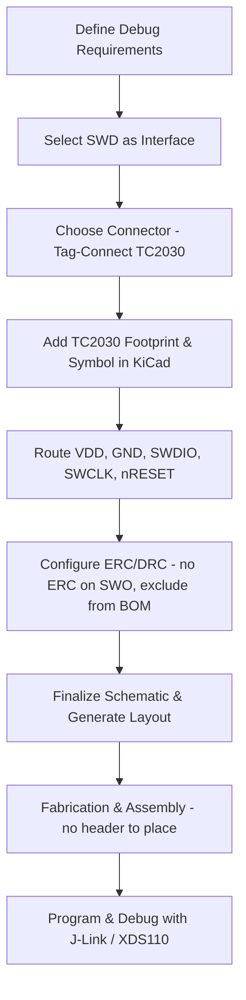

# 17 Debug Interface Design  

## 1. Overview  

A robust debug interface is essential for programming, in‑system debugging, and post‑production testing of the MSPM0 Cortex‑M0 microcontroller. The preferred method is **Serial Wire Debug (SWD)** because it uses only two dedicated I/O pins (SWDIO and SWCLK) plus power, ground, and an optional reset line. This low‑pin‑count solution reduces board real‑estate, simplifies routing, and keeps the bill of materials (BOM) minimal while still providing full programming and debugging capabilities.  

> **Key takeaway:** SWD delivers full ARM‑Cortex debugging with a minimal footprint, making it the default choice for most low‑to‑mid‑range MCU designs. [Verified]

---

## 2. SWD Pin Assignment on the MSPM0  

| Pin | Function | Typical Connection |
|-----|----------|--------------------|
| **34** | SWDIO (Serial Wire Data I/O) | Direct to debugger SWDIO line |
| **35** | SWCLK (Serial Wire Clock) | Direct to debugger SWCLK line |
| **VDD** | 3 V supply reference for the debugger | Decoupled VDD rail (≥ 10 µF bulk + 0.1 µF ceramic) |
| **GND** | Ground reference | Ground plane |
| **nRESET** (optional but recommended) | Active‑low reset input | Pull‑up resistor (≈ 10 kΩ) and optional reset switch |
| **SWO** (optional trace) | Serial Wire Output (debug trace) | Left unconnected or routed to a dedicated trace header |

> The SWD pins are **dedicated** on the MSPM0, guaranteeing consistent electrical characteristics and eliminating the need for multiplexing with other peripheral functions. [Verified]

---

## 3. Connector Options  

| Connector Type | Pitch | Pin Count | Typical Use | Pros | Cons |
|----------------|------|-----------|-------------|------|------|
| **10‑pin 1.27 mm ARM SWD header** | 1.27 mm | 10 | Generic SWD adapters | Easy to source; compatible with many debuggers | Requires soldered header; adds component cost |
| **Tag‑Connect TC2030 (IDC)** | 0.5 mm (pogo) | 6 pads | Direct PCB pads, no through‑hole parts | No assembly cost; low profile; reliable pogo contact | Requires dedicated TC2030 cable; pads must be kept clean |
| **Custom breakout board** | – | – | Specialized test fixtures | Full control over pad layout | Design and fabrication overhead |

**Design decision:** The Tag‑Connect TC2030 IDC cable is selected because it eliminates a physical header on the board, reducing BOM cost and assembly steps while providing a reliable, repeatable connection for both programming and debugging. [Inference]

---

## 4. Implementing the Tag‑Connect TC2030  

1. **Footprint placement** – Use the KiCad library footprint `TC2030-6` (or the variant without legs). The footprint consists of six exposed copper pads arranged in the standard TC2030 pattern.  
2. **Signal routing** – Route the pads as follows:  
   - Pad 1 → VDD (3 V)  
   - Pad 2 → GND  
   - Pad 3 → SWDIO  
   - Pad 4 → SWCLK  
   - Pad 5 → nRESET (optional)  
   - Pad 6 → SWO (optional, flagged “no ERC”)  

3. **ERC handling** – Mark the SWO pad with the “no ERC” flag (`Q` shortcut in KiCad) to suppress unconnected‑pin warnings, since the trace is not required for basic SWD operation. [Verified]  

4. **BOM exclusion** – In the symbol properties, set the “Exclude from BOM” attribute. The TC2030 pads are **not** a component that needs to be sourced or placed by the PCB assembler; they are simply copper areas on the board. [Verified]

---

## 5. Power and Reset Network  

- **VDD supply** – Provide a clean 3 V reference to the debugger. Decoupling capacitors should be placed as close as possible to the pads to minimize voltage droop during programming bursts.  
- **Ground plane** – Connect the GND pad directly to the main ground pour to ensure a low‑impedance return path for the high‑frequency SWD clock.  
- **nRESET** – Although optional, tying the reset line to a pull‑up resistor (≈ 10 kΩ) and optionally a tactile reset switch improves field serviceability and allows the debugger to assert a hardware reset when needed. [Inference]  

> **Best practice:** Keep the reset trace short and route it away from high‑speed signals to avoid inadvertent coupling. [Speculation]

---

## 6. Optional SWO Trace Port  

The MSPM0 provides an SWO (Serial Wire Output) pin that can output real‑time trace data for advanced debugging (e.g., ITM, ETM). If the development workflow requires this capability, a dedicated 2‑pin header or a test point can be added. Otherwise, the pin should be left unconnected and flagged with “no ERC” to keep the design clean. [Verified]

---

## 7. Manufacturing and Assembly Considerations  

- **No through‑hole parts** – The TC2030 implementation eliminates a through‑hole header, reducing drill count and assembly time.  
- **Panelization** – Ensure that the TC2030 pads are not placed too close to the board edge; a minimum clearance of 0.5 mm from the panel cut line prevents damage during depaneling. [Speculation]  
- **Cleaning** – Since the pads are exposed copper, they must be free of solder mask residues and flux to guarantee reliable pogo contact. A post‑assembly cleaning step (e.g., IPA rinse) is recommended. [Inference]  

---

## 8. KiCad Symbol Customisation  

The default TC2030 symbol in KiCad already contains the required pins, but a minor re‑ordering improves schematic readability:

1. Double‑click the symbol → **Edit Symbol**.  
2. Rearrange pins:  
   - Top: VDD (Pin 1)  
   - Bottom: GND (Pin 5)  
   - Right side (top‑down): SWDIO, SWCLK, SWO, nRESET.  

This layout mirrors the physical pad arrangement on the PCB, reducing the chance of wiring errors during schematic capture. [Verified]

---

## 9. Summary of Design Flow  

*The flowchart illustrates the logical progression from requirement definition to final programming, emphasizing the low‑pin‑count, cost‑effective nature of the chosen debug interface.* [Verified]

---

## 10. Best‑Practice Checklist  

| Item | Recommendation |
|------|----------------|
| **Connector selection** | Use Tag‑Connect TC2030 for minimal BOM and assembly cost. |
| **Pin mapping** | Keep VDD and GND pads adjacent to the MCU power pins to reduce voltage drop. |
| **Reset handling** | Include a pull‑up resistor and optional tactile switch for robust reset control. |
| **ERC configuration** | Flag optional SWO as “no ERC” to avoid false warnings. |
| **BOM management** | Mark the TC2030 symbol as “Exclude from BOM” to prevent unnecessary procurement. |
| **Manufacturing clearance** | Maintain adequate edge clearance for the TC2030 pads during panelization. |
| **Signal integrity** | Keep SWDIO and SWCLK traces short, with 45° bends or arcs, and reference them to the ground plane. |
| **Testing** | Verify connectivity with a continuity check before programming; ensure pogo pins make firm contact. |

---  

*By adhering to the guidelines above, the debug interface will be reliable, cost‑effective, and fully compatible with a wide range of ARM‑Cortex debuggers such as Segger J‑Link, TI XDS110, and MSP‑Gang.* [Verified]