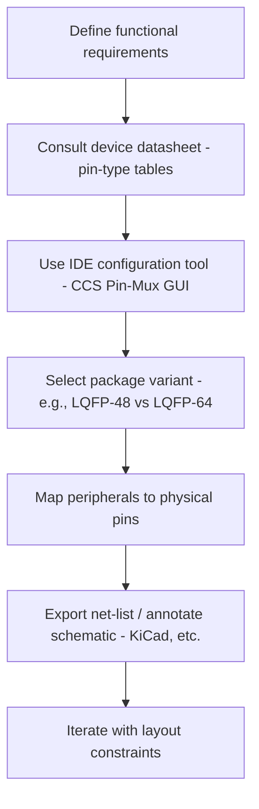

# 18 – Pin‑out Planning & Assignment  

*This section documents a systematic approach to selecting and assigning pins on a TI MSP‑G3507 microcontroller for a custom PCB. It captures the workflow, design constraints, and best‑practice recommendations that ensure a clean schematic and a manufacturable layout.*

---

## 1. Overview of the Pin‑assignment Process  

A reliable pin‑out is the foundation of a robust schematic and a routable PCB. The process can be broken into four logical stages:

*The flowchart reflects the sequence demonstrated in the IDE and the subsequent schematic entry.*[Verified]

---

## 2. Sources of Pin Information  

| Source | What it Provides | Typical Use |
|--------|------------------|-------------|
| **Device datasheet – Table 6‑2 (Pin Attributes)** | Pin numbers, default functions, voltage tolerance, open‑drain capability, analog‑/Digital‑IO classification. | Quick sanity check, verification of IDE selections, DFM analysis. |
| **IDE Pin‑Mux GUI (Code Composer Studio)** | Graphical view of all peripherals, selectable pin‑mux options, automatic conflict resolution, package‑specific pin availability. | Primary tool for initial assignment; reduces manual lookup errors. |
| **Package‑specific pin‑out diagrams** | Physical location of pins on the chosen footprint (e.g., LQFP‑48). | Critical for routing decisions and component placement. |

All three sources must be consulted; the IDE reflects the datasheet but also enforces package‑specific limits, preventing the selection of pins that do not exist on the chosen footprint.[Verified]

---

## 3. Package Selection and Its Impact  

The MSP‑G3507 is offered in multiple LQFP variants. Switching from **LQFP‑64** to **LQFP‑48** reduces the total pin count, which directly limits the number of simultaneously usable peripherals.

* **Pin‑count reduction** – Fewer pins mean some alternate functions disappear; the IDE automatically disables unavailable options.  
* **Board‑size implication** – A smaller package enables a more compact board but may increase routing density.  
* **Thermal & mechanical considerations** – Smaller packages have lower thermal mass; ensure adequate copper pour and thermal vias for power‑dense sections.  

When the package is changed in the IDE, the peripheral list updates instantly, guaranteeing that only legal pin‑mux combinations are presented.[Verified]

---

## 4. Mandatory Pins  

Regardless of functional mapping, certain pins are **non‑negotiable**:

| Pin Type | Typical Assignment | Reason |
|----------|-------------------|--------|
| **VDD / VCORE** | Power pins (e.g., VDD = pin 6, VCORE = pin 48) | Supply the core and I/O banks; must be decoupled locally. |
| **VSS / Ground** | Ground pins (e.g., VSS = pin 7) | Reference for all logic levels; multiple pins recommended for low‑impedance return. |
| **Programming Interface** | Serial‑Wire‑Debug (SWD) pins – SWCLK, SWDIO | Required for in‑system programming and debugging. |
| **Reset** | Dedicated reset pin (if present) | Guarantees reliable startup; often tied to a pull‑up resistor. |

These pins are highlighted in the IDE (red for power, green for debug) and should be placed near the board edge to simplify connector routing and test access.[Verified]

---

## 5. Peripheral Assignment Strategy  

### 5.1. UART Example  

1. **Select UART peripheral** – In the IDE, click *UART* → *Add* → default selects **UART1**.  
2. **Choose a quick profile** – Sets baud‑rate and default clock source.  
3. **Review auto‑selected pins** – IDE highlights **RX = pin 33 (PA18)**, **TX = pin 32 (PA17)**.  
4. **Re‑map if needed** – Expand *Pin‑Mux* table; any compatible pin listed can replace the default. Selecting **PA0** for TX automatically switches the peripheral to **UART0** and updates the RX pin accordingly.  
5. **Add flow‑control** – Enable RTS/CTS in the *Basic Configuration* tab; IDE assigns **RTS = pin 30**, **CTS = pin 29**.  

> **Best practice:** Keep UART pins adjacent to the USB‑to‑UART bridge connector to minimise trace length and reduce EMI coupling. Place the bridge IC close to the MCU, and route TX/RX as a short, 45‑Ω controlled‑impedance pair only if the baud‑rate exceeds a few Mbps. [Inference]

### 5.2. Other Peripherals  

| Peripheral | Typical Pin‑type | Assignment Tips |
|------------|------------------|-----------------|
| **I²C** | Open‑drain SDA/SCL, 5 V‑tolerant optional | Keep SDA/SCL away from high‑speed digital lines; add pull‑up resistors (4.7 kΩ–10 kΩ) close to the MCU. |
| **SPI** | Push‑pull MOSI/MISO/SCK, optional CS | Route as a short, matched‑length bus; place CS pins near the slave device to avoid long stubs. |
| **ADC** | Analog‑capable pins (e.g., PA24) | Isolate from noisy digital traces; provide a dedicated analog ground plane or star‑ground to improve SNR. |
| **Timers / PWM** | General‑purpose I/O with alternate timer function | Prefer pins on the same side of the board as the driven load (e.g., motor driver) to reduce trace inductance. |

The IDE’s *Pin‑Mux* table lists all viable pins for each peripheral; selecting a pin automatically updates the peripheral instance (UART0 vs UART1, etc.), ensuring a consistent configuration without manual bookkeeping.[Verified]

---

## 6. Exporting the Pin‑out to the Schematic  

Once the IDE pin‑mux is finalized:

1. **Create net labels** – In KiCad (or the chosen schematic editor), place a net label on the MCU pin (e.g., `UART_TX`).  
2. **Copy the label** – Duplicate for the paired pin (`UART_RX`) and rename accordingly.  
3. **Connect to external components** – Wire the net label to the appropriate connector pins or peripheral ICs.  

> **Tip:** Use a consistent naming convention (`UART0_TX`, `UART0_RX`, `I2C0_SCL`, etc.) to simplify ERC checks later. [Inference]

---

## 7. Design‑for‑Manufacturability (DFM) Considerations  

| Concern | Mitigation |
|---------|------------|
| **Pin density** – Small packages increase routing congestion. | Reserve a *keep‑out* area around high‑speed pins; use 45‑° bends and avoid 90‑° angles. |
| **Power/ground stitching** – Long power rails can cause voltage droop. | Add multiple vias between VDD/VSS pins and the copper pour; place decoupling caps (0.1 µF) within 1 mm of each power pin. |
| **Signal integrity for UART/USB** – Reflections at high baud rates. | If baud > 3 Mbps, treat TX/RX as controlled‑impedance traces; maintain length matching within 0.5 mm. |
| **Thermal via placement** – High‑current peripherals (e.g., USB bridge) generate heat. | Use thermal vias under the bridge IC and near VDD pins to spread heat to internal planes. |
| **Programming access** – Ensure SWD pins are not blocked by components. | Route SWCLK/SWDIO on the board edge and provide a test pad or header for in‑circuit programming. |

These guidelines help avoid costly revisions after fabrication and improve overall reliability.[Inference]

---

## 8. Summary Checklist  

| ✅ Item | Reason |
|--------|--------|
| **Datasheet pin‑type table consulted** | Guarantees correct voltage tolerance and function. |
| **IDE Pin‑Mux configured for chosen package** | Prevents illegal pin selections. |
| **Power and ground pins assigned and decoupled** | Ensures stable operation and low noise. |
| **Programming/debug pins exposed** | Enables firmware development and field updates. |
| **Peripheral pins placed with routing and EMI in mind** | Improves signal integrity and simplifies layout. |
| **Net labels created consistently in schematic** | Facilitates ERC/DRC and downstream layout. |
| **DFM checks performed** | Reduces risk of manufacturing defects. |

Following this disciplined workflow yields a clean, manufacturable PCB that meets functional requirements while minimizing redesign cycles.