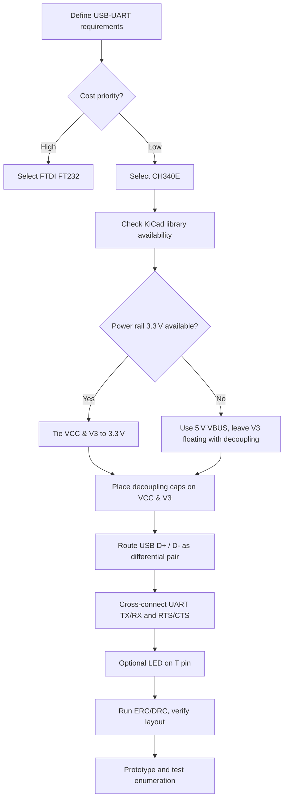

# 19  USB‑UART Interface IC  

This section documents the selection, schematic integration, and PCB‑level considerations for a USB‑to‑UART bridge based on the **CH340E** IC. The guidance below captures the engineering trade‑offs, component choices, and best‑practice layout techniques that ensure a reliable, low‑cost USB connectivity solution.

---

## 1. Part Selection Overview  

| Candidate | Package | Typical Unit Cost* | Key Characteristics |
|-----------|---------|-------------------|----------------------|
| FTDI FT232 | SSOP‑28 / QFN‑28 | ≈ $6 [Verified] | Mature driver, extensive documentation, built‑in EEPROM, higher cost |
| **CH340E** | MSOP‑10 | **$0.38 – $0.65** [Verified] | Very low cost, USB 2.0 full‑speed (12 Mbps), supports hardware flow‑control, widely available on Chinese and hobbyist boards |

\*Cost quoted for low‑volume purchases; prices drop further at higher volumes.  

**Rationale** – For cost‑sensitive designs that do not require the extra features of the FT232 (e.g., EEPROM configuration, high‑speed operation), the CH340E provides a sufficient full‑speed USB‑UART bridge while keeping the bill of materials (BOM) minimal. Its MSOP‑10 package is also natively supported by the KiCad libraries, simplifying schematic capture and footprint assignment.

---

## 2. Electrical Overview  

### 2.1 Pin Functions  

| Pin | Function | Typical Connection |
|-----|----------|--------------------|
| VCC | Primary supply (3.3 V) | Tied to system 3.3 V rail |
| V3  | Supply output / optional decoupling | Tied to VCC for 3.3 V operation; left floating with a decoupling capacitor when VCC = 5 V |
| GND | Ground | System ground |
| D+ / D‑ | USB differential pair | Connected to USB connector D+ / D‑ respectively |
| TX  | UART transmit (to MCU) | Cross‑connected to MCU RX |
| RX  | UART receive (from MCU) | Cross‑connected to MCU TX |
| RTS / CTS | Hardware flow‑control (optional) | Cross‑connected to MCU CTS / RTS respectively |
| T   | Activity LED output (active‑high) | Optional LED + resistor to GND or MCU pin |

> **Note** – The CH340E operates correctly with a single 3.3 V rail; the V3 pin can be tied directly to VCC for this voltage level. When the board runs from a 5 V USB VBUS, V3 must be left unconnected and only a decoupling capacitor is required on the pin. This flexibility allows the same schematic to be reused across multiple power‑scheme variants. [Inference]

### 2.2 Decoupling Strategy  

- **One 100 nF (or 470 nF) capacitor per power pin** placed as close as possible to the VCC and V3 pins.  
- Capacitors should be low‑ESR, X7R (or equivalent) ceramic types.  
- Using a single capacitor value across the design reduces BOM complexity and simplifies assembly. [Inference]

---

## 3. Schematic Integration  

### 3.1 Library Availability  

The CH340E MSOP‑10 footprint and schematic symbol are included in the default KiCad libraries. Verify that the assigned footprint matches the datasheet (MSOP‑10, 0.65 mm pitch).  

### 3.2 Net Naming Conventions  

- **USB differential pair** – Use distinct net names such as `USB_D+` and `USB_D-`. KiCad will treat them as a differential pair when the “Differential Pair” property is set.  
- **UART signals** – Prefix with `UART_` (e.g., `UART_TX`, `UART_RX`, `UART_RTS`, `UART_CTS`) to avoid ambiguity across subsystems.  
- **Power nets** – `VCC_3V3` for the 3.3 V rail, `GND` for ground.  

Consistent naming aids ERC/DRC checks and improves readability for downstream designers. [Verified]

### 3.3 Cross‑Connection Details  

| CH340E Pin | MCU Pin | Connection |
|------------|---------|------------|
| TX | MCU RX | Direct wire (no series resistor needed for short traces) |
| RX | MCU TX | Direct wire |
| RTS | MCU CTS | Direct wire |
| CTS | MCU RTS | Direct wire |

> **Best Practice** – For prototypes or designs where future pin reassignment is possible, insert **0 Ω “jumpers”** or **optional series termination resistors (≈ 33 Ω)** on the UART lines. This provides a non‑destructive way to swap or terminate signals without redesigning the board. [Speculation]

### 3.4 Optional Activity LED  

The `T` pin can drive an LED (active‑high) through a current‑limiting resistor (typical 330 Ω). If the LED is not required, leave the pin unconnected and mark it with a “No ERC” flag in KiCad to suppress warnings. [Verified]

---

## 4. PCB Layout Guidelines  

### 4.1 Power Supply Decoupling  

- Place the decoupling capacitors **within 1 mm** of the VCC and V3 pins.  
- Keep the capacitor pads on the same layer as the IC to minimize via usage.  
- Route short, wide traces from the capacitor to the pins to reduce inductance.  

### 4.2 USB Differential Pair Routing  

- **Maintain pair coupling**: Keep D+ and D‑ traces adjacent with a constant spacing (typically 6–8 mil for full‑speed USB).  
- **Length matching**: Skew should be < 150 ps, which translates to < 0.5 mm mismatch for FR‑4 at 12 Mbps. For most low‑speed boards, visual matching is sufficient.  
- **Avoid stubs and vias**: Use a single via per pair if a layer change is unavoidable; keep the via length short.  
- **Impedance control** is not required for full‑speed USB, but keeping the pair on a reference plane improves signal integrity. [Inference]

### 4.3 UART Trace Routing  

- **Short, direct routes** are acceptable for board‑level UART (≤ 10 cm).  
- Keep traces away from high‑frequency or high‑current nets to reduce crosstalk.  
- If the board uses a ground plane, route UART traces over the plane to provide a return path and reduce EMI.  

### 4.4 Component Placement  

- Position the CH340E **near the USB connector** to minimize the length of the differential pair.  
- Place MCU UART pins **adjacent** to the CH340E pins (e.g., MCU PA8/PA9 for RTS/CTS) to reduce routing complexity and keep the flow‑control signals compact.  
- Reserve a small area for the optional activity LED close to the `T` pin to keep the trace short.  

### 4.5 Design‑for‑Manufacturability (DFM)  

- **Clearance**: Ensure at least 0.15 mm clearance between the MSOP‑10 pads and adjacent copper to satisfy most fab houses.  
- **Silkscreen**: Label the USB and UART pins on the silkscreen for assembly verification.  
- **BOM Consolidation**: Use a single capacitor value (e.g., 470 nF) for all decoupling caps to reduce part count and simplify pick‑and‑place programming. [Inference]

---

## 5. Verification & Testing  

1. **ERC/DRC** – Run KiCad’s Electrical Rule Check (ERC) and Design Rule Check (DRC) after schematic capture and layout. Suppress warnings on intentionally unconnected pins (e.g., `T` if LED not used) with a “No ERC” flag.  
2. **Continuity Test** – Verify that D+ ↔ D+ and D‑ ↔ D‑ connections are correct; cross‑checking UART lines (TX ↔ RX, RTS ↔ CTS) prevents the common “crossed UART” mistake.  
3. **USB Enumeration** – Power the board and confirm that the host enumerates the device as a USB‑UART bridge (standard CDC‑ACM class).  
4. **Baud‑Rate Test** – Use a terminal program to send/receive data at the intended baud rate (up to 1 Mbit/s) and verify no data loss.  

---

## 6. Decision Flowchart  

The following flowchart summarizes the key decision points when integrating a USB‑UART bridge into a PCB design.

---

## 7. Summary of Key Takeaways  

- **CH340E** offers a cost‑effective USB‑UART bridge with a compact MSOP‑10 package; it is fully supported by KiCad libraries.  
- **Power handling**: Tie VCC and V3 together for 3.3 V operation; otherwise, leave V3 floating with a decoupling capacitor when using 5 V VBUS.  
- **Decoupling**: One capacitor per power pin, placed as close as possible, reduces supply noise and satisfies ERC.  
- **Signal integrity**: Keep the USB differential pair tightly coupled and length‑matched; UART traces can be short and direct for board‑level connections.  
- **Cross‑connections** are a common source of errors; explicitly label nets and verify with ERC.  
- **Component placement** near the USB connector and MCU UART pins simplifies routing and improves manufacturability.  
- **BOM consolidation** (using a single capacitor value) reduces part count and assembly complexity.  

By following these guidelines, designers can reliably integrate a low‑cost USB‑UART interface while maintaining good signal integrity, manufacturability, and overall board robustness.