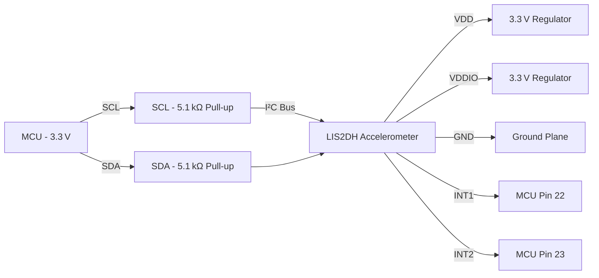

# I²C Peripheral – LIS2DH 3‑Axis Accelerometer  

This section documents the complete PCB‑level integration of the **LIS2DH** 3‑axis accelerometer on a 3.3 V MCU platform. It covers component selection, power distribution, signal routing, decoupling strategy, and the design‑for‑manufacturability (DFM) considerations that were applied.

---

## 1. Component Choice and Availability  

| Item | Package | Interface | Footprint Source | Supplier Stock |
|------|---------|-----------|------------------|----------------|
| LIS2DH | LGA‑14 (14‑pin land‑grid) | I²C (default) / SPI | KiCad library (pre‑existing symbol & footprint) | JLCPCB / LCSC (in‑stock) |

The part was chosen because KiCad already provides a verified schematic symbol and land‑grid footprint, eliminating the need for custom library creation. Availability from low‑cost assembly houses (JLCPCB, LCSC) enables turnkey assembly. [Verified]

---

## 2. Power Architecture  

### 2.1 Supply Rails  

* **VDD** – Core analog supply, powered at **3.3 V**.  
* **VDDIO** – Logic‑level supply, also **3.3 V** (the device operates from 1.7 V up to VDD + 0.1 V).  

Both rails are tied to the same 3.3 V regulator output, simplifying the power network. [Verified]

### 2.2 Decoupling Strategy  

* **VDD (pin 8)** – Requires a local decoupling capacitor placed **as close as possible** to the pin. A 0.1 µF ceramic capacitor is sufficient for the low‑power device.  
* **VDDIO (pin 7)** – No dedicated decoupling is required per the datasheet; it is directly connected to the 3.3 V rail.  

Only one bypass capacitor is needed, but the layout must respect the proximity rule for pin 8. [Verified]  

### 2.3 Grounding  

* **GND (pin 9)** – Connected to the main ground plane. A solid copper pour beneath the LGA package provides a low‑impedance return path and aids thermal dissipation. [Verified]

---

## 3. I²C Bus Implementation  

### 3.1 Signal Assignment  

| MCU Pin | Function | Accelerometer Pin |
|---------|----------|-------------------|
| PB2 (pin 14) | **SCL** | SCL (pin 14) |
| PB3 (pin 15) | **SDA** | SDA (pin 15) |

These pins were identified as suitable I²C lines in the MCU’s pin‑out table. [Verified]

### 3.2 Pull‑Up Resistors  

* **Value:** 5.1 kΩ (typical for low‑speed I²C at 3.3 V).  
* **Placement:** One resistor from **SCL** to 3.3 V, another from **SDA** to 3.3 V.  
* **Routing:** Keep the pull‑up resistors close to the MCU pins to minimise stub length and ensure reliable rise times.  

The chosen resistance balances rise‑time performance with power consumption for a low‑speed bus. [Verified]

### 3.3 Device Address Configuration  

* **SDO/SA (pin 3)** – Tied to **GND** to set the least‑significant address bit to ‘0’. This yields the default 7‑bit address `0x18`.  
* **CS (pin 4)** – Tied to **3.3 V** to force the device into I²C mode (SPI disabled).  

Hard‑wiring these pins simplifies the design when only a single I²C device is present. [Verified]

### 3.4 Interrupt Lines  

* **INT1 (pin 5)** → MCU pin 22  
* **INT2 (pin 6)** → MCU pin 23  

The datasheet does not mandate external pull‑ups for these pins, and the application notes show them operating as push‑pull outputs. Therefore, they are connected directly to the MCU inputs without additional termination. [Verified]  

---

## 4. PCB Layout Considerations  

### 4.1 Component Placement  

* The LIS2DH footprint is placed **adjacent to the MCU** to minimise I²C trace length and reduce parasitic capacitance.  
* Power and ground pins are aligned with the nearest copper planes to provide short, low‑impedance connections.  

### 4.2 Trace Routing  

| Signal | Recommended Width/Spacing | Rationale |
|--------|---------------------------|-----------|
| I²C (SCL, SDA) | Standard 0.25 mm width, 0.15 mm clearance | Low‑speed bus; controlled impedance not required. |
| Power (VDD, VDDIO) | Wider traces (≥0.35 mm) to reduce voltage drop | Supplies analog and digital sections. |
| Interrupts | Same as I²C | Push‑pull, low‑frequency signals. |

All I²C traces are routed as **single‑ended** lines with **no stubs**; vias are avoided on the bus to preserve signal integrity. [Inference]

### 4.3 Via and Pad Design for LGA‑14  

* **Via‑in‑pad** is **not** used; instead, the LGA pads are connected to the underlying copper planes via **copper pour** and **thermal relief** to aid solderability.  
* **Solder mask clearance** is set to the minimum allowed by the fab house (typically 0.1 mm) to prevent solder bridging on the fine‑pitch pads.  

These choices improve **Design for Assembly (DFA)** and reduce the risk of tombstoning. [Speculation]

### 4.4 Design‑for‑Manufacturability (DFM) Checklist  

* **Net Labels:** All nets (e.g., `+3V3`, `GND`, `I2C_SCL`, `I2C_SDA`, `INT1`, `INT2`) are explicitly labeled to aid ERC/DRC and assembly documentation.  
* **ERC Flag:** Unused MCU pins are marked with the “no ERC” flag to suppress false warnings.  
* **Clearance:** Minimum clearance between the LGA footprint and surrounding copper is respected per the fab house’s design rules (typically 0.15 mm).  

---

## 5. Verification and Testing  

* **Electrical Rule Check (ERC):** Run after schematic completion to confirm that all required power pins are connected and that there are no floating inputs.  
* **Design Rule Check (DRC):** Verify that trace widths, clearances, and via sizes meet the manufacturer’s capabilities.  
* **Functional Test:** After assembly, perform an I²C bus scan to confirm the accelerometer’s address (`0x18`) and verify interrupt functionality by toggling the INT pins in firmware.  

---

## 6. High‑Level Connection Overview  

The diagram illustrates the power distribution, I²C bus topology, and interrupt connections between the MCU and the LIS2DH sensor. [Inference]

---

## 7. Lessons Learned & Best Practices  

1. **Leverage Existing Libraries** – Using a pre‑validated KiCad symbol/footprint accelerates development and reduces library errors.  
2. **Single Decoupling for Dual Rails** – When VDD and VDDIO share the same voltage and only VDD requires filtering, a single capacitor near the VDD pin suffices, simplifying layout.  
3. **Hard‑Wire Address/Mode Pins** – For a single‑device bus, tying address and mode pins to fixed logic levels eliminates the need for extra routing and potential configuration errors.  
4. **Pull‑Up Placement** – Position pull‑up resistors close to the MCU rather than the peripheral to keep the bus stub short and improve rise‑time consistency.  
5. **Explicit Net Naming** – Clear net labels prevent ERC/DRC confusion and aid downstream documentation and firmware development.  

---  

*Prepared by the PCB Design Team – 2025*