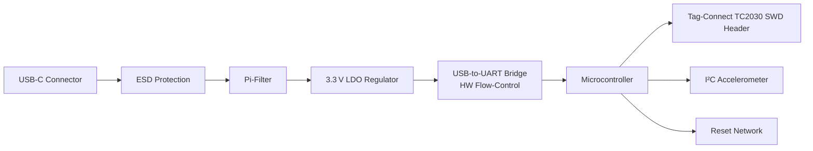

# Schematic Clean‑Up  

## 1. Overview  

After the functional connectivity of the schematic has been established, the final clean‑up phase focuses on **designator consistency**, **electrical rule validation**, and **readability for reviewers**. The board under development contains a USB‑C power/communication front‑end, a 3.3 V power‑rail, a USB‑to‑UART bridge with hardware flow‑control, a Tag‑Connect TC2030 SWD debug header, a reset network, and an I²C‑accelerometer peripheral. All of these blocks are now present on the schematic and net‑labeled; the remaining tasks are purely organizational and verification‑oriented.

---

## 2. Power‑Supply and Interface Block Diagram  



*The block diagram reflects the logical signal flow from the external USB‑C interface to the MCU and its attached peripherals.*[Verified]

---

## 3. Component Designator Annotation  

### 3.1 Why Annotation Matters  

- **Readability:** A sequential left‑to‑right, top‑to‑bottom scheme mirrors the natural reading order, making the schematic easier to audit.  
- **Manufacturing Documentation:** Consistent designators simplify BOM generation and assembly instructions.  
- **Error Prevention:** Duplicate designators cause ERC failures and can lead to component placement mistakes on the PCB.  

### 3.2 KiCad Annotation Options  

| Method | Description | Typical Outcome |
|--------|-------------|-----------------|
| **Automatic annotate (X‑sort)** | Sort symbols by X‑coordinate, then assign numbers. | Often yields gaps (e.g., R1 → R5) when components are spread across columns. |
| **Automatic annotate (Y‑sort)** | Sort symbols by Y‑coordinate first. | Improves vertical grouping but still may produce non‑contiguous numbers. |
| **Manual annotation** | Directly edit each reference (e.g., change C7 → C1). | Guarantees the desired logical order but is labor‑intensive and prone to human error. |

> **Best practice:** Use the automatic tool to obtain a rough ordering, then manually adjust any out‑of‑place items. Always run **ERC** after changes to catch duplicate or missing designators. [Inference]

### 3.3 Symbol Reference Adjustments  

KiCad defaults to generic prefixes (U for ICs, D for diodes). When a component’s function deviates from the generic class, rename the reference to reflect its role (e.g., change the default `U1` to `D1` for a diode array). This improves BOM clarity and reduces confusion during assembly. [Verified]

---

## 4. Electrical Rule Check (ERC)  

- **No‑ERC Flags:** After completing connectivity, set the *No ERC* flag on pins that are intentionally left floating (e.g., optional test points).  
- **Run ERC:** Verify that there are no duplicate designators, unconnected power pins, or mismatched net classes.  
- **Iterate:** If ERC reports errors, correct the schematic (adjust annotation, add missing connections, or apply *No ERC* where appropriate) and re‑run until a clean report is obtained. [Verified]

---

## 5. Adding Section Labels for Reviewability  

### 5.1 Purpose  

Textual labels act as visual anchors, allowing reviewers to jump quickly to functional blocks (e.g., “USB‑C Connector”, “LDO Regulator”, “UART Bridge”).  

### 5.2 Implementation Steps  

1. Press **T** (or click the *Draw Text* tool).  
2. Enter the desired label text.  
3. Choose a legible font; enable **Bold** for emphasis.  
4. Adjust the text size (e.g., 100 units) to balance visibility with schematic density.  
5. Position the label near the corresponding block, avoiding overlap with wires or symbols.  

Consistent labeling reduces the cognitive load during design reviews and aids in cross‑referencing between schematic and layout. [Verified]

---

## 6. Schematic Clean‑Up Workflow  

```mermaid
flowchart TD
    A[Complete functional connectivity] --> B[Add net labels]
    B --> C[Set No‑ERC flags on optional pins]
    C --> D[Run automatic annotation (X‑sort / Y‑sort)]
    D --> E[Manual fine‑tuning of designators]
    E --> F[Rename generic references (U → D, etc.)]
    F --> G[Add textual section labels]
    G --> H[Run ERC]
    H --> I{ERC clean?}
    I -- Yes --> J[Proceed to PCB layout]
    I -- No --> D
```

*The flowchart outlines the iterative nature of schematic clean‑up, emphasizing verification after each major change.*[Verified]

---

## 7. Key Takeaways & Best Practices  

- **Designator Discipline:** Adopt a logical ordering scheme and enforce uniqueness through ERC.  
- **Leverage KiCad Tools:** Use automatic annotation as a starting point, but be prepared to intervene manually for optimal readability.  
- **Explicit Documentation:** Section labels and clear reference prefixes dramatically improve review efficiency and downstream manufacturing communication.  
- **Iterative Verification:** Run ERC after every annotation or labeling change to catch inadvertent errors early.  
- **Balance Effort vs. Benefit:** While manual annotation is time‑consuming, the payoff in reduced assembly errors and clearer documentation often justifies the investment for low‑to‑mid‑volume designs. [Inference]

By following these guidelines, the schematic becomes a reliable, maintainable foundation for the subsequent PCB layout stage.
