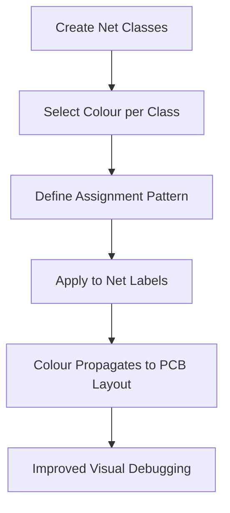

# Net Classes & Colours  

*Using colour‑coded net classes to improve schematic readability, accelerate PCB layout, and reduce signal‑integrity risk.*

---

## 1. Why Net Classes Matter  

A **net class** groups electrical nets that share common characteristics (e.g., function, speed, voltage).  
Assigning a distinct colour to each class gives an immediate visual cue that helps the designer:

* Distinguish high‑speed digital traces (bright‑green) from slower or analog signals.  
* Spot power‑rail nets (red) and reference/ground nets (gray) at a glance.  
* Detect potential **crosstalk** zones—e.g., analog vs. digital nets—without zooming into individual labels.  

These visual cues are valuable both in the schematic editor and, more critically, in the PCB layout where routing decisions are made. [Verified]

---

## 2. Defining Net Classes  

1. **Open the project‑wide net‑class manager** (e.g., *Schematic → Setup → Project Net Classes*).  
2. **Create a new class** for each functional group (USB, UART, Power, Ground, etc.).  
3. **Configure class properties**:  
   * **Wire / Bus thickness** – useful for schematic clarity.  
   * **Line style** – dashed for optional nets, solid for mandatory ones.  
   * **Colour** – the primary visual identifier that propagates to the PCB view.  

The colour is stored in the project file, so any board opened from the same project automatically inherits the same net‑class colours. [Verified]

---

## 3. Colour Assignment Workflow  



*The flow above summarises the typical workflow from class creation to the visual benefits realized during layout.* [Inference]

---

## 4. Pattern‑Based Net‑Class Assignment  

Manually tagging every net label is error‑prone. KiCad (and most ECAD tools) support **wild‑card patterns** to bulk‑assign nets:

*Pattern syntax*: `/<prefix>*` – matches any net whose name starts with `<prefix>`.  

**Example** – Assign all USB‑related nets to the *USB* class:  

```
Pattern: /USB*
Target Net Class: USB
```

The tool scans the schematic, finds every net label that matches the pattern, and applies the class (and its colour) automatically. This approach scales well for large designs with dozens of related signals. [Verified]

---

## 5. Typical Net‑Class Colour Schemes  

| Net Class | Suggested Colour | Rationale |
|-----------|------------------|-----------|
| **Power (VCC, 3.3 V, 5 V, etc.)** | Red | High‑visibility for supply rails; draws attention to voltage‑critical routing. |
| **Ground / Reference** | Gray / Light‑Blue | Neutral colour that blends with the board background, emphasizing its omnipresence. |
| **High‑Speed Digital (USB, HDMI, PCIe, etc.)** | Bright Green or Cyan | Stands out against other nets, reminding the designer to respect impedance and length‑matching rules. |
| **Analog / Sensor Signals** | Orange or Yellow | Highlights the need for low‑noise routing and separation from digital domains. |
| **Debug / UART** | Purple | Distinguishes test and console lines without confusing them with functional data paths. |

These are **guidelines**, not hard rules; the most important factor is consistency across the project. [Speculation]

---

## 6. Impact on PCB Layout  

### 6.1 Rapid Visual Inspection  

When the layout view inherits the net‑class colours, a designer can instantly:

* Verify that **high‑speed nets** stay on controlled‑impedance layers and avoid unnecessary vias.  
* Ensure **analog nets** are routed away from noisy digital traces, reducing EMI coupling.  
* Spot missing **ground fills** or insufficient **decoupling** by checking that all power nets retain their red colour throughout the board.  

### 6.2 Signal‑Integrity Awareness  

Colour coding reinforces **design‑rule checks (DRC)** and **electrical rule checks (ERC)**:

* A bright‑green USB trace crossing a gray ground plane will be visually flagged, prompting a review of clearance and spacing.  
* If a red power net appears on a layer that lacks a solid reference plane, the colour cue can trigger a stack‑up revision.  

### 6.3 Documentation & Handoff  

Manufacturers and assembly houses often request a **colour‑coded net list** for quick verification. Providing a consistent colour scheme reduces misinterpretation and speeds up **Design‑for‑Manufacturability (DFM)** reviews. [Inference]

---

## 7. Best‑Practice Checklist  

| Practice | Why It Matters |
|----------|----------------|
| **Define net classes early** (at schematic capture) | Guarantees that every net receives a colour before routing begins. |
| **Use meaningful, high‑contrast colours** | Improves readability on both screen and printed documentation. |
| **Keep colour‑to‑function mapping consistent across projects** | Facilitates team collaboration and reduces learning curve. |
| **Leverage pattern assignment for large groups** | Minimises manual errors and speeds up project setup. |
| **Validate colour propagation after board import** | Some ECAD tools may require a refresh to apply colours to the PCB view. |
| **Document the colour scheme in the project README** | Provides a reference for reviewers, manufacturers, and future maintainers. |

---

## 8. Common Pitfalls & Mitigations  

| Pitfall | Symptom | Mitigation |
|---------|---------|------------|
| **Colour clash with board background** | Net colours become hard to see on a dark board view. | Choose colours with sufficient luminance contrast; test in both light and dark UI themes. |
| **Over‑use of colours** (more than 8‑10 classes) | Visual clutter, reduced effectiveness. | Group less critical nets into a generic “Other” class with a neutral colour. |
| **Missing pattern for a subset of nets** | Some nets retain the default colour, leading to confusion. | Run a final **ERC/DRC** pass that flags any net without an assigned class. |
| **Changing colour after layout is complete** | May hide previously identified routing issues. | Freeze the colour scheme before final routing; treat colour changes as a design‑review step. |

---

## 9. Summary  

Net classes coupled with a disciplined colour scheme are a low‑cost, high‑impact technique that:

* Enhances schematic clarity and speeds up net identification.  
* Provides immediate visual feedback during PCB layout, helping to enforce signal‑integrity and EMI best practices.  
* Facilitates smoother handoffs to DFM/DFT teams and external manufacturers.  

Adopting a consistent, pattern‑driven workflow for net‑class creation and assignment is therefore a recommended standard for any modern PCB design project. [Verified]