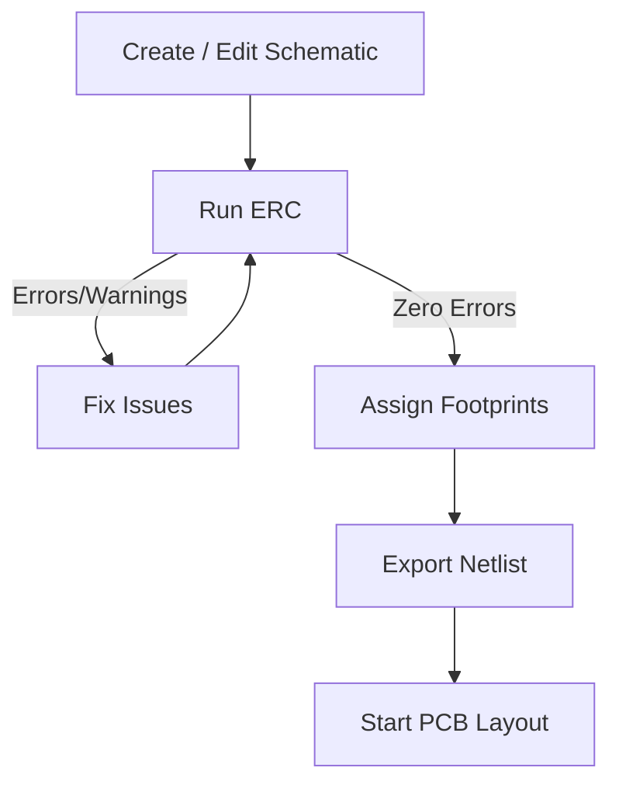

# Electrical Rules Check (ERC)

## 1. Why ERC Matters  

ERC is the **electrical sanity‑check** that runs on the schematic before any PCB layout work begins.  
It verifies that the netlist obeys fundamental electrical rules such as:

* Every **input power pin** is driven by at least one **output power pin**.  
* No two pins that are both defined as **outputs** are tied together.  
* All nets have the expected number of connections (no floating or single‑connection nets).  

Running ERC early catches logical mistakes that would otherwise manifest as **DRC violations**, re‑work, or even functional failures after the board is fabricated. In a mature workflow the goal is **zero ERC errors** before proceeding to footprint assignment and layout. [Verified]

---

## 2. Performing an ERC in KiCad  

1. Click the **Electrical Rules Check** button on the top toolbar.  
2. KiCad scans the schematic and reports **errors**, **warnings**, and **informational markers**.  
3. Selecting any marker automatically jumps the cursor to the offending schematic location, and a red arrow is drawn on the sheet for visual reference. [Verified]

> **Tip:** Use the “Delete all markers” command after you have resolved the issues to keep the schematic clean. [Best practice]

---

## 3. Typical ERC Findings and How to Resolve Them  

| ERC Issue | Typical Cause | Recommended Fix |
|-----------|---------------|-----------------|
| **Power‑output ↔ Power‑output connection** | Two pins are both defined as *outputs* (e.g., a regulator’s VOUT and a USB‑to‑UART converter’s V3) and are wired together. | Verify the component datasheet. If one pin can be used as an *input* (e.g., V3 may be an output **only** when not tied to VCC), edit the symbol’s pin type or replace the symbol with a correct version. [Verified] |
| **Input power pin not driven** | An input power net (e.g., VBUS, 3.3 V) lacks a source definition. | Place a **Power Flag** symbol on the net that represents the actual power source (e.g., the USB‑C connector’s VBUS pin). Hide the flag’s value if desired. [Verified] |
| **Symbol‑library mismatch after pin edit** | Pins were manually moved using the *Edit Symbol* property, breaking the link to the original library definition. | Either revert the symbol to the library version or create a **custom library part** that reflects the new pin arrangement, then update all instances. [Verified] |
| **Unconnected net (single‑connection net)** | A net is only attached to one component, often due to a missing wire or an accidental deletion. | Add the missing connection or delete the stray net if it is not required. [Verified] |

### 3.1 Using Power Flags  

Power flags are **special schematic symbols** that tell the ERC engine where a net’s *origin* is. To add one:

1. Open the **Place Symbol** dialog (right‑hand side toolbar).  
2. Search for **“flag”** and select the **Power Flag** symbol.  
3. Place it on the appropriate net (e.g., ground of the USB‑C connector, VBUS, 3.3 V).  
4. Optionally hide the flag’s value to keep the schematic tidy.  

Power flags eliminate the “input power pin not driven” error and make the netlist clearer for downstream tools such as the **BOM generator** and **layout netlist exporter**. [Verified][Inference]

---

## 4. Managing ERC Violations  

### 4.1 Reviewing & Excluding  

* **Right‑click** a marker → **Exclude** to silence a known‑good violation.  
* Add a comment when excluding to document the rationale (e.g., “V3 tied to 3.3 V per CH340E datasheet”).  

### 4.2 Adjusting Severity  

The ERC severity (Error, Warning, Ignore) can be customized in **Schematic Setup → Electrical Rules**. This is useful when a particular rule is not applicable to a specific design (e.g., a deliberately floating net for a test point). [Verified]

### 4.3 Documentation Discipline  

* Keep a **log** of excluded items with references to datasheets or design notes.  
* Re‑run ERC after any schematic modification to ensure new issues have not been introduced. [Best practice]

---

## 5. Transitioning to PCB Layout  

Once the schematic is **ERC‑clean**:

1. **Assign footprints** to every component (if not already done). The **Assign Footprints** tool is located on the top toolbar.  
2. Verify that each footprint matches the physical package and that the **pad stack** complies with the manufacturer’s capabilities.  

Only after footprints are correctly assigned should you export the netlist and begin the PCB layout stage. [Verified]

---

## 6. ERC Workflow Overview  

*The loop between **Run ERC** and **Fix Issues** continues until the schematic is error‑free, ensuring a robust foundation for the subsequent layout.* [Inference]

---

## 7. Key Takeaways  

* **Run ERC early and often** – it is the first line of defense against logical design flaws.  
* **Power flags are essential** for informing the ERC engine about true power sources.  
* **Do not edit library symbols without updating the library**; otherwise you will encounter mismatched‑symbol warnings.  
* **Document every exclusion** to maintain traceability and design intent.  
* **Zero ERC errors** is the practical target before moving to footprint assignment and PCB layout. [Best practice][Verified]