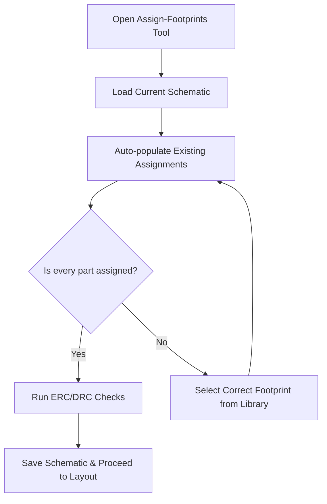

# 24 – Footprint Assignment Tool  

## 1. Purpose and Scope  

The **Footprint Assignment Tool** is the bridge between the schematic netlist and the physical layout. It ensures that every schematic symbol is bound to a PCB land‑pattern (footprint) that matches the component’s mechanical dimensions, pad layout, and manufacturing constraints. Correct assignment is a prerequisite for a successful **ERC → DRC → Layout → Fabrication → Assembly** flow and eliminates costly re‑work caused by mismatched parts.  

> **Key principle:** *A schematic symbol should never be decoupled from its footprint.* When the link is established in the library, a single “Apply & Save” propagates the correct land‑pattern to every instance in the design.  

---

## 2. Typical Footprint‑Verification Flow  

*The loop continues until **all** components have a verified footprint.*  

---

## 3. Library Strategy – Symbol‑to‑Footprint Binding  

### 3.1. Custom Symbol Libraries  

Creating **custom schematic symbol libraries** that embed a *default footprint reference* is the most robust approach.  

* **Benefits**  
  * Automatic propagation of the correct land‑pattern when the symbol is placed.  
  * Single‑source truth for part number, package code, and manufacturer part number.  
  * Simplifies version control – a change to the library updates every instance on the next load.  

* **Implementation** (standard practice)  
  1. Define the symbol (pin names, electrical type).  
  2. Add a *footprint field* that points to the exact IPC‑7351 or manufacturer‑provided land‑pattern (e.g., `Cap_603_470nF`).  
  3. Store the library in a shared repository (Git, SVN) and lock it for revision control.  

> This workflow reduces manual “Assign Footprint” actions and is **highly recommended for production‑grade designs**. [Inference]

### 3.2. Generic vs. Specific Libraries  

| Library type | When to use | Trade‑off |
|--------------|-------------|-----------|
| **Generic (e.g., “0805 Capacitor”)** | Early prototyping, low‑volume runs | Faster library creation but higher risk of mismatched pad dimensions. |
| **Specific (e.g., “Cap_603_470nF”)** | Production, high‑reliability designs | Slightly larger library maintenance effort; eliminates footprint errors. |

---

## 4. Verification Checklist  

When the **Assign Footprints** dialog is opened, run through the following checklist before saving:

| Item | What to verify | Typical reference (example) |
|------|----------------|-----------------------------|
| **Passive components** | Value‑specific package codes (e.g., 470 nF → `603`, 10 µF → `805`) | `[Verified]` |
| **Integrated circuits** | Package family (QFN, TQFP, BGA) matches the datasheet | `[Inference]` |
| **Diodes & discrete semiconductors** | Correct orientation pads (e.g., anode‑cathode marking) and footprint size | `[Inference]` |
| **Mechanical parts** | Mounting holes, slots, and any non‑electrical features are present in the layout library | `[Inference]` |
| **Fiducial markers** | At least two (preferably three) fiducials are defined for optical alignment during assembly | `[Inference]` |
| **ERC/DRC** | Run after assignment to catch un‑connected pins or clearance violations | `[Verified]` |

If any component shows **“Unassigned”** or an unexpected footprint, select the correct entry from the library and re‑apply.  

---

## 5. Adding Mechanical Features  

### 5.1. Mounting Holes  

* **Purpose** – Provide physical anchoring points for the PCB to the enclosure or chassis.  
* **Design considerations**  
  * Hole diameter must accommodate the fastener plus clearance for tolerance stack‑up.  
  * Keep a minimum copper‑to‑hole clearance (typically ≥ 0.2 mm) to avoid plating defects.  
  * Place holes away from high‑speed traces to minimize impedance discontinuities.  

### 5.2. Fiducial Markers  

* **Purpose** – Serve as reference points for automated pick‑and‑place and optical inspection.  
* **Best practice**  
  * Use circular copper pads with a surrounding clearance ring (e.g., 2 × pad diameter).  
  * Locate fiducials near the board corners and, for large boards, add a central fiducial to improve alignment accuracy.  
  * Ensure fiducials are on the same copper layer as the component pads (usually the top layer) and are not covered by solder mask.  

Both mounting holes and fiducials are added **in the schematic** (as mechanical symbols) so that they appear automatically in the layout and are included in the fabrication output files (Gerbers, drill files).  

---

## 6. Best‑Practice Summary & Trade‑offs  

| Practice | Impact on Design | Cost / Complexity |
|----------|------------------|--------------------|
| **Custom symbol‑footprint binding** | Eliminates manual errors, improves BOM accuracy | Slightly higher library maintenance effort |
| **Explicit verification of each footprint** | Guarantees manufacturability, reduces re‑work | Increases upfront review time |
| **Including mounting holes & fiducials early** | Streamlines mechanical integration and assembly alignment | Minimal extra design effort; negligible cost impact |
| **Using generic libraries for prototypes** | Faster iteration | Higher risk of mismatched footprints when moving to production |
| **Using specific, manufacturer‑verified footprints** | Guarantees pad dimensions, solder mask clearance | Requires diligent library updates when parts change |

> **Design recommendation:** For any design that will transition beyond a one‑off prototype, adopt a **custom library strategy** and embed mechanical features (holes, fiducials) in the schematic from the start. This approach pays off in reduced DFM issues, smoother hand‑off to the fab house, and lower total cost of ownership. [Inference]  

---  

*End of Chapter 24 – Footprint Assignment Tool*