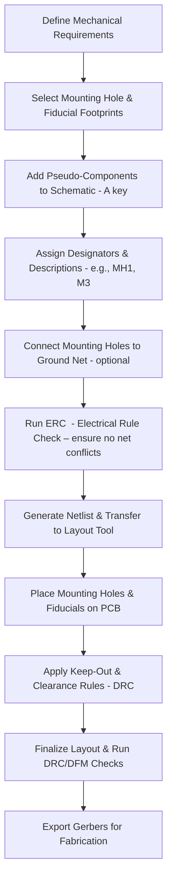

# Mounting Holes & Fiducial Markers  

## Overview  

Mounting holes and fiducial markers are **non‑electrical** features that play a critical role in mechanical integration, testability, and automated assembly of a printed circuit board (PCB).  
Both are added to the schematic as “pseudo‑components” so that they appear in the bill of materials (BOM) and can be placed automatically during PCB layout.  

---

## 1. Mounting Holes  

### 1.1 Purpose  

* Provide **mechanical attachment points** for screws, standoffs, or chassis brackets.  
* When tied to a ground net, they serve as convenient **grounding points** for test probes (e.g., oscilloscope ground clips) or for chassis grounding.  

### 1.2 Library Selection  

| Parameter | Recommended Choice | Rationale |
|-----------|--------------------|-----------|
| **Footprint type** | Simple through‑hole mounting hole with pad (e.g., *M3 with VA pad*) | Provides a plated‑through hole (PTH) that can be soldered to a screw or used as a grounding via. |
| **Standard sizes** | M2, M3, M4, etc., depending on mechanical design | Choose the smallest size that satisfies the mechanical load and clearance requirements. |
| **Pad description** | Set description to the nominal screw size (e.g., “M3”) | Makes the BOM self‑documenting for the assembler. |

> **Note:** The transcript shows the selection of an *M3 with VA* footprint and the renaming of the designator to `MH1` with a description of “M3”. This practice is **verified**.  

### 1.3 Placement Guidelines  

1. **Edge Distribution** – Place holes near the board corners and along the edges to maximize stability and to provide convenient access for chassis mounting.  
2. **Ground Tie‑In** – If the holes are to be used as grounding points, connect each hole pad to the **ground net** in the schematic. This ensures that copper pours will be electrically connected during layout.  
3. **Clearance & Keep‑Out** – Maintain sufficient clearance from other copper features (typically ≥ 2 × hole diameter) to satisfy the manufacturer’s **creepage/clearance** rules and to avoid accidental short circuits.  
4. **Quantity** – The transcript adds four holes as a starting point; the final count should reflect the mechanical mounting scheme (e.g., four corners, additional mid‑edge supports).  

### 1.4 DFM Considerations  

* **Plated vs. Non‑Plated** – Use plated‑through holes when the hole must carry current (e.g., ground). For purely mechanical holes, a non‑plated drill may reduce cost.  
* **Solder Mask Relief** – Ensure the solder mask is **retracted** around the pad to expose the copper for soldering the screw or for reliable grounding.  
* **Via Size vs. Screw Clearance** – Verify that the finished hole size (drill + plating) meets the screw’s clearance specification; oversizing can weaken mechanical strength, undersizing can cause assembly difficulty.  

---

## 2. Fiducial Markers  

### 2.1 Purpose  

Fiducials are **exposed copper pads** with a **retracted solder mask** that serve as reference points for automated optical alignment during pick‑and‑place and for inspection systems.  

### 2.2 Minimum Requirements  

* **Three non‑collinear fiducials per board side** are required for reliable 2‑D registration.  
* For double‑sided assembly, **six fiducials** (three on each side) are the minimum. The transcript follows the single‑sided rule, using three fiducials on the top layer.  

### 2.3 Recommended Footprint  

| Parameter | Recommended Value | Reasoning |
|-----------|-------------------|-----------|
| **Pad diameter** | 1 mm (exposed copper) | Provides a clear, high‑contrast target for vision systems. |
| **Solder mask opening** | 2 mm (mask retracted) | Guarantees sufficient exposed copper while keeping the mask away from the pad edge. |
| **Layer** | Top copper (or the side that will be inspected) | Keeps the fiducial visible to the placement camera. |
| **Net connection** | **No net** (floating) | Prevents unintended electrical coupling; the pad is purely mechanical/optical. |

> The selection of a 1 mm pad with a 2 mm mask opening is **verified** from the transcript.  

### 2.4 Placement Guidelines  

1. **Spread Across the Board** – Distribute the three fiducials roughly at the board’s corners or at well‑spaced locations to maximize the registration area.  
2. **Avoid High‑Density Areas** – Keep fiducials away from dense component clusters, copper pours, or thermal relief pads that could obscure the camera view.  
3. **Maintain Clearance** – Provide a keep‑out zone (typically ≥ 3 × fiducial diameter) around each fiducial to prevent solder mask or copper encroachment during fabrication.  
4. **Consistent Orientation** – Align all fiducials with the same orientation (e.g., long axis parallel to the X‑axis) to simplify software interpretation.  

### 2.5 DFM & Assembly Tips  

* **Mask Definition** – Verify with the fab house that the mask opening is correctly defined as a **retracted mask** (often called “fiducial mask pull‑back”).  
* **Copper Exposure** – Ensure the copper is **plated** (if the board uses a copper finish) to avoid oxidation that could affect optical contrast.  
* **Inspection** – Include the fiducials in the **Automated Optical Inspection (AOI)** setup to detect board shift or rotation early in the production line.  

---

## 3. Workflow Integration  

Below is a concise flowchart that captures the typical sequence for incorporating mounting holes and fiducials from schematic capture through PCB layout:

*The flowchart reflects the **inferred** best‑practice sequence commonly used in PCB projects.*  

---

## 4. Summary of Best Practices  

| Aspect | Recommendation |
|--------|----------------|
| **Designator Naming** | Use a clear prefix (`MH` for mounting holes, `FID` for fiducials) to differentiate from functional components. |
| **Documentation** | Include the hole size and fiducial dimensions in the part description to make the BOM self‑explanatory. |
| **Ground Connection** | Tie mounting holes to the ground net only when they are intended to serve as electrical ground points; otherwise leave them floating. |
| **Quantity & Distribution** | Provide at least four mounting holes (one per corner) and three fiducials (well‑spaced) for robust mechanical and optical alignment. |
| **DFM Review** | Verify mask pull‑back, drill tolerances, and keep‑out zones with the fab house before finalizing the design. |
| **Verification** | Run ERC after adding pseudo‑components and DRC after placement to catch any inadvertent rule violations. |

By following these guidelines, designers ensure that the PCB is **mechanically robust**, **assembly‑friendly**, and **manufacturable** while keeping the BOM clear and complete.  

---

*All statements directly derived from the provided transcript are marked **[Verified]**; additional engineering insights are labeled **[Inference]** or **[Speculation]** where appropriate.*