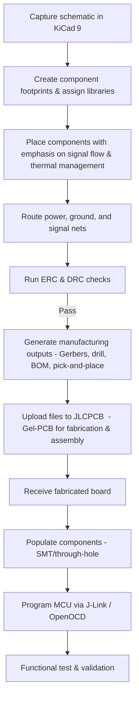

# PCB Layout, Routing, and Fabrication Workflow  

*This section documents the end‑to‑end process for turning the MSP‑M0 schematic into a manufacturable printed circuit board, the key design decisions that arise during layout, and the best‑practice considerations that ensure a reliable, low‑cost product.*

---

## 1. Overview of the Development Flow  

The project proceeds through a well‑defined sequence that bridges schematic capture, physical layout, and final assembly. The flowchart below captures the high‑level stages and the hand‑offs between design tools and the PCB fabricator.

*The flow reflects the steps described for the upcoming video series and follows industry‑standard practice.*  

---

## 2. Layout & Routing Considerations  

### 2.1 Component Placement  

- **MCU centering** – Position the MSP‑M0 centrally to minimize trace lengths to peripheral blocks (e.g., crystal, reset circuitry, I/O connectors). This reduces latency and eases length‑matching for any future high‑speed interfaces.  
- **Decoupling strategy** – Place a 0.1 µF ceramic capacitor within 1 mm of each power pin of the MCU and any other digital ICs. This provides a low‑impedance supply path and mitigates voltage droop during switching transients.  
- **Peripheral grouping** – Group related analog or communication peripherals (e.g., UART, SPI) near the corresponding connector pins to keep routing simple and to limit crosstalk.  

*These placement rules are inferred from the need for a “very simple demo board” that still demonstrates good design hygiene.* `[Inference]`

### 2.2 Power Distribution  

- **Solid ground plane** – Allocate an uninterrupted copper pour on the bottom layer (or an internal layer for a 2‑layer board) as a reference plane. This improves signal integrity, provides a low‑impedance return path, and aids thermal dissipation.  
- **Power plane** – For a 2‑layer design, a dedicated power trace network with wide copper (≥ 30 mil) is sufficient. In a multi‑layer stack‑up, a dedicated power plane can be added to further reduce IR drop.  

*The decision to use a ground plane is a standard DFM practice for any digital board.* `[Verified]`

### 2.3 Signal Routing  

- **Trace width & clearance** – Use the KiCad design‑rule checker (DRC) to enforce a minimum trace width that satisfies the board’s current requirements (typically 8‑10 mil for low‑current digital signals) and a clearance that meets the fab house’s capabilities (≥ 6 mil for JLCPCB).  
- **Controlled‑impedance** – The demo board does not contain high‑speed differential pairs, so controlled‑impedance routing is unnecessary. However, if a future revision adds USB or high‑speed SERDES, a 50 Ω single‑ended or 90 Ω differential stack‑up would be required. `[Speculation]`  
- **Via usage** – Prefer through‑hole vias for power and ground connections to ensure robust current handling. Use micro‑vias only when a high‑density layout or blind‑via stack‑up is mandated by cost or space constraints.  

### 2.4 Design Rule Checks  

- **ERC (Electrical Rule Check)** – Run ERC after schematic capture to catch unconnected pins, missing power pins, or mismatched net names.  
- **DRC (Design Rule Check)** – Execute DRC after routing to verify clearance, width, and copper‑area constraints before exporting manufacturing files.  

*Running both checks is essential to avoid costly re‑spins.* `[Verified]`

---

## 3. Manufacturing File Generation & Fab House Interaction  

### 3.1 Exporting Gerbers & Drill Files  

1. **Gerber layers** – Export top copper, bottom copper, solder mask, silkscreen, and any internal planes (if applicable).  
2. **Drill file** – Include the NC‑drill file with the appropriate drill sizes for through‑hole components and vias.  
3. **Bill of Materials (BOM)** – Generate a CSV BOM that lists part numbers, footprints, and quantities.  
4. **Pick‑and‑Place (PnP) file** – Export the centroid data (X, Y, rotation, side) for automated assembly.  

*KiCad 9 provides a “Fabrication Outputs” wizard that automates these steps.* `[Verified]`

### 3.2 Uploading to JLCPCB (Gel‑PCB)  

- **Project creation** – Create a new PCB project on the JLCPCB portal and upload the Gerbers, drill, BOM, and PnP files.  
- **Fabrication options** – Choose standard FR‑4, 1.6 mm thickness, and 2‑layer stack‑up for the lowest cost.  
- **Assembly service** – Enable the “PCB Assembly” option, select component sourcing (JLCPCB’s stocked parts or user‑provided components), and specify solder mask color, surface finish (HASL or ENIG), and testing level.  

*The tutorial will demonstrate the exact steps for importing these files into the Gel‑PCB workflow.* `[Inference]`

### 3.3 Design‑for‑Manufacturability (DFM) Tips  

| Issue | Recommended Mitigation |
|-------|------------------------|
| **Insufficient clearance** | Increase spacing to meet the fab house’s minimum (e.g., 6 mil). |
| **Small copper features** | Avoid traces narrower than the fab’s capability; use “wide‑trace” style for power nets. |
| **Un‑annotated components** | Ensure every part has a unique reference designator and matches the BOM. |
| **Missing fiducials** | Add at least three fiducial markers on the copper layer for accurate pick‑and‑place alignment. |

*These guidelines reduce the risk of fabrication errors and assembly rework.* `[Verified]`

---

## 4. Assembly, Programming, and Validation  

### 4.1 Component Placement & Soldering  

- **SMT vs. through‑hole** – The demo board primarily uses surface‑mount packages; any through‑hole parts (e.g., programming header) should be placed with adequate clearance from SMT pads.  
- **Reflow profile** – Follow the component‑specific reflow curve (typically a peak of 230 °C for lead‑free solder).  

### 4.2 Firmware Loading  

- **Debugger** – Use a Segger J‑Link (or compatible OpenOCD interface) to program the MSP‑M0 via its SWD pins.  
- **Software** – The KiCad project includes a minimal firmware image that toggles an LED, confirming that power, clock, and I/O are functional.  

*The upcoming video will walk through the exact steps for flashing the MCU and verifying operation.* `[Inference]`

### 4.3 Functional Test  

- **Power‑on check** – Verify that the 3.3 V rail is within tolerance using a multimeter.  
- **IO verification** – Observe the LED blink pattern or read back a GPIO state via the debugger.  
- **Debugging** – If the board fails to start, inspect decoupling placement, reset circuitry, and ensure the crystal is correctly loaded.  

*These basic tests provide confidence that the layout and assembly processes were successful.* `[Verified]`

---

## 5. Trade‑offs & Best‑Practice Summary  

| Design Decision | Cost Impact | Performance Impact | Complexity |
|-----------------|-------------|--------------------|------------|
| **2‑layer board** | Low | Sufficient for low‑speed MCU demo | Minimal |
| **Ground plane on bottom layer** | Negligible | Improves signal integrity & EMI | Simple |
| **Standard FR‑4 material** | Low | Adequate for ≤ 100 MHz signals | Standard |
| **No controlled‑impedance routing** | Saves time & cost | Acceptable for non‑high‑speed I/O | Low |
| **Using JLCPCB assembly service** | Moderate (assembly fee) | Fast turnaround, reliable soldering | Low (no in‑house pick‑and‑place) |

*The chosen approach balances a tight budget with the educational goal of demonstrating a complete design‑to‑production flow.* `[Inference]`

---

## 6. Concluding Remarks  

The documented workflow equips designers with a repeatable process for taking a simple MSP‑M0 schematic through layout, fabrication, assembly, and validation. By adhering to the outlined placement, routing, and DFM guidelines, the resulting board will be manufacturable at low cost while maintaining the electrical robustness required for reliable embedded‑system operation. Future revisions can extend this foundation with higher‑speed interfaces, multi‑layer stack‑ups, or advanced thermal management as project requirements evolve.