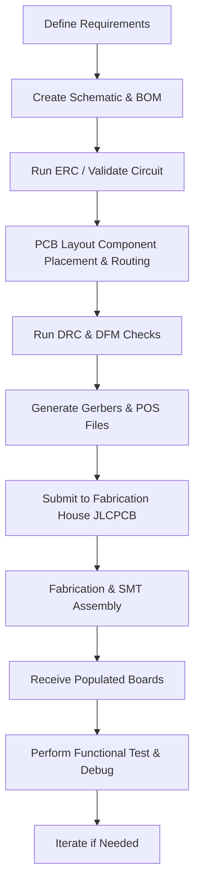

# Introduction  

This chapter provides an overview of the design intent, key functional blocks, and the primary PCB‑related decisions that shape the **Keycat 9 demo board**. The board is built around a Texas Instruments **MSPM0** low‑power microcontroller and includes USB‑UART conversion, a USB‑C power and data connector, and an optional I²C accelerometer. The focus of this section is on the PCB layout strategy, layer‑count trade‑offs, and the manufacturing workflow that will be used to obtain a fabricated and assembled board from **JLCPCB**.  

---  

## 1. Scope of the Design  

The project is deliberately kept simple to illustrate the end‑to‑end flow from schematic capture to board ordering. All schematic details are covered in the preceding video (part 1); this documentation concentrates on the **layout, DFM/DFA considerations, and ordering process**. The board is intended as a **reference design** that can be easily adapted—components such as the header on the right‑hand side may be swapped for an I²C accelerometer or any other peripheral required by the final application.  

---  

## 2. Core Components and Functional Blocks  

| Block | Primary Part | Role |
|------|--------------|------|
| **Microcontroller** | TI MSPM0 (low‑power MCU) | Executes firmware, provides GPIO, UART, I²C, etc. |
| **USB‑UART Bridge** | Generic USB‑to‑UART converter | Enables serial communication over USB for debugging and data logging. |
| **USB‑C Connector** | USB‑C receptacle (power + data) | Supplies board power and carries UART data when used in “USB‑C UART” mode. |
| **Optional Sensor** | I²C accelerometer (e.g., ISQED) | Demonstrates peripheral integration; can be replaced with any I²C device. |
| **Programming Header** | 2‑wire debug header (SWD/JTAG) | Provides in‑system programming and debugging access. |

The functional partitioning is deliberately linear: power enters via the USB‑C connector, is filtered and distributed to the MCU and peripheral circuits, while the USB‑UART bridge provides a bidirectional data path to the host PC.  

---  

## 3. Layer Count Selection and Stackup Considerations  

The demo board uses a **two‑layer stackup** (top signal layer, bottom ground plane) – this is sufficient for the modest component count and modest signal speeds involved.  

- **Cost vs. Complexity** – Two‑layer boards are the most economical option and simplify DFM checks. For designs that require controlled‑impedance routing (e.g., high‑speed USB 3.0 or RF), a four‑layer stackup with dedicated power and ground planes would be advisable. `[Inference]`  
- **Signal Integrity** – The bottom copper serves as a solid ground reference, which helps to reduce EMI and provides a return path for all signals, including the USB differential pair. `[Verified]`  
- **Thermal Management** – A continuous ground plane also aids in heat spreading from the MCU and USB‑C connector. `[Inference]`  

If a designer wishes to explore a four‑layer board, the typical stackup would be:  

1. **Top Signal** – component placement, routing of high‑speed traces.  
2. **Inner Plane 1 – Ground** – reference for controlled‑impedance pairs.  
3. **Inner Plane 2 – Power** – stable VCC distribution, decoupling.  
4. **Bottom Signal** – additional routing, optional ground fill.  

---  

## 4. Layout Strategies for Power, USB, and Sensors  

### 4.1 Power Distribution  

- Place the **USB‑C VBUS** trace close to the connector and route it with a **wide copper pour** on the top layer to minimize voltage drop.  
- Insert **decoupling capacitors** (0.1 µF and 1 µF) as close as possible to the MCU VDD pins; on a two‑layer board these are typically placed on the top layer with their ground pads connected directly to the bottom plane via short vias. `[Inference]`  
- Use **via stitching** around the USB‑C footprint to reinforce the ground return and improve EMI shielding.  

### 4.2 USB‑UART Signal Routing  

- The USB‑UART bridge’s **TX/RX** lines are low‑speed (12 Mbps) and do not require strict impedance control on a two‑layer board, but keep them **short and away from noisy digital lines**.  
- Maintain a **minimum clearance** of at least the manufacturer’s default (usually 0.15 mm) to satisfy DRC and avoid solder mask shorts.  

### 4.3 I²C Accelerometer Integration  

- Route the **SCL/SDA** pair as a **short differential pair** with matched lengths where possible; on a two‑layer board this is a best‑practice rather than a strict requirement. `[Inference]`  
- Provide **pull‑up resistors** (typically 4.7 kΩ) on the top layer close to the MCU pins to ensure reliable bus operation.  

### 4.4 Component Placement  

- Group **power‑related components** (USB‑C connector, bulk capacitor, voltage regulator if present) near the board edge to simplify mechanical integration.  
- Keep the **MCU centrally located** to minimize trace lengths to all peripherals.  
- Reserve a **clear area** for the programming header to avoid accidental solder bridges during assembly.  

---  

## 5. Design for Manufacturability (DFM) and Design for Assembly (DFA)  

| Aspect | Recommendation | Rationale |
|--------|----------------|-----------|
| **Footprint Selection** | Use manufacturer‑approved footprints (e.g., JLCPCB’s library) and verify pad dimensions against the component datasheet. | Reduces the risk of mis‑registration and improves yield. |
| **Silkscreen** | Keep silkscreen text at least 0.2 mm away from pads and vias. | Prevents solder mask bridging and improves readability. |
| **Clearance & Creepage** | Follow the PCB fab house’s default clearance (≥0.15 mm) unless higher voltage is present. | Ensures compliance with IPC‑2221 standards. |
| **Via Usage** | Prefer **through‑hole vias** for signal connections between top and bottom layers; avoid micro‑vias on a two‑layer board. | Simplifies fabrication and reduces cost. |
| **Panelization** | When ordering from JLCPCB, request **standard panelization** (e.g., 2 × 2 array) to lower per‑board cost. | Economical for small‑batch production. |
| **Assembly Options** | Enable **SMT assembly** for all components; for the optional accelerometer, provide a **pick‑and‑place file** if the part is not stocked by the fab house. | Guarantees consistent solder quality and reduces manual labor. |

---  

## 6. Fabrication and Assembly with JLCPCB  

The board will be fabricated and assembled by **JLCPCB**, a widely used low‑cost fab house that offers both **PCB manufacturing** and **SMT assembly** services.  

- **Gerber Generation** – Export standard Gerber files (RS‑274X) with an accompanying **drill file** and **pick‑and‑place (POS) file** for assembly.  
- **Design Rule Check (DRC)** – Run a final DRC in the CAD tool using JLCPCB’s default design rules (minimum trace/space, via size, etc.) before submission.  
- **Bill of Materials (BOM)** – Provide a complete BOM with **JLCPCB part numbers** where possible to take advantage of their component sourcing service.  
- **Order Parameters** – Select **2‑layer, FR‑4, 1.6 mm thickness** (standard) and request **lead‑free solder mask**.  
- **Turn‑around Time** – Typical prototype turnaround is **3–5 business days** for fabrication and **5–7 days** for assembly, depending on component availability.  

---  

## 7. Development Flow Overview  

The following flowchart captures the end‑to‑end process from concept to a populated board.  

---  

## 8. Summary  

The Keycat 9 demo board demonstrates a **straightforward two‑layer PCB design** that balances cost, manufacturability, and functional completeness for a low‑power MCU platform. By adhering to solid DFM/DFA practices, using a robust ground plane, and following a disciplined development flow, the design can be reliably fabricated and assembled through a single‑source provider such as JLCPCB. Designers are encouraged to adapt the layout to their own peripheral requirements while preserving the core principles outlined above.