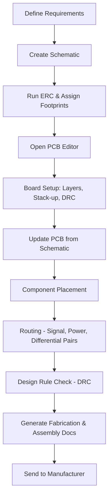

# PCB Set‑Up  

*This section documents the complete workflow for preparing a new PCB layout, from importing the schematic to defining the board stack‑up, layer visibility, and design‑rule constraints. The guidelines below are derived from a typical two‑layer board design and illustrate best‑practice decisions that ensure manufacturability, reliable assembly, and predictable electrical performance.

## 1. Importing the Schematic and Verifying Net Labels  

Before any layout work begins, confirm that the schematic‑to‑PCB net mapping is correct. In this design the USB D‑ and D+ nets were inadvertently swapped at the USB‑UART converter; the net labels were corrected by moving the corresponding pins on the schematic. A quick **ERC** (Electrical Rule Check) after the edit verified that all nets now match the intended routing topology.  

> **Tip:** Perform an ERC immediately after any schematic edit; it catches label mismatches before they propagate to the PCB.

## 2. PCB Editor Navigation  

| Action | Mouse / Keyboard | Result |
|--------|------------------|--------|
| Pan the board | Hold **Middle‑mouse button** and drag | Moves the viewport |
| Zoom | Scroll **Middle‑mouse wheel** (in/out) | Changes zoom level |
| Switch to 3‑D view | **Alt + 3** or *View → 3D Viewer* | Opens a real‑time 3‑D render of the board |
| Update layout from schematic | **F8** or *Update PCB from Schematic* button | Synchronises component placement and netlist |

The editor presents a **Layer Panel** on the right, listing all physical and fabrication layers (copper, solder mask, silkscreen, paste, etc.). For a simple two‑layer board only a subset of these layers is required.

## 3. Board Setup – Defining Stack‑up and Constraints  

All board‑wide parameters are configured through **Board Setup** (top‑left menu). The following subsections describe the essential settings.

### 3.1 Layer Visibility  

Only the layers needed for layout and documentation are kept visible:

* **Top Copper** – signal and power routing  
* **Bottom Copper** – ground plane (set to *Power Plane* for clarity)  
* **Solder Mask** (Top & Bottom) – defines mask openings  
* **Silkscreen** (Top) – component designators and outlines  
* **Solder Paste** (Top & Bottom) – for stencil generation  

All fabrication‑only layers (e.g., adhesive, drill‑drawing, mechanical) are hidden to reduce visual clutter.  

> **Why set Bottom Copper to “Power Plane”?**  
> The bottom layer will be used as a solid ground reference, and labeling it as a power plane makes the intent explicit in the CAD tool. [Inference]

### 3.2 Physical Stack‑up  

| Parameter | Typical Value | Comment |
|-----------|---------------|---------|
| **Board thickness** | **1.6 mm** (nominal) | Standard for two‑layer FR‑4 boards [Verified] |
| **Copper weight** | 1 oz/ft² (≈35 µm) | Implicit when using standard stack‑up |
| **Surface finish** | Hot‑air‑solder‑level (HASL), lead‑free | Suitable for general‑purpose assemblies [Verified] |
| **Dielectric material** | FR‑4 (unspecified) | Default for low‑cost boards |

These values are communicated to the fabricator via the **Fabrication Drawing** and **Assembly Drawing** generated from the CAD tool.

### 3.3 Solder‑Mask & Paste Settings  

* **Mask expansion** – **0.1 mm** (adds a small clearance around pads to compensate for mask mis‑registration) [Verified]  
* **Minimum mask‑to‑copper clearance** – **0.1 mm** [Verified]  
* **Minimum mask web width** – **0.1 mm** [Verified]  

These numbers are typical for manufacturers such as JLCPCB, which can achieve 1:1 mask‑to‑copper registration but a modest expansion improves yield.  

> **Design‑for‑Assembly (DFA) note:** The mask opening must be larger than the pad to guarantee solderability; too small an opening can cause solder bridges or insufficient wetting.

Solder‑paste parameters are left at the CAD tool defaults, which are adequate for standard 0603–1206 components.

### 3.4 Design‑Rule Constraints (DRC)  

Setting realistic DRC limits early prevents costly redesigns. The values below are deliberately **more generous** than the absolute manufacturing minima to increase process yield.

| Rule | Value | Rationale |
|------|-------|-----------|
| **Minimum clearance (track‑to‑track, track‑to‑pad, pad‑to‑pad)** | **0.152 mm** (≈6 mil) [Verified] | Slightly above typical fab capability; avoids marginal clearances |
| **Minimum track width** | **0.152 mm** [Verified] | Matches clearance; ensures robust copper |
| **Minimum annular ring** | **0.15 mm** [Verified] | Guarantees sufficient copper around drilled holes |
| **Via drill diameter** | **0.3 mm** (hole) with **0.7 mm** overall via (0.3 mm pad) [Verified] | Standard through‑hole via size for 1 oz copper |
| **Copper‑to‑hole clearance** | **0.254 mm** [Verified] | Prevents copper erosion during plating |
| **Copper‑to‑edge (board) clearance** | **0.5 mm** [Verified] | Provides mechanical strength and avoids edge delamination |
| **Minimum text height** | **0.8 mm** [Verified] | Ensures legibility on silkscreen |
| **Minimum text thickness** | **0.1 mm** [Verified] | Adequate for printing processes |

> **Best practice:** Always stay **one step back** from the fab house’s advertised minima. This margin absorbs process variation and improves first‑pass yield. [Inference]

### 3.5 Pre‑defined Track & Via Sizes  

To speed up routing, a set of common widths and via dimensions is stored in the CAD tool:

* **Signal traces** – 0.3 mm (typical)  
* **Power traces** – 0.5 mm – 1 mm (depending on current)  
* **Standard via** – 0.7 mm overall, 0.3 mm drill  

These presets can be selected from a drop‑down during routing, avoiding manual entry each time.

### 3.6 Net Classes & Differential Pairs  

Net classes group nets that share similar routing requirements:

| Net Class | Typical Use | Custom Rules |
|----------|-------------|--------------|
| **Power** | VCC, VDD, VAA | Wider tracks, larger clearance |
| **Ground** | GND, GND‑plane | Solid fill on bottom layer |
| **Crystal** | XTAL_IN/OUT | Tight clearance, minimal stubs |
| **USB‑DP/DM** | USB D+, D‑ | Differential pair definition (width ≈ 0.3 mm, spacing ≈ 0.3 mm, via gap ≈ 0.5 mm) [Verified] |

Although the design uses **USB Full‑Speed** (12 Mbps) and does not require strict controlled‑impedance routing, a differential‑pair definition is still created so the CAD tool can enforce consistent spacing and optionally length‑match the pair later.  

> **Note:** For **USB 2.0 High‑Speed** (480 Mbps) a controlled‑impedance pair (≈90 Ω differential) would be mandatory, requiring precise trace width/spacing and a dedicated reference plane. [Speculation]

## 4. Updating the PCB from the Schematic  

After completing the board‑setup, synchronize the layout with the schematic:

1. Click **Update PCB from Schematic** (or press **F8**).  
2. The tool places all components according to their schematic coordinates and updates net connections.  

At this point the board appears as a collection of un‑routed parts on a blank canvas, ready for component placement and trace routing.

## 5. Summary Flowchart  

*The flowchart captures the high‑level sequence from concept to fabrication, emphasizing the board‑setup step as the bridge between schematic completion and physical layout.*  

## 6. Key Takeaways  

* **Early DRC configuration** prevents downstream redesigns and improves yield.  
* **Layer visibility** should be trimmed to the essentials for a clear workspace.  
* **Solder‑mask expansion** of ~0.1 mm balances manufacturability with pad exposure.  
* **Net classes** enable differentiated routing rules for power, ground, and high‑speed signals.  
* Even when controlled‑impedance is not required (e.g., USB Full‑Speed), defining differential pairs helps maintain consistent spacing and simplifies later verification.  

By following the procedures and constraints outlined above, designers can produce a clean, manufacturable PCB layout that aligns with both electrical performance goals and the capabilities of low‑cost fabricators.