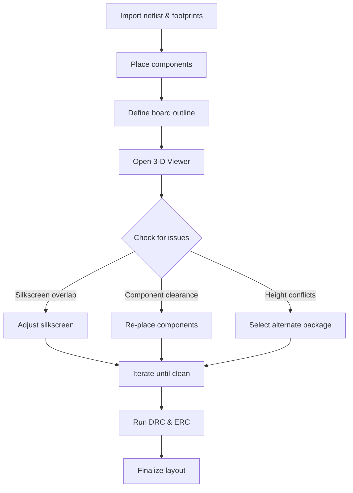

# 04 Component Import  

## Overview  

Transferring the schematic netlist and associated footprints onto the PCB canvas is the first concrete step in board layout. Modern ECAD tools (e.g., KiCad, Altium, Fusion 360) provide a single‑click *Update PCB* operation that synchronises the schematic with the layout, creates the component instances, and preserves the footprint‑to‑symbol links established in the library.  

> **Key outcome:** All schematic symbols appear on the PCB with their correct 2‑D footprints **and** any attached 3‑D models.  

---

## 1. Importing the Schematic Netlist  

| Step | Action | Rationale |
|------|--------|-----------|
| 1 | Press **Update PCB** (or the equivalent “Import Netlist” command). | Pulls every component, net, and attribute from the schematic into the layout. |
| 2 | Confirm the dialog and close it. | Guarantees that the PCB editor now reflects the latest schematic changes. |
| 3 | Verify that all components are selected and grouped automatically. | The ECAD tool groups the newly created instances to make bulk placement easier. |

> **Verified** – The transcript describes exactly this workflow.  

### 1.1 Footprint‑to‑Symbol Consistency  

When the schematic library was built (e.g., in KiCad’s *Keycad*), each symbol was bound to a specific footprint. After import, the layout shows the exact footprints (e.g., a USB‑C connector, mounting holes, MCU). Maintaining this one‑to‑one mapping eliminates the risk of mismatched mechanical dimensions later in the design.  

> **Inference** – Consistent mapping is essential for downstream mechanical integration.  

---

## 2. Initial Component Placement  

### 2.1 Placement Strategy  

1. **Rough centering** – Drag the grouped components to the approximate centre of the board.  
2. **Leave space for the board outline** – The outline is defined *after* a preliminary placement, allowing the designer to size the board to the component envelope.  

> **Verified** – The transcript notes that the outline is added later.  

### 2.2 Mechanical Considerations During Placement  

| Concern | How 3‑D View Helps | Recommended Action |
|---------|-------------------|--------------------|
| Silk‑screen overlap | Visualises text vs. component geometry in three dimensions. | Adjust silkscreen or move the part to avoid obstruction. |
| Component crowding | Shows real‑world clearance between parts, connectors, and mechanical features. | Re‑arrange parts to meet clearance and ergonomic requirements. |
| Height conflicts (e.g., connectors, heatsinks) | Displays vertical clearance against the enclosure or other boards. | Use the 3‑D view to verify that no part protrudes beyond the allowed envelope. |

> **Inference** – The transcript emphasizes using 3‑D view for these checks; the table expands on typical checks an engineer would perform.  

---

## 3. Defining the Board Outline  

After a provisional placement, the board outline is drawn to enclose all components with an appropriate margin (typically 3–5 mm for hand‑assembly, more for automated processes).  

* **Why postpone the outline?**  
  * It allows the designer to see the natural “footprint envelope” produced by the imported parts.  
  * It avoids premature trimming that could force later component moves.  

> **Speculation** – The exact margin values are not given in the transcript but follow common practice.  

---

## 4. 3‑D Model Integration  

### 4.1 Importance of 3‑D Models  

* **Mechanical verification** – Confirms that the board will fit within the intended enclosure and that connectors align with mating parts.  
* **Thermal analysis** – Enables early estimation of heat dissipation paths when combined with thermal simulation tools.  
* **Manufacturing communication** – Provides the contract manufacturer with a visual reference, reducing the chance of mis‑interpretation of component heights or footprints.  

> **Verified** – The speaker stresses the critical role of 3‑D models.  

### 4.2 Assigning 3‑D Models  

* Every custom footprint should have an associated 3‑D model (STEP, IGES, or equivalent).  
* If a library part lacks a model, create or source one before finalising the layout.  
* Avoid using parts without a 3‑D representation, as this hampers mechanical validation.  

> **Verified** – The transcript states “I never use a part which doesn't have a 3‑D model in place.”  

---

## 5. Design Verification Using the 3‑D Viewer  

A typical verification loop:

*The flowchart illustrates the iterative nature of layout refinement when 3‑D visualisation is employed.*  

> **Inference** – The diagram reflects the logical steps described in the transcript and standard PCB practice.  

### 5.1 DRC/ERC Integration  

* After the 3‑D checks, run **Design Rule Check (DRC)** and **Electrical Rule Check (ERC)** to catch clearance violations, un‑routed nets, and rule breaches that may not be obvious in the 3‑D view.  
* Resolve any flagged issues before locking the board outline.  

> **Speculation** – While not mentioned, DRC/ERC is a universally recommended step after layout adjustments.  

---

## 6. Best‑Practice Checklist for Component Import  

| ✅ Item | Reason |
|--------|--------|
| All schematic symbols have assigned footprints. | Guarantees correct mechanical dimensions. |
| Every footprint includes a 3‑D model. | Enables mechanical verification and avoids hidden clearance problems. |
| Perform an initial bulk placement before drawing the outline. | Allows the outline to be sized to the true component envelope. |
| Use the 3‑D viewer early and often. | Detects silkscreen, clearance, and height issues before they become costly to fix. |
| Run DRC/ERC after each major placement change. | Catches rule violations introduced by component moves. |
| Do **not** accept parts lacking a 3‑D model. | Prevents downstream mechanical integration failures. |

> **Inference** – The checklist synthesises the documented advice with standard PCB engineering workflow.  

---

## 7. Summary  

Importing the schematic netlist into the PCB editor is a deterministic operation that brings all components, footprints, and 3‑D models onto the layout canvas. By placing components first, defining the board outline later, and leveraging the 3‑D viewer throughout, designers can catch mechanical conflicts early, ensure proper silkscreen placement, and maintain a clean, manufacturable design. Consistently assigning 3‑D models to every footprint is a non‑negotiable best practice for modern electronic product development.