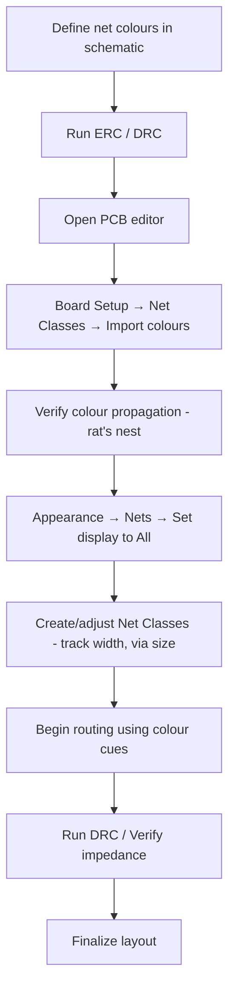

# Net Colours – Visual Management of Signals in PCB Layout  

## 1. Overview  

In modern PCB layout tools the colour of a net is used as a visual cue that instantly identifies the electrical function of a trace, pad or via.  
When a board is viewed in the **2‑D editor**, the colour of a net is over‑laid on the active copper layer:

| Layer | Default colour (tool default) |
|-------|------------------------------|
| Front (F.Cu) | Red |
| Back  (B.Cu) | Blue |

These defaults provide a quick visual distinction between the two copper sides but they do **not** differentiate between power, ground, high‑speed, or control signals. Relying solely on the default palette makes it difficult to spot routing errors or to verify that critical nets (e.g., USB, differential pairs, high‑current rails) have been treated correctly.  

> **Key principle:** Assign meaningful colours to nets **once** in the schematic and propagate them to the PCB layout. This creates a single source of truth for net identification across the entire design flow. [Verified]

## 2. Benefits of Consistent Net Colouring  

| Benefit | Description |
|---------|-------------|
| **Rapid visual debugging** | A glance at the board instantly reveals where power, ground, and signal nets reside, reducing the time spent hunting for a missing connection. |
| **Improved design communication** | Team members can discuss routing decisions using colour references (e.g., “the USB‑DP line is still green”). |
| **Error prevention** | Colour‑coded nets make it easier to spot accidental cross‑overs between unrelated nets, especially in dense, multi‑layer designs. |
| **Facilitates design reviews** | Reviewers can verify that controlled‑impedance nets have the correct width/spacing simply by checking their colour group. |

## 3. Importing Net Colours from the Schematic  

Most ECAD suites provide a **“Import colours from schematic”** command (usually found under *Board Setup → Net Classes → Design Rules*). The workflow is:

1. **Define net colours** in the schematic editor (e.g., red for power, green for USB, gray for ground).  
2. Open *Board Setup* in the PCB editor.  
3. Navigate to **Net Classes → Design Rules** and click **Import colours from schematic**.  
4. The PCB view updates, showing the same colour assignments that were used in the schematic.  

> This step eliminates the need to manually re‑assign colours in the PCB editor, guaranteeing colour consistency throughout the project. [Verified]

## 4. Net Classes and Associated Design Rules  

A **net class** groups nets that share common physical constraints (track width, via size, clearance, impedance). After importing colours, the default net class is automatically created, but designers can add additional classes for special requirements:

| Net Class Example | Typical Use | Typical Constraints |
|-------------------|------------|---------------------|
| **Power** | High‑current rails (VCC, VDD) | Wider tracks, larger vias, generous clearance |
| **Ground** | Plane or polygon nets | No specific width, but may enforce copper pour rules |
| **USB / High‑Speed** | USB 2.0, HDMI, Ethernet | Controlled impedance (50 Ω single‑ended, 90 Ω differential), length matching, tighter spacing |
| **Signal** | General‑purpose I/O | Default width/spacing from design rules |

When a net is assigned to a class, the class’s default parameters are automatically applied to any new track or via placed on that net. This reduces the chance of violating signal‑integrity or manufacturability constraints.  

> **Best practice:** Create a dedicated net class for every high‑speed or high‑current domain before beginning routing. [Inference]

## 5. Appearance Settings – From Rat’s Nest to Full Net Display  

The **appearance panel** controls how net colours are rendered:

| Display Mode | What is coloured |
|--------------|------------------|
| **Rat’s Nest only** | Only the “air‑wire” connections (unrouted net segments) adopt the net colour. |
| **All objects** | Pads, tracks, vias, and copper polygons are coloured according to their net assignment. |

Switching to **All objects** provides a “colour‑rich” view that many engineers find indispensable for routing. In this mode, a USB differential pair might appear as a bright green pair of traces, while the power rail shows up as a solid orange block, making it trivial to stay on‑track during layout.  

> The change is performed by opening **Appearance → Nets → Net Display Options** and selecting **All**. [Verified]

## 6. Practical Workflow for Net Colour Management  

*The flowchart illustrates the recommended sequence for establishing a colour‑coded net environment and integrating it with design‑rule enforcement.*  

## 7. Best Practices & Recommendations  

1. **Colour‑code at the schematic level** – Choose a palette that is easily distinguishable on both screen and printed documentation.  
2. **Maintain a colour‑to‑function legend** – Store the legend in the project documentation to avoid ambiguity for new team members.  
3. **Leverage net classes** – Align colour groups with net classes so that physical constraints are automatically applied.  
4. **Use “All objects” view during active routing** – This provides immediate feedback on whether a trace is being placed on the correct net.  
5. **Lock critical nets** – After routing high‑speed or power nets, lock them (or set them to a read‑only layer) to prevent accidental modification.  
6. **Run DRC/ERC after colour import** – Ensure that the colour import has not introduced any mismatches (e.g., a net inadvertently assigned to the wrong class).  
7. **Document any deviations** – If a net must break from its colour convention (e.g., a shared ground that is split for isolation), annotate the change directly on the board layout.  

> Following these guidelines yields a layout that is both **visually intuitive** and **electrically robust**, reducing iteration cycles and improving overall design quality. [Inference]

## 8. Summary  

Consistent net colour management bridges the gap between schematic intent and PCB reality. By defining colours once, importing them automatically, and coupling them with well‑structured net classes, designers gain a powerful visual aid that accelerates routing, minimizes errors, and supports rigorous DRC/DRC checks. The combination of a clear colour palette, appropriate appearance settings, and disciplined net‑class usage forms a cornerstone of modern, high‑quality PCB design workflows.