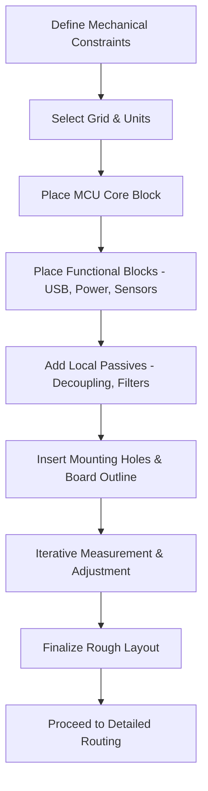

# Rough Layout  

## 1. Overview  

A well‑executed rough layout is the foundation for a smooth routing phase.  
If components are placed haphazardly, routing may require additional layers, excessive via usage, or extensive redesign – all of which increase cost and time.  
The goal of the rough layout is to establish a logical, manufacturable component map that respects mechanical constraints, signal‑flow considerations, and DFM (Design‑for‑Manufacturing) guidelines before any detailed routing begins. [Verified]

## 2. Layout Philosophy & Functional Sectioning  

The board is divided into **functional sections** that are placed relative to one another:

| Section | Core Element | Typical Neighbours |
|--------|--------------|--------------------|
| **MCU Core** | Microcontroller (centerpiece) | Decoupling caps, pull‑up/down resistors, crystal |
| **USB Interface** | USB‑to‑UART bridge (e.g., CH340) | USB‑C connector, ESD protection, filtering |
| **Power Supply** | LDO regulator (3.3 V) | Input filter caps, output caps, load devices |
| **Sensors / Peripherals** | I²C accelerometer, external crystal | MCU I²C pins, optional test points |
| **Programming / Test** | Tag‑Connect header | MCU debug pins, accessible edge |

Each section is first placed as a **block**, then the surrounding passive components (decoupling, filtering, test points) are added. This block‑first approach reduces the number of long, crossing rats‑nests and makes later routing more deterministic. [Verified]

## 3. Grid Strategy & Placement Accuracy  

| Grid Size | Recommended Use |
|-----------|-----------------|
| **0.5 mm – 1 mm** | Initial rough placement of major blocks |
| **0.25 mm** | Final positioning of all components, including small passives |
| **≤0.1 mm** | Not required for typical hobby‑grade designs; reserved for ultra‑fine pitch parts |

* **Why a fixed grid?**  
  * Guarantees repeatable component spacing.  
  * Aligns with pick‑and‑place machine tolerances (typically ±0.1 mm).  
  * Simplifies DRC (Design Rule Check) because clearance rules can be expressed as integer multiples of the grid. [Inference]

* **Keyboard shortcuts** (generic to most ECAD tools):  
  * `N` / `Shift + N` – cycle grid down/up.  
  * `M` – move component (snaps to grid).  
  * `R` – rotate 90 ° CCW.  
  * `Ctrl + Shift + M` – measure distance.  

Adhering to a **minimum 0.25 mm grid** for all components (including decoupling caps) provides a safe margin for most assembly houses while still allowing compact layouts. [Verified]

## 4. Component Placement Workflow  

1. **Place the MCU footprint** at a convenient location (often near the geometric centre).  
2. **Snap the MCU to the grid** and lock its orientation based on the most critical pins (e.g., UART TX/RX, crystal pins).  
3. **Assign peripheral blocks** (USB bridge, LDO, sensor) to the side of the MCU that best matches their pin‑out.  
4. **Move each block** using the rat‑nest visualisation to minimise net length.  
5. **Insert local passives** (decoupling, filter caps) around each block, keeping a small clearance for routing.  
6. **Add mechanical features** (mounting holes, board outline) after the functional blocks are roughly positioned.  

During this process, **avoid placing components directly on top of each other**; maintain a clearance that accommodates solder mask expansion and component footprints. [Inference]

## 5. Pin Assignment Flexibility  

Microcontrollers and FPGAs often provide **multiple pin‑function options** (e.g., UART, SPI, I²C) on the same physical pad.  

* **Best practice:**  
  * Review the schematic netlist and, if a net is congested, re‑assign the function to an alternative pin that yields a shorter, more direct route.  
  * Keep power pins (VDD, VSS) fixed; they cannot be remapped.  

This flexibility can dramatically reduce routing complexity and should be considered **before** committing to a placement. [Inference]

## 6. Cross‑Reference Between Schematic and PCB  

Most modern ECAD suites provide **bidirectional cross‑highlighting**:

* Selecting a component in the schematic instantly jumps to its footprint on the PCB canvas.  
* Selecting a footprint on the PCB highlights the corresponding schematic symbol.  

Keeping both windows open (or using a dual‑monitor setup) eliminates the need to toggle between tabs and speeds up verification of net connections, especially on large, multi‑page schematics. [Verified]

## 7. Board Outline, Mounting Holes, and Mechanical Constraints  

1. **Define mounting‑hole footprints** (e.g., M3) early; they act as reference points for the board envelope.  
2. **Align hole centers** horizontally and vertically to obtain integer‑multiple dimensions (e.g., 20 mm × 45 mm). This simplifies panelization and jig design. [Inference]  
3. **Draw the board outline** to enclose all components, keep‑out zones, and the silk‑screen margin.  
4. **Measure** the provisional board size using the ECAD measurement tool; adjust component placement if the board exceeds the target envelope.  

Mechanical constraints such as enclosure dimensions, mounting‑hole locations, and keep‑out areas must be respected throughout the layout; otherwise, redesign will be required later. [Verified]

## 8. Iterative Refinement & Measurement  

Rough layout is **iterative**:

* After an initial placement, use the **measure tool** (`Ctrl + Shift + M`) to verify critical distances (e.g., between mounting holes, between high‑speed connectors).  
* If a net appears excessively long, shift the associated block a grid step (`arrow keys` after selecting the component) and re‑evaluate.  
* Keep a **backup** of the layout before major moves (undo/redo stack) to revert if a change degrades overall routing.  

The final rough layout should satisfy:

* Reasonable component spacing for routing and test‑point access.  
* Minimal rat‑nest length for high‑speed or critical signals.  
* Compliance with mechanical envelope and mounting‑hole placement.  

Only after these criteria are met should the designer proceed to detailed placement and routing. [Verified]

---

## 9. High‑Level Rough‑Layout Flow  

The flow emphasizes that **mechanical constraints** and **grid selection** precede any component placement, ensuring that the subsequent steps are built on a solid foundation. [Verified]

## 10. Key Takeaways  

* **Section‑first placement** reduces routing complexity.  
* **Fixed grids** (≥ 0.25 mm) guarantee manufacturability and simplify DRC.  
* **Pin‑function flexibility** should be exploited early to improve net routing.  
* **Bidirectional schematic‑PCB linking** accelerates verification.  
* **Mechanical features** (mounting holes, board outline) are integral to the layout, not an afterthought.  
* **Iterative measurement** ensures the board meets size, clearance, and routing goals before detailed routing begins.  

By following these practices, the rough layout becomes a reliable scaffold that enables efficient, error‑free routing and a cost‑effective PCB design. [Verified]