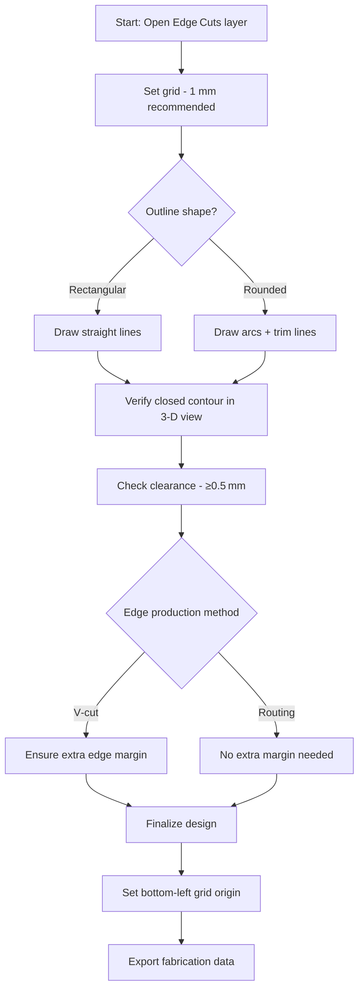

# 07 Board Outline  

## Overview  

The **Edge Cuts** layer defines the physical shape of a PCB. It is the only layer that the fab house uses to generate the board‑outline data for panelization, nesting, and mechanical drawings. A well‑defined outline guarantees that the board fits its intended enclosure, that mounting holes are correctly positioned, and that sufficient clearance is left for copper, silkscreen, and components.  

---

## 1. Defining the Outline on the Edge Cuts Layer  

| Step | Action | Reason |
|------|--------|--------|
| 1 | Switch to the **Edge Cuts** layer. | This layer is interpreted by the manufacturer as the board contour. |
| 2 | Use the **Line** tool (or shortcut *Ctrl + Shift + L*) to draw straight edges. | Straight edges are the simplest way to create a rectangular or orthogonal outline. |
| 3 | Set the grid to a convenient step (e.g., **1 mm**) with *Shift + N*. | A coarse grid speeds up rough outline creation while still keeping dimensions reasonable. |
| 4 | Click to place vertices around the desired perimeter, double‑click to finish, then press **Esc** to exit the command. | The double‑click terminates the polyline, producing a closed shape that the DRC recognises as the board edge. |
| 5 | Verify the outline in the 3‑D viewer (shortcut *Alt + 3*). | The 3‑D view instantly shows whether the outline is closed and free of errors. |

> **Tip:** Even a rough outline is acceptable for a development board, but for production boards you should align the outline to the exact mechanical envelope of the enclosure. [Verified]

---

## 2. Adding Rounded Corners  

Rounded corners are created with the **Arc** tool (*Ctrl + Shift + A*).  

1. Place the cursor at the centre of the desired corner (typically a mounting‑hole centre).  
2. Click once to set the centre, click a second time to define the start radius, then move the cursor to set the sweep angle (commonly **90°**).  
3. Press **Esc** to finish the arc.  
4. Drag the adjoining straight‑edge lines so their end points snap to the arc’s termini.  

Repeat the process for each corner, or copy‑paste a finished corner and rotate it ( *Ctrl + C*, *Ctrl + V*, *R* ) to speed up the workflow.  

> **Design note:** Rounded corners reduce stress concentration at the board edge and are easier to route with a CNC router than sharp 90° V‑cuts. [Inference]

---

## 3. Clearance & Manufacturability  

### 3.1 Minimum Edge Clearance  

- **Component & copper clearance:** ≥ 0.5 mm from any copper, silkscreen, or component pad to the edge.  
- **Mechanical clearance for V‑cut / routing:** Keep a similar margin to avoid chipping or burrs.  

These clearances are a common DFM rule of thumb and were explicitly recommended in the design flow. [Verified]

### 3.2 V‑Cut vs. Routed Edge  

| Method | Advantages | Disadvantages |
|--------|------------|---------------|
| **V‑cut (V‑coring)** | Lower cost, fast panelization, no extra routing passes. | Requires a larger edge clearance; not suitable for tight‑radius corners. |
| **Routing (mechanical milling)** | Allows arbitrary shapes, rounded corners, tighter tolerances. | Higher cost, longer fabrication time. |

When a design uses rounded corners, routing is the preferred method because V‑cuts cannot produce smooth arcs. [Verified]

---

## 4. Grid Origin & Coordinate System  

### 4.1 Bottom‑Left Origin (IPC Recommendation)  

The IPC standard advises placing the **grid origin** at the board’s bottom‑left corner. This yields only **positive X/Y** coordinates for every object, simplifying placement arithmetic and export files (e.g., drill and placement data).  

- Set the origin via **Place → Grid Origin** and snap it to the intersection of the bottom and left board edges.  
- Align the **drill‑file origin** to the same point to keep all manufacturing data consistent.  

### 4.2 Centered Origin for Symmetrical Placement  

For designs that are highly symmetrical (e.g., a board with a central USB connector), it can be convenient to temporarily shift the reference point to the board centre:

1. Determine the centre coordinates (half of board width and height).  
2. Press **Space** to set a *reference point* at the centre.  
3. Subsequent moves display deltas relative to this centre, aiding symmetric component placement.  

Alternatively, you may permanently move the grid origin to the centre if the entire workflow benefits from it.  

> **Best practice:** Keep the **draw‑file origin** (grid origin) at the bottom‑left for final data export, but use temporary reference points for layout symmetry. [Verified]

---

## 5. Practical Workflow Summary  

*The flowchart captures the decision points for creating a board outline, from shape selection to clearance verification and final origin placement.* [Verified]

---

## 6. Recommendations & Best Practices  

1. **Define the outline early** – establishing the Edge Cuts shape before component placement prevents later re‑routing due to size changes.  
2. **Maintain a 0.5 mm edge clearance** for all copper, silkscreen, and components to satisfy most fab houses’ DFM rules.  
3. **Prefer routing for rounded corners**; V‑cuts are limited to straight edges and require larger clearances.  
4. **Adopt the IPC‑recommended bottom‑left origin** for all exported data; use temporary centre references only for layout convenience.  
5. **Use integer grid steps (e.g., 5 mm)** when possible to simplify panelization and nesting, but do not let this dictate the final board size if functional constraints require otherwise. [Inference]  
6. **Validate the outline in the 3‑D viewer** after each edit to catch open polygons or stray lines before running DRC.  

By following these guidelines, the board outline will be mechanically sound, manufacturable, and aligned with industry standards, reducing the risk of costly revisions during fabrication.