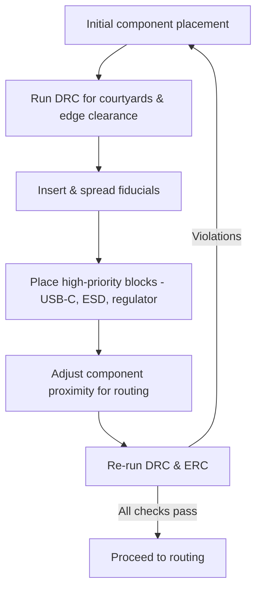

# 08 – Refining the PCB Layout  

In this stage the physical placement of every part is tuned to satisfy **manufacturability**, **assembly**, **electrical performance**, and **mechanical** constraints before any routing begins. The focus is on clearing the board outline, establishing reliable reference features, and positioning high‑priority blocks (USB‑C, ESD protection, power regulation) to simplify later routing and improve signal integrity.

---

## 1. Component Courtyard Management  

- **Rule:** Courtyards (the pink‑ish clearance boxes shown by most ECAD tools) must **not overlap** and must stay a safe distance from the board outline.  
  - This prevents solder‑mask violations, mechanical damage, and board‑edge copper exposure.  [Verified]  
- **Practical tip:** After the initial placement, run a **Design Rule Check (DRC)** for courtyard clearance. Any highlighted violations should be resolved by nudging the offending part or expanding the board edge.  

> **Why it matters:** Overlapping courtyards can cause the assembly house to reject the panel, and edge‑adjacent courtyards can lead to copper delamination during flex or handling.

---

## 2. Fiducial Marker Strategy  

Fiducials are high‑contrast copper pads used by pick‑and‑place machines and Automated Optical Inspection (AOI) systems to locate the board in the camera’s field of view.

| Requirement | Recommended Practice |
|-------------|----------------------|
| **Quantity** | Minimum **three** fiducials.  [Verified] |
| **Distribution** | Place them as far apart as possible—commonly **top‑left**, **bottom‑left**, and **bottom‑right** corners of the board.  [Verified] |
| **Proximity to mounting holes** | Align one fiducial next to a mounting hole to reuse the mechanical reference and keep the layout tidy.  [Verified] |
| **Size & copper exposure** | Use a pad size that satisfies the assembler’s tolerance (typically ≥ 1 mm square with a 0.2 mm clearance ring).  [Speculation] |

> **Best practice:** Verify fiducial visibility in the 3‑D view of the ECAD tool; this catches hidden occlusions caused by tall components.

---

## 3. Edge Clearance & Connector Overhang  

### 3.1 USB‑C Connector Placement  

- **Overhang option:** The USB‑C edge can be **flush** with the board edge, but a small overhang (a few hundred microns) is often left to accommodate the connector’s mechanical shroud and to avoid board‑edge stress.  [Inference]  
- **Routing implication:** Keeping the connector close to the edge reduces the length of high‑speed differential pairs, which is critical for maintaining impedance and minimizing skew.  

### 3.2 General Edge Clearance  

- **Mounting holes:** Keep a **minimum of ~1 mm** from the board edge.  [Verified]  
- **Through‑hole components:** Provide a slightly larger clearance than for surface‑mount devices (SMDs) to accommodate the drill’s tolerance and the mechanical head of the component.  [Inference]  

> **Design rule tip:** Set the ECAD tool’s “keep‑out” rule for the board outline to at least the largest required clearance (typically the through‑hole rule) to automate compliance.

---

## 4. ESD Protection Placement  

- **Proximity to source:** Place ESD protection devices **as close as possible** to the USB‑C connector’s VBUS and CC pins. This shunts transient energy to ground before it can propagate into downstream circuitry.  [Verified]  
- **Ground reference:** Ensure a low‑impedance ground plane under the protection device to provide an effective discharge path.  

> **Signal‑integrity note:** Keeping the protection network short also reduces added parasitic inductance, preserving the high‑speed USB‑C signal integrity.

---

## 5. Power Regulation and Supporting Circuitry  

- **Regulator location:** Position the main power regulator **away from the USB‑C connector** to give room for its external components (inductors, capacitors, feedback network). This also isolates noisy switching activity from the high‑speed USB lines.  [Verified]  
- **Component fan‑out:** Arrange supporting passive components (e.g., filter caps, feedback resistors) around the regulator in a compact “star” layout to minimize loop area and improve transient response.  

> **Thermal consideration:** Provide adequate copper pour or thermal vias beneath the regulator to spread heat, especially for high‑current designs.  [Speculation]

---

## 6. USB Signal Routing Considerations  

- **Length minimization:** Keep the USB differential pair **as short as practicable** and maintain consistent spacing to preserve the target differential impedance (typically 90 Ω).  [Verified]  
- **Component proximity:** Move the USB controller (U2) **closer to the connector** (D1) to reduce trace length and avoid unnecessary bends.  [Verified]  

> **Impedance control:** If the design requires controlled impedance, set the trace width/spacing based on the stack‑up’s dielectric thickness and use the ECAD tool’s impedance calculator.  [Speculation]

---

## 7. Iterative Placement Workflow  

Refining the layout is an **iterative loop**:

1. **Initial placement** based on functional blocks.  
2. **Clearance checks** (courtyards, edge, mounting holes).  
3. **Fiducial insertion** and verification.  
4. **High‑priority block positioning** (USB‑C, ESD, regulator).  
5. **Fine‑tuning** – nudging parts, adjusting pin‑outs, and re‑evaluating routing feasibility.  
6. **Repeat** until DRC passes and the board looks “clean” for routing.  

*The diagram illustrates the feedback nature of layout refinement.*  [Verified]

---

## 8. Consolidated Best‑Practice Checklist  

| Aspect | Guideline |
|--------|-----------|
| **Courtyards** | No overlap; keep clear of board outline. |
| **Fiducials** | ≥ 3, widely spaced, near mounting holes. |
| **Edge clearance** | ≥ 1 mm for mounting holes; larger for through‑holes. |
| **USB‑C** | Minimal overhang; keep differential pair short. |
| **ESD protection** | Place adjacent to connector, with solid ground return. |
| **Regulator** | Isolate from high‑speed I/O; allow space for passive network. |
| **Iterative loop** | Run DRC/ERC after each major move; adjust pin‑outs if needed. |
| **Thermal & mechanical** | Provide copper pours/thermal vias for power devices; respect mechanical stress zones. |

---

### Closing Remarks  

The refinement phase sets the stage for a **clean, manufacturable, and high‑performance** board. By respecting courtyard clearances, strategically placing fiducials, and positioning critical blocks with an eye toward routing simplicity and electrical robustness, the designer dramatically reduces the risk of downstream issues such as assembly errors, signal integrity problems, or mechanical failures. Treat this phase as a disciplined, repeatable process rather than a one‑off activity; each iteration brings the layout closer to an optimal, production‑ready state.   [Verified]