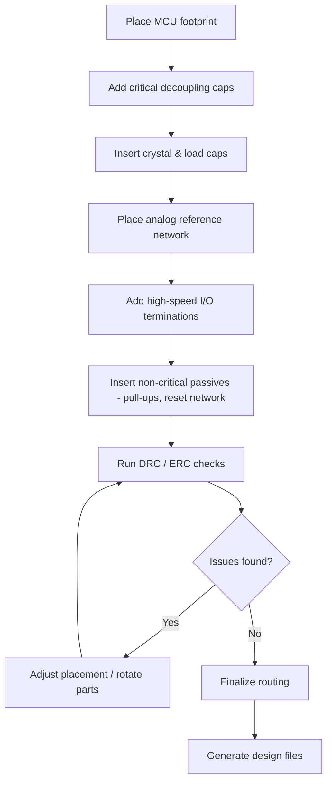

# Layout for MCU Supporting Components  

*This section describes a systematic approach to placing the supporting circuitry of a micro‑controller (MCU) on a PCB. The guidance is derived from proven practice and reflects the decisions, constraints, and trade‑offs encountered when laying out a typical low‑to‑moderate‑speed MCU board.*

## 1. Placement Strategy Based on Criticality  

The most reliable way to obtain a clean layout is to place components in order of **functional criticality**:

1. **MCU package** – the reference point for every other part.  
2. **Power‑rail decoupling capacitors** (VCORE, 1.35 V, 3.3 V, etc.).  
3. **Crystal oscillator and its load capacitors**.  
4. **Analog reference (VRF/VF) network** (reference capacitor, trimming resistors).  
5. **High‑speed I/O terminations** (USB, external sensors).  
6. **Non‑critical passive components** (pull‑up/pull‑down resistors, reset filter caps).  

Placing the most timing‑sensitive parts first guarantees that the shortest possible loop lengths and the most favorable routing windows are preserved for those nets. Less critical parts can be shifted later to accommodate routing or mechanical clearances.  

> **Why this order matters** – The loop area of a decoupling capacitor directly influences the impedance seen by the MCU’s power pins; a larger loop adds inductance, degrading transient response. Similarly, the crystal’s feedback loop must be kept short to maintain frequency stability.  

## 2. Power‑Rail Decoupling and Loop‑Area Minimization  

### 2.1 General Rules  

| Rule | Rationale |
|------|-----------|
| **Place each decoupling capacitor as close as possible to its associated V‑pin and ground pin** | Minimizes the series inductance of the power‑return loop. |
| **Keep the capacitor‑ground pad directly under the V‑pad when possible** | Forms a compact “π‑network” that reduces loop area. |
| **Avoid placing a capacitor so close that its courtyard overlaps the MCU’s keep‑out or the copper clearance required for other nets** | Prevents DRC violations and preserves routing channels. |
| **Orient the capacitor to leave a clear path for adjacent pins** (e.g., rotate a 0805 part to free pins 47‑44) | Facilitates later fan‑out of high‑density I/O. |

### 2.2 Practical Example  

- **VCORE (C12)** – The single VCORE net is routed to a 0603 capacitor placed directly beside the 1.35 V pad. The capacitor is rotated 90° to keep pins 47‑44 free for future signals. The ground via is placed on the opposite side of the capacitor, forming a tight rectangular loop.  

- **3.3 V (C11)** – Because the package is larger (0805) and several pins must be routed past it, the capacitor is positioned a few millimetres away from the MCU edge. This compromise preserves routing space while keeping the loop short enough for the board’s modest current demand.  

> **Design tip** – When a decoupling capacitor blocks a critical pin, consider moving the capacitor **and** rotating the MCU footprint (if the library permits) rather than forcing a long trace around the part.  

## 3. Crystal Oscillator and Load Capacitors  

### 3.1 Placement  

- The crystal should sit **adjacent to the MCU pins** that drive the high‑frequency (HFX) oscillator.  
- Load capacitors (C8, C9) are placed **symmetrically** on either side of the crystal, as close as the package size allows, but with enough clearance to permit a small amount of trimming (e.g., swapping a capacitor for fine‑tuning).  

### 3.2 Isolation  

- Keep the crystal assembly **away from fast‑edge digital traces** (USB D+/D‑, high‑speed SPI, etc.) to reduce jitter caused by capacitive coupling.  
- A modest separation (a few millimetres) is usually sufficient for low‑to‑moderate‑speed MCUs; tighter spacing is only required for high‑precision timing or RF applications.  

> **Inference** – The designer deliberately left a clear corridor between the crystal and the USB connector to avoid interference.  

## 4. Voltage Reference and Analog Supply Network  

The analog reference (VRF/VF) network typically consists of a **reference capacitor (C10)** and a **trimming resistor (R5)**.  

- **C10** is placed centrally between the VF+ and VF‑ pins, aligned with the 1.35 V decoupling capacitor to keep the analog supply loop compact.  
- **R5** (or a 0 Ω “short” when VF‑ is tied directly to ground) is positioned so that its courtyard does not intersect the MCU’s keep‑out area, yet remains close enough to maintain a low‑impedance path.  

These components are **critical for ADC accuracy**; therefore, their placement follows the same “short‑loop, minimal‑parasitic” philosophy used for power decoupling.  

## 5. Reset Network (Pull‑up, Filter Capacitor, and Series Resistor)  

The reset line is comparatively tolerant of longer traces, but good practice still calls for a **compact arrangement** to avoid unnecessary exposure to noise:  

- **Pull‑up resistor (R8)** and **filter capacitor (C14)** are grouped near the MCU’s reset pin and the connector that drives the reset (e.g., a Tag‑Connect debug header).  
- The group is positioned **away from mounting holes** and other mechanical features to preserve clearance for the connector’s “legged” pins.  

If the reset network must cross other high‑speed traces, the designer can **re‑route the reset line underneath the component group** (using the bottom copper layer) to keep the top‑layer routing clean.  

> **Speculation** – The designer may have used the bottom layer as a dedicated ground plane, allowing the reset trace to be routed on the top without compromising signal integrity.  

## 6. Component Orientation, Courtyard Clearance, and Mechanical Constraints  

- **Rotation**: Frequently rotate 0603/0805 parts (R, C) to open up routing channels for adjacent MCU pins.  
- **Courtyard overlap**: Avoid any overlap that would violate the design‑rule‑check (DRC) clearance for the MCU’s keep‑out area.  
- **Mounting‑hole clearance**: Keep passive components at least one pad‑width away from mounting‑hole pads, especially for connectors with protruding pins.  

These considerations are part of **Design‑for‑Manufacturability (DFM)** and help prevent assembly issues such as solder bridging or component shifting during reflow.  

## 7. Layer Strategy and Ground Plane Utilization  

- **Single‑sided component placement**: All active and passive parts are placed on the **top layer**. This simplifies assembly, reduces the risk of component‑to‑component interference, and makes visual inspection easier.  
- **Bottom layer**: Reserved for a **continuous ground plane**. The plane provides a low‑impedance return path for all decoupling loops and improves electromagnetic compatibility (EMC).  

Using a dedicated ground plane also allows the designer to **shorten ground vias** for decoupling capacitors, further reducing loop inductance.  

## 8. Iterative Layout Workflow  

A practical layout proceeds through several passes, each refining placement and routing based on the previous step’s constraints. The flowchart below captures the typical iteration:

*The loop “Adjust placement / rotate parts” is repeated until all DRC/ERC violations are cleared and the routing space is satisfactory.*  

## 9. Key Takeaways & Best‑Practice Summary  

- **Prioritize by criticality**: power decoupling and crystal networks come first; pull‑ups and filters can be placed later.  
- **Minimize loop area** for every decoupling capacitor; keep the V‑pad, capacitor, and ground via as close together as the component size permits.  
- **Maintain clear routing corridors** for high‑density I/O pins by rotating or repositioning nearby passive parts.  
- **Use a single component layer** when possible; allocate the opposite layer to a solid ground plane for optimal return paths and EMC performance.  
- **Iterate**: layout is an iterative process that balances electrical performance, mechanical clearance, and manufacturability.  

By following these guidelines, a clean, reliable MCU sub‑circuit can be achieved with minimal routing congestion and robust electrical performance.