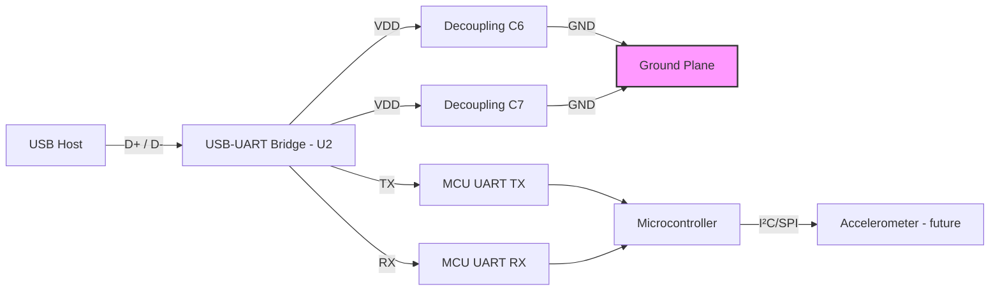

# 10 – Layout for USB‑UART Supporting Components  

## Overview  

The USB‑to‑UART bridge (U2) is the first high‑speed peripheral that must be placed and routed after the power network is defined. Its proper layout directly influences USB enumeration reliability, UART signal integrity, and the ease of routing downstream interfaces such as the MCU and sensors. This section details the placement of the decoupling network, the routing philosophy for power and UART lines, and the design‑intent conventions that keep the schematic‑to‑layout translation unambiguous.

---

## 1. Decoupling Capacitor Placement for the USB‑UART Bridge  

| Capacitor | Target Pin | Recommended Placement | Rationale |
|----------|------------|-----------------------|-----------|
| **C6**   | Pin 7 (VDD) | Adjacent to Pin 7, on the same side of the component | Provides the shortest possible loop for the high‑frequency current demanded by the USB transceiver. |
| **C7**   | Pin 10 (VDD) | Adjacent to Pin 10, mirroring the placement of C6 | Maintains symmetry and ensures both supply pins see low‑impedance bypass. |

*Both capacitors are of the same value and voltage rating; the ordering is dictated by design intent rather than electrical necessity.* [Verified]

### 1.1 Why Proximity Matters  

- **Loop Area Minimization** – The decoupling loop (VDD → capacitor → ground → IC) should be as small as possible to reduce inductance and EMI.  
- **High‑Frequency Bypass** – USB 2.0 full‑speed (12 Mbps) and low‑speed (1.5 Mbps) already demand low‑impedance paths; any added parasitic inductance can cause voltage droop during transient bursts.  
- **Current Return Path** – Placing the capacitor next to the power pin forces the return current to flow directly through the ground plane, limiting radiated emissions. [Verified]

---

## 2. Maintaining Design Intent and Component Order  

The schematic explicitly annotates the intended order of C6 and C7 relative to the USB‑UART pins. Preserving this order in the layout:

- **Reduces ambiguity** for downstream designers and for automated DRC/ERC checks.  
- **Facilitates future revisions** where component values may change but the physical relationship must stay constant.  

Even when the two capacitors are electrically interchangeable, adhering to the schematic‑driven placement demonstrates disciplined engineering practice and eases hand‑off to manufacturing. [Inference]

---

## 3. Routing Strategies for USB Power and UART Signals  

### 3.1 Power Routing  

When space constraints prevent a direct “capacitor‑to‑pin” connection, a **neck‑down trace** can be used:

1. Route the VDD net through the capacitor pad.  
2. Taper the trace (reduce width) as it approaches the IC pin to keep the loop short while providing clearance for adjacent signal traces.  

This approach trades a marginal increase in trace resistance for a significant gain in routing freedom, allowing the UART TX/RX lines to be placed without excessive via hopping or layer changes. [Inference]

### 3.2 UART Signal Routing (UR0_TX, UR0_RX)  

- **Keep traces short and direct** to the MCU pins (typically pins 1 & 2 of the microcontroller).  
- **Avoid crossing the decoupling loop**; if a trace must pass near the capacitor, maintain at least one trace width clearance to preserve the integrity of the power loop.  
- **Prefer same‑layer routing** for low‑speed UART (≤ 115 kbps) to simplify the stackup; higher speeds would demand controlled‑impedance differential routing, but this is unnecessary for the current design. [Verified]

---

## 4. Symmetry, Aesthetics, and Current Loop Minimization  

While visual symmetry does not affect electrical performance, a **balanced layout** offers several practical benefits:

- **Predictable thermal distribution** – Symmetric placement of decoupling caps helps spread heat evenly across the board.  
- **Simplified inspection** – Manufacturing and quality‑control personnel can quickly verify that components are placed as intended.  
- **Reduced design errors** – Aesthetic alignment often coincides with optimal electrical routing, minimizing stray inductance and unintended coupling.  

Thus, positioning C7 in a mirror image of C6, even if it requires a slight compromise in trace length, is a worthwhile trade‑off. [Inference]

---

## 5. Planning for Future Supporting Components  

After the USB‑UART bridge is secured, the next logical block is the **accelerometer** (or any other sensor). Early placement considerations include:

- **Proximity to the MCU** – Short I²C or SPI traces reduce latency and improve signal integrity.  
- **Isolation from high‑frequency USB traces** – Keep noisy USB routing away from sensitive analog sensor lines, possibly by allocating a dedicated “sensor zone” on the board.  
- **Future expandability** – Reserve keep‑out areas for optional components (e.g., external crystal, additional UART ports) to avoid redesigning the entire layout later.  

These foresight steps prevent costly re‑routing and maintain a clean, modular board architecture. [Inference]

---

## 6. General PCB Best Practices Illustrated by This Layout  

| Practice | Application in This Design |
|----------|-----------------------------|
| **Design‑for‑Manufacturability (DFM)** | Component orientation chosen to avoid 90° pads that are difficult for pick‑and‑place machines. |
| **Design‑for‑Assembly (DFA)** | Decoupling caps placed on the same side as the USB‑UART to reduce the need for re‑flow or manual soldering. |
| **Electrical Rule Check (ERC) & Design Rule Check (DRC)** | Enforced clearance between power loops and UART traces to prevent inadvertent shorts. |
| **Current Loop Awareness** | Decoupling caps placed as close as possible to supply pins, minimizing loop area. |
| **Signal Integrity for Low‑Speed UART** | No controlled‑impedance routing required; standard trace width and spacing suffice. |
| **Aesthetic Layout** | Symmetrical placement of C6 and C7 improves visual inspection and board documentation. |

---

## 7. High‑Level Block Diagram  

The following Mermaid diagram captures the relationship between the USB‑UART bridge, its decoupling network, the MCU, and the upcoming sensor block.

*The diagram emphasizes the short, direct connections from the USB‑UART bridge to its decoupling caps and the MCU, while reserving a clear path for future sensor integration.* [Inference]

---

### Key Takeaways  

- **Place decoupling capacitors adjacent to the exact power pins they serve**; preserve the schematic‑driven order to maintain design intent.  
- **When space is limited, use a neck‑down trace** to keep the power loop short while freeing routing channels for UART signals.  
- **Symmetry and aesthetic alignment** are not merely cosmetic—they aid manufacturability, inspection, and often coincide with optimal electrical performance.  
- **Plan ahead for downstream components** (e.g., accelerometer) by allocating dedicated zones and maintaining clear separation from high‑frequency USB routing.  

By following these guidelines, the USB‑UART subsystem will achieve reliable operation, simplify downstream routing, and provide a solid foundation for expanding the board’s functionality.