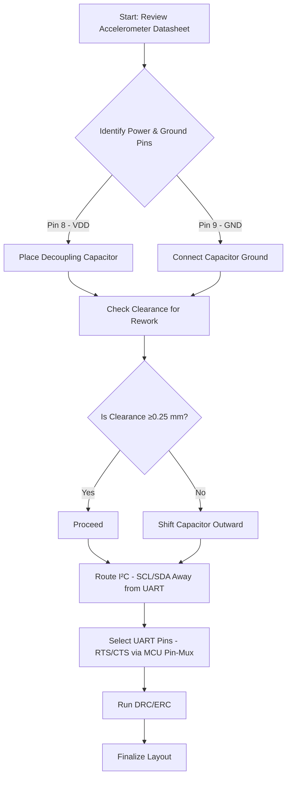

# 11 – Accelerometer Layout Guidelines  

This section documents the PCB‑level considerations for integrating the MEMS accelerometer (U4) into a mixed‑signal board. It covers decoupling strategy, ground‑pin selection, component placement, clearance for rework, aesthetic alignment, and the routing of the I²C and UART control lines. The recommendations are derived from the device datasheet, schematic cross‑reference, and proven layout practice.

---

## 1. Decoupling Strategy  

### 1.1 Critical Decoupling Node  

The accelerometer’s analog‑digital interface is powered from **VDD** on pin 8. This pin supplies the internal analog front‑end and must be decoupled as close as possible to the silicon. A 0 µF (or appropriate value per the datasheet) ceramic capacitor **C13** is therefore placed directly adjacent to pin 8.  

> **Why pin 8?** Pin 4 is the chip‑select line (digital control) and does **not** require a local decoupler. Pin 7 is the **VDDIO** supply that only defines the I/O logic level and also does not need a dedicated decoupling capacitor. The datasheet explicitly calls out pin 8 as the power pin that benefits from a low‑impedance bypass. [Verified]

### 1.2 Placement Rules  

| Rule | Rationale |
|------|-----------|
| **Shortest possible loop** between VDD (pin 8) and C13, and between GND (pin 9) and C13. | Minimises inductance and ensures high‑frequency noise is shunted to ground. [Verified] |
| **Direct stitching** of the capacitor’s two pads to the respective power and ground pins (no intermediate vias). | Reduces parasitic inductance and improves decoupling effectiveness. [Inference] |
| **Symmetrical layout** when possible (e.g., centering C13 under the IC). | Improves mechanical balance and eases visual inspection; has negligible electrical impact when the loop length is unchanged. [Speculation] |

---

## 2. Ground‑Pin Selection  

The accelerometer package exposes multiple ground pads (pins 3, 9‑14). Only **pin 9** is the true power ground that should be tied to the board’s ground plane. Connecting the decoupling capacitor to any other ground pad would create unnecessary current loops and degrade noise performance. [Verified]

**Implementation tip:** Route the ground pad of C13 to pin 9 using a short, wide trace or a copper pour that directly contacts the pad. Avoid routing through other ground pins unless a deliberate ground‑splitting scheme is required (rare for low‑power MEMS). [Inference]

---

## 3. Component Placement & Clearance  

### 3.1 Rework Clearance  

When hot‑air reflow is used for re‑balling or repairing U4, the proximity of C13 can cause the capacitor to lift off unintentionally. To mitigate this risk:

* **Provide at least one grid unit (≈0.25 mm)** of clearance between the capacitor and the IC’s thermal pad or surrounding pins.  
* Position C13 such that a rework tool can access the IC without obstructing the capacitor leads.  

> This modest offset does **not** affect the decoupling performance because the loop area remains essentially unchanged. [Speculation]

### 3.2 Aesthetic Alignment  

Centering C13 with respect to U4 yields a tidy layout that eases visual inspection and automated optical inspection (AOI). While purely cosmetic, a well‑aligned board can reduce the likelihood of placement errors during assembly.  

> The alignment shift is typically a single grid step (0.25 mm) and has no measurable electrical impact. [Speculation]

---

## 4. Signal Routing Considerations  

### 4.1 I²C Bus  

The accelerometer communicates via an I²C interface (SCL, SDA). These lines must be routed **away from high‑speed or noisy traces** (e.g., UART RTS/CTS) to preserve signal integrity. Recommended practices:

* Keep I²C traces **short and parallel** where possible, with a controlled impedance of 50 Ω (optional for low‑speed I²C).  
* Maintain a **minimum spacing** of 3× the trace width from aggressive signal lines to reduce crosstalk. [Inference]  
* Use **pull‑up resistors** (typically 4.7 kΩ to VDDIO) placed close to the accelerometer pins to meet the bus’s rise‑time requirements.  

### 4.2 UART RTS/CTS  

The board also routes UART flow‑control signals (RTS, CTS). These signals may intersect the I²C routing corridor. To avoid congestion:

1. **Prioritize the I²C path** because it is a shared bus and more sensitive to impedance discontinuities.  
2. **Route RTS/CTS on a different layer** or use a staggered via strategy to cross the I²C traces without creating a direct overlap.  
3. **Check pin‑mux options** in the MCU’s pin‑assignment tool (e.g., Code Composer Studio) to select alternative UART pins (e.g., pins 18‑24) that are physically distant from the I²C pins. [Verified]

---

## 5. Design Trade‑offs & Best Practices  

| Trade‑off | Decision | Reasoning |
|-----------|----------|-----------|
| **Component density vs. reworkability** | Slightly increase spacing between U4 and C13. | Improves serviceability without compromising electrical performance. [Speculation] |
| **Aesthetic symmetry vs. electrical optimality** | Align C13 centrally (single‑grid shift). | No measurable impact on decoupling; enhances visual inspection and assembly yield. [Speculation] |
| **Routing simplicity vs. signal integrity** | Separate I²C and UART paths on different layers. | Reduces crosstalk and eases DRC compliance for spacing rules. [Inference] |

### Checklist for Accelerometer Layout  

1. **Identify power (pin 8) and ground (pin 9) pads** from the schematic.  
2. **Place decoupling capacitor (C13) adjacent to pin 8**, with a direct connection to pin 9.  
3. **Provide ≥0.25 mm clearance** between C13 and the IC’s thermal area for rework.  
4. **Center the capacitor** for aesthetic balance (optional).  
5. **Route I²C traces** with minimal length, avoiding high‑speed or noisy nets.  
6. **Assign pull‑up resistors** close to the accelerometer pins.  
7. **Plan UART RTS/CTS routing** on a separate layer or use alternative MCU pins to avoid crossing I²C.  
8. **Run DRC/ERC** to verify spacing, net connectivity, and component‑to‑pad assignments.  

---

## 6. Layout Decision Flow (Mermaid)

*The flowchart captures the sequential decisions required to achieve a reliable, serviceable accelerometer layout.*  

---

### References  

* Accelerometer datasheet – power pin (VDD) on pin 8, ground on pin 9.  
* MCU pin‑mux tool (e.g., Code Composer Studio) – identification of I²C and UART pins.  

---  

*End of Chapter 11 – Accelerometer Layout.*