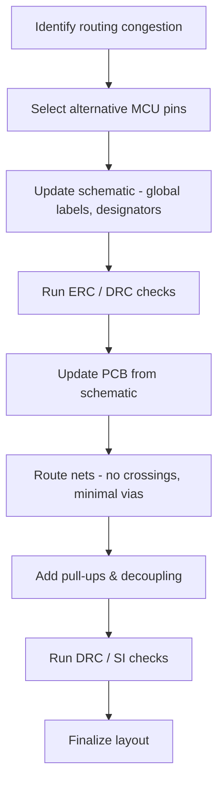

# Remapping MCU Pins  

## Overview  

When a microcontroller (MCU) offers flexible pin‑mapping, the physical layout of the board can be dramatically improved by re‑assigning peripheral functions to pins that are more convenient for routing. In this design the I²C bus (SDA/SCL) and two interrupt lines of an accelerometer were moved to MCU pins that are located on the left side of the device. The result is a cleaner topology with fewer layer transitions, no forced cross‑overs, and a more compact placement of the sensor.

> **Key takeaway:** Treat the schematic as a logical description of connectivity; the physical pin‑out can be altered later to satisfy routing, DFM, and EMI constraints without redesigning the entire circuit. [Verified]

## 1. Pin‑Remap Strategy  

| Function | Original MCU Pin | New MCU Pin | Reason for Change |
|----------|------------------|-------------|-------------------|
| I²C SDA | I²C C1 (unused) | I²C C0 (pin 18) | C0 is on the left side, allowing a straight trace to the accelerometer. |
| I²C SCL | I²C C1 (unused) | I²C C0 (pin 19) | Same rationale as SDA. |
| INT1 (accelerometer) | Pin 6 (right side) | Pin 6 (unchanged) | Only the sensor location moved; interrupt routing stays the same. |
| INT2 (accelerometer) | Pin 5 (right side) | Pin 5 (unchanged) | Same as INT1. |

The MCU acts as the I²C master, so SDA is **bidirectional** while SCL is **output‑only** from the MCU. The interrupt pins are **inputs** to the MCU.  

> **Design implication:** Using a bidirectional global label for SDA clarifies its directionality to both schematic and layout tools. [Verified]

## 2. Schematic Organization  

### 2.1 Global Labels vs. Net Labels  

- **Global labels** (or *global ports*) carry a shape that indicates signal direction (input, output, bidirectional).  
- They also act as *jump points* across schematic pages, ensuring that the net is electrically connected even when the visual representation is split.  

> **Best practice:** Always annotate global labels with a short text note (e.g., “I²C SDA – MCU ↔ Accelerometer”) to avoid confusion during later revisions. [Verified]

### 2.2 Component Placement  

- The accelerometer was moved from the right side of the schematic to the bottom‑left corner, freeing space for other logic and matching the physical board layout.  
- Designators were renumbered to follow a **left‑to‑right, top‑to‑bottom** flow, improving readability and making the bill of materials (BOM) easier to audit.  

> **Benefit:** Consistent annotation reduces the risk of ERC/DRC violations caused by mismatched designators. [Inference]

## 3. Updating the PCB  

1. **Synchronize schematic → layout**  
   - Use the “Update PCB from Schematic” command (or press **F8**) after any schematic change.  
2. **Verify component placement**  
   - The MCU pins 18/19 (SDA/SCL) now appear on the left side of the device, matching the new schematic.  
3. **Reroute critical nets**  
   - I²C traces can be routed directly without any forced cross‑overs or via‑stitching.  
   - Interrupt lines (INT1/INT2) are routed around the decoupling capacitor C14, keeping them short and avoiding unnecessary layer changes.  

> **Result:** All high‑speed or timing‑critical signals now have a single‑layer, monotonic path, which improves signal integrity and reduces manufacturing complexity. [Verified]

## 4. Pull‑Up Resistors and Decoupling  

- **Pull‑up resistors** for the I²C bus were added (R7 and R8) and placed close to the MCU pins to minimize stub length.  
- Decoupling capacitor **C14** remains adjacent to the MCU’s VDD pin, providing local high‑frequency bypass.  

> **Design note:** For I²C at standard speeds (≤ 400 kHz), 4.7 kΩ pull‑ups are typical; higher speeds may require lower values. [Speculation]

## 5. Lessons Learned & Recommendations  

| Aspect | Observation | Recommendation |
|--------|-------------|----------------|
| **Pin flexibility** | Re‑assigning I²C pins eliminated a crossing and reduced via count. | Exploit MCU pin‑mux capabilities early; keep a list of “free” pins for later optimization. |
| **Schematic clarity** | Global labels with direction symbols prevented mis‑routing and made cross‑page jumps explicit. | Use global ports for any net that spans multiple pages, especially for buses and critical signals. |
| **Designator consistency** | Renumbering components to follow a logical flow eased review and BOM generation. | Adopt a naming convention that reflects physical placement (e.g., left‑side components get lower numbers). |
| **Layout updates** | Immediate PCB refresh after schematic changes highlighted routing improvements. | Integrate a “synchronization checkpoint” in the design workflow to catch mismatches early. |
| **Pull‑up placement** | Locating pull‑ups near the MCU reduced trace length and stub effect. | Keep passive components that terminate a bus as close as possible to the driver/receiver pins. |

> **Overall principle:** Treat the schematic as a *living* document; iterative pin‑remapping and schematic re‑organisation are powerful tools to achieve a manufacturable, high‑quality PCB without sacrificing functionality. [Inference]

## 6. High‑Level Flow Diagram  

*The diagram illustrates the iterative process from detecting a routing issue to finalizing a clean layout.*  

## 7. Checklist for Future Pin‑Remap Projects  

- **Verify MCU pin‑mux availability** (datasheet, pin‑function table).  
- **Mark global ports** with direction symbols and descriptive text.  
- **Renumber designators** to preserve logical flow.  
- **Run ERC** after each schematic edit.  
- **Synchronize layout** immediately (F8 / “Update PCB”).  
- **Inspect routing** for unnecessary layer changes or cross‑overs.  
- **Place termination components** (pull‑ups, terminations) close to drivers/receivers.  
- **Perform final DRC/DRC** before sign‑off.  

> **Tip:** Maintain a “pin‑map matrix” in the project documentation to track which MCU pins are currently assigned and which remain free for future changes. [Inference]
