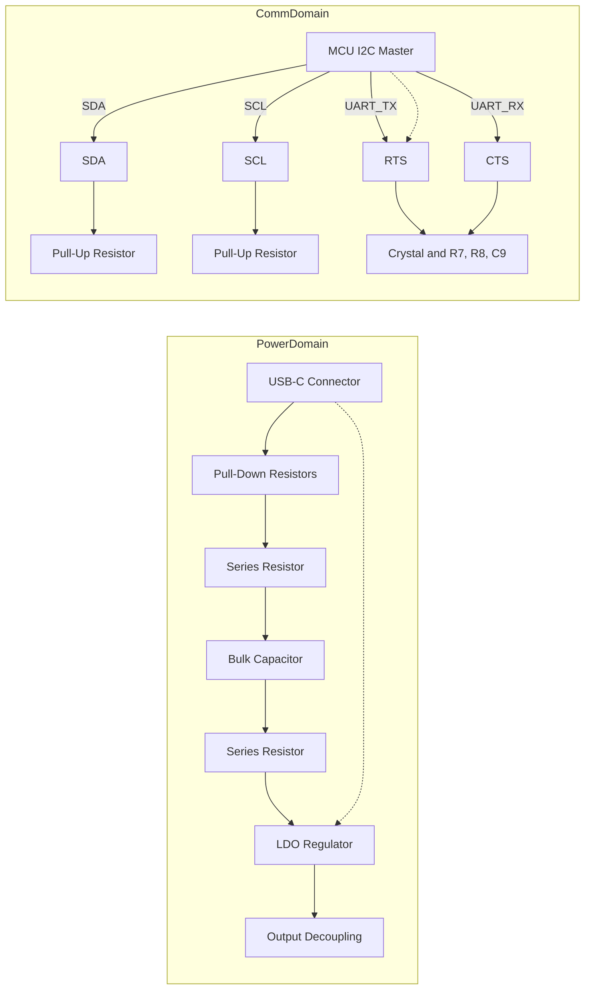

# Layout Considerations for the Accelerometer Sub‑System (Continued)

---

## 1. I²C Bus Pull‑Up Resistors – Proximity & Routing Strategy  

The I²C bus is a relatively slow, open‑drain interface, but good layout hygiene still improves signal integrity and eases debugging.

| Design Decision | Rationale |
|-----------------|-----------|
| **Place pull‑up resistors close to the I²C master (U4) and the nearest I²C slave (C4).** | Short return paths minimise voltage drop and reduce susceptibility to noise.  [Verified] |
| **Two viable routing topologies**:  1. **Route the SDA/SCL lines into U4, then fan‑out to the pull‑ups.**  2. **Place the pull‑ups inline with the SDA/SCL traces before they reach U4.** | Both topologies are electrically equivalent for a standard‑speed I²C bus; the choice is driven by board‑level congestion and component placement. [Inference] |
| **Keep the I²C traces away from high‑speed or high‑current nets.** | Even though the bus is slow, coupling to noisy nets can cause spurious edges. [Speculation] |
| **Maintain a clean, orthogonal routing style.** | Improves DRC compliance and makes ERC checks easier. [Verified] |

> **Best‑practice tip** – When the board edge is close to the I²C cluster, shift the pull‑up network slightly inward to preserve a margin for routing the UART and crystal traces (see Section 2).  

---

## 2. UART (RTS/CTS) Clearance & Crystal Placement  

The UART signals (RTS, CTS) must traverse the area occupied by the crystal and its associated components (R7, R8, C9). If the crystal is positioned too far toward the board edge, the UART traces can become cramped or forced to use acute angles, which degrades signal quality and complicates assembly.

| Issue | Mitigation |
|-------|------------|
| **Crystal placed near the board edge** – limited routing channel for RTS/CTS. | **Shift the crystal leftward (or upward) to create a dedicated corridor** for the UART lines. [Inference] |
| **Potential interference between crystal and UART traces** – proximity can introduce crosstalk. | **Maintain at least one trace width clearance** (or follow the manufacturer’s spacing rules) between the crystal’s differential pair and the UART single‑ended traces. [Speculation] |
| **Aesthetic layout vs. functional routing** – a tidy layout may conflict with the need for clear signal paths. | **Prioritise functional clearance**; aesthetic symmetry is secondary for low‑speed UART. [Verified] |

> **Design guideline** – For any differential pair (e.g., crystal) keep a **minimum of 3× trace width** spacing from unrelated single‑ended signals unless a specific impedance requirement dictates otherwise.  

---

## 3. Power‑Rail Organization – USB‑C Pull‑Downs, Pi‑Filter, and LDO Decoupling  

The power domain surrounding the USB‑C connector and the on‑board LDO (U1) follows a classic hierarchy:

1. **USB‑C Pull‑Down Resistors (R2, R3)** – define the default pull‑up state for the CC pins.  
2. **Pi‑Filter Network** – attenuates high‑frequency noise from the USB power source before the regulator.  
3. **Low‑Dropout Regulator (U1)** – supplies a clean rail to the rest of the board.  
4. **Input/Output Decoupling Capacitors** – placed as close as possible to the LDO pins.

### Layout Recommendations  

* **Start the power chain on one side of the board** (left or right) and progress linearly to the LDO. This reduces the number of long, shared traces and simplifies the ground return path. [Inference]  
* **Place the pull‑down resistors adjacent to the CC pins** to minimise trace length and avoid unintended parasitic inductance. [Verified]  
* **Implement the Pi‑filter (R‑C‑R) before the LDO input**; the series resistor should be positioned close to the USB‑C VBUS pin, followed by the bulk capacitor, then the second resistor leading into the LDO. [Verified]  
* **Decoupling caps** (both high‑frequency ceramic and bulk electrolytic) must be **directly under the LDO pins** with short, wide vias to the ground plane. This provides a low‑impedance return for transient currents. [Verified]  

> **Thermal note** – The LDO may dissipate noticeable power when the USB source is at 5 V and the board draws higher currents. Ensure adequate copper pour under the regulator and consider a thermal via array if the package’s thermal resistance is a concern. [Speculation]  

---

## 4. General Layout Strategies & Trade‑offs  

| Consideration | Typical Trade‑off | Recommended Approach |
|---------------|-------------------|-----------------------|
| **Component density vs. routing clearance** | Packing components tightly saves board area but can force cramped trace routes, especially for mixed‑signal interfaces. | **Maintain a modest clearance envelope** (≥ 2× trace width) around high‑frequency or critical nets (I²C, UART, crystal). [Verified] |
| **Aesthetic symmetry vs. functional routing** | Symmetrical placement looks clean but may increase trace lengths or require vias that degrade signal quality. | **Prioritise functional routing**; use symmetry only when it does not compromise clearance or DFM rules. [Verified] |
| **Layer count vs. cost** | Adding internal planes simplifies power/ground distribution and controlled‑impedance routing but raises fabrication cost. | For a modest‑speed accelerometer interface, a **2‑layer board** with a solid ground pour is sufficient; reserve additional layers only if higher‑speed interfaces (e.g., USB 3.0) are added later. [Speculation] |
| **DFM/DFA compliance** | Small footprints and tight spacing can cause solder‑mask bridging or component placement errors. | **Select standard‑size footprints** (e.g., 0603 for passive components) and provide **silk‑screen reference markers** for critical parts like the crystal and USB‑C connector. [Verified] |

---

## 5. Signal‑Path Overview  

The following block diagram summarises the high‑level interconnections discussed above. It highlights the flow of power from the USB‑C connector through the filtering network into the LDO, and the routing of the I²C and UART signals relative to the crystal and pull‑up networks.

*The diagram reflects the logical grouping of power and communication nets; physical placement follows the guidelines in Sections 1‑3.*  

---

### Closing Remarks  

When finalising the accelerometer board layout, **verify clearance** for the UART traces around the crystal, **keep I²C pull‑ups adjacent** to their master/slave devices, and **organise the power chain** from the USB‑C connector through a Pi‑filter into the LDO with tight decoupling. By adhering to these principles, the design will achieve reliable operation while remaining manufacturable and serviceable.