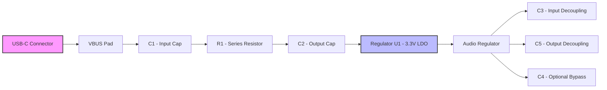

# Power Supply Layout Strategy {#power-layout}

## 1. Design Priorities and Criticality  

When arranging components on a board the **power path** must be treated as the most critical subsystem.  
Resistors that merely define USB‑C CC‑line pull‑downs (R2, R3) are far less sensitive to placement; they could be positioned arbitrarily without jeopardising functionality. Consequently the layout workflow should start with the **VBUS rail, input filtering, and regulator circuitry**, and only then place the ancillary components such as pull‑downs or optional bypass caps. [Verified]

## 2. USB Type‑C Power Entry and Input Filtering  

### 2.1 Connector Pinout Awareness  

A USB‑C receptacle presents two mirrored pin groups (A‑side and B‑side). Each side carries:

- D⁺ / D⁻ (high‑speed data)  
- CC1 / CC2 (configuration channel)  
- VBUS (5 V)  
- GND  

Because the connector can be inserted in either orientation, the layout must be **symmetrical** with respect to the two pin sets to avoid a “wrong‑side” placement that would lengthen critical traces. [Verified]

### 2.2 PI‑Filter Placement (C1‑R1‑C2)  

The input PI filter is the first element that the VBUS sees after the connector. The recommended topology is:

```
VBUS → C1 → R1 → C2 → LDO (U1)
```

Key placement rules:

| Rule | Rationale |
|------|-----------|
| **Proximity to VBUS** – place the filter “closeish” to the VBUS pads, but not directly on top of them. | Minimises loop area while leaving enough copper for reliable soldering and for routing the VBUS trace to downstream components. [Inference] |
| **Avoid excessive crowding** – keep a modest distance from the LDO so that the regulator’s thermal pad and surrounding vias have clearance. | Prevents solder‑mask lift‑off and eases heat‑sinking. [Inference] |
| **Symmetry** – mirror the filter on the opposite side of the connector (C2 on the B‑side) to keep the layout balanced. | Reduces differential skew for any future high‑speed signals that may share the same layer. [Speculation] |
| **Compact alternative** – a tighter arrangement (C1‑R1‑C2 in a single line) can be used when board real‑estate is limited, provided the same electrical distances are maintained. | Saves space without sacrificing performance. [Verified] |

The exact routing order (VBUS → C1 → R1 → C2 vs. VBUS → R1 → C1 → C2) has a **minor impact** on the filter’s response; the chosen order should follow the physical placement that yields the cleanest trace geometry. [Verified]

### 2.3 ESD Protection Integration  

TVS diodes for VBUS and data lines should be placed **adjacent to the connector** and **share the same short VBUS trace** used by the PI filter. This keeps the protective path as short as possible, limiting the energy that can be coupled into downstream circuitry during an ESD event. [Verified]

## 3. LDO Regulator Decoupling  

The regulator (U1) supplies the 3.3 V rail for the audio subsystem. Proper decoupling is essential for stability and noise performance.

### 3.1 Input Capacitor (C3)  

- **Package**: 0805 (or larger) to provide sufficient ESR/ESL.  
- **Orientation**: Pin 1 of the LDO is the power input; the capacitor must be rotated 180 ° so that its positive pad aligns with this pin.  
- **Placement**: Directly adjacent to the input pin, with a short, wide trace to minimise inductance.  
- **Ground Via**: Reserve space for a via beneath the capacitor to connect to the solid ground plane, reducing the loop area. [Verified]

### 3.2 Output Capacitor (C5)  

- **Location**: Placed as close as possible to the regulator’s output pin (pin 5).  
- **Symmetry**: Aligning C5 opposite C3 yields a balanced layout, which helps keep the **output current loop** compact. [Inference]

### 3.3 Optional Bypass (C4)  

- **Purpose**: Further reduces high‑frequency noise on the 3.3 V rail; not always required depending on the LDO’s internal architecture.  
- **Placement**: Near the regulator, but with a modest separation from C3/C5 to avoid crowding. The trace between pin 4 (bypass) and pin 1 (input) should be short yet not so tight that solder‑mask clearance becomes an issue. [Verified]

## 4. CC‑Line Pull‑Down Resistors (R2, R3)  

The CC pins need **10 kΩ pull‑downs** to indicate a default power role to the host. Placement guidelines:

- **Symmetrical positioning** under the USB‑C connector (R2 on the B‑side, R3 on the A‑side) keeps the VBUS routing unobstructed.  
- **Routing under the connector** is acceptable when the connector’s shell is **raised** and does not make direct contact with the solder mask. However, designers should **avoid relying on the solder mask as an insulator**; if the shell is low‑profile, route the pull‑downs on the outer layer instead. [Verified]  
- **Clearance**: Maintain sufficient creepage/clearance from VBUS to satisfy safety standards (typically > 0.5 mm for 5 V systems). [Speculation]

## 5. Routing Considerations for VBUS and ESD  

- **Short VBUS traces** from the connector to the PI filter and then to the LDO minimise voltage drop and EMI.  
- **Keep VBUS away from high‑frequency data traces** to reduce coupling.  
- **Ground plane continuity** under the VBUS and filter area is crucial; avoid splitting the plane with unnecessary cuts.  
- **Via stitching** around the regulator and filter region improves return‑path integrity and reduces impedance. [Inference]

## 6. Mechanical and Assembly Constraints  

### 6.1 Component Side Selection  

All components are placed on the **top side** of the board. This simplifies assembly (single‑sided solder paste application) and inspection, at the cost of a slightly denser routing layer. For a simple board with modest component count this trade‑off is acceptable. [Verified]

### 6.2 Connector Clearance  

When the USB‑C shell is **raised**, routing traces **under** the connector is permissible, but designers should verify the mechanical drawing to ensure no physical interference. If the shell contacts the board, keep all copper clear of the shell footprint and rely on the solder mask only for cosmetic protection, not for electrical isolation. [Verified]

### 6.3 Silkscreen, Fiducials, and Mounting Holes  

- **Silkscreen cleanup** (removing stray text near fiducials or mounting holes) should be performed **late** in the design flow, after the final placement is locked.  
- **Fiducial markers** must be clearly visible and free of copper or solder‑mask artifacts.  
- **Mounting holes** can be placed after component placement to avoid accidental blockage of traces or vias. [Verified]

## 7. Stackup and Layer Planning  

Before routing begins, define a **stackup** that matches the board’s electrical and mechanical requirements:

```
Top Layer (Component side)
Signal / Power
Ground Plane
Signal / Power
Bottom Layer (optional, currently unused)
```

- For a **single‑sided component board**, a **2‑layer stackup** (signal on top, solid ground plane on the bottom) provides excellent return‑path performance and simplifies impedance control for the modest speed signals present.  
- If additional routing density becomes necessary, a **4‑layer stackup** can be introduced later, moving high‑speed or dense signal nets to inner layers while preserving the solid ground reference. [Inference]

## 8. High‑Level Power‑Path Flow  

The following diagram summarises the intended power flow from the USB‑C connector to the downstream analog circuitry:



*The flow emphasises the short, low‑impedance connections between each stage, which is the cornerstone of a stable power distribution network.* [Verified]

## 9. Summary of Best Practices  

| Practice | Reason |
|----------|--------|
| **Place power‑critical components first** (VBUS, PI filter, LDO) | Guarantees optimal trace lengths and loop areas. |
| **Maintain symmetry** for mirrored connector pins and pull‑downs | Simplifies routing and improves EMI performance. |
| **Keep VBUS and ESD paths as short as possible** | Reduces voltage drop and improves protection efficacy. |
| **Reserve ground‑via clearance beneath decoupling caps** | Minimises inductance of the decoupling loop. |
| **Route pull‑downs under the connector only if the shell is raised** | Avoids accidental shorting or reliance on solder‑mask insulation. |
| **Perform silkscreen and fiducial cleanup at the end of the layout** | Prevents unnecessary re‑work when component placement changes. |
| **Select a stackup that matches component density** | Balances cost, manufacturability, and signal integrity. |

Adhering to these guidelines yields a robust, manufacturable power layout that simplifies subsequent routing and ensures reliable operation of the downstream analog and digital circuitry.