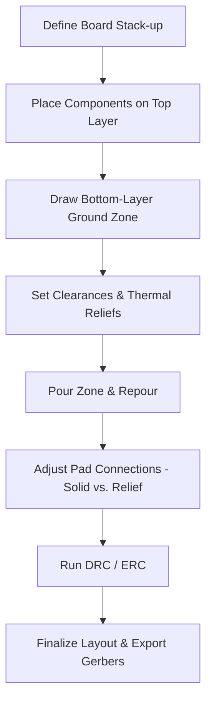

# Layer Assignment & Polygon Pours  

## Overview  

For a simple two‑layer board the most common and cost‑effective stack‑up is:

| Layer | Primary Function | Typical Content |
|------|------------------|-----------------|
| **Top (Layer 1)** | Signal & power routing | All components and their associated copper traces |
| **Bottom (Layer 2)** | Reference plane | A solid ground polygon that fills the entire board area |  

This arrangement provides a low‑impedance ground reference, simplifies routing, and keeps the bill of materials low because only standard through‑hole vias are required.  

> **Key principle:** *Assign the signal‑rich layer to the component side and dedicate the opposite layer to a continuous ground (or power) plane.*  [Verified]

---

## Creating a Bottom‑Layer Ground Polygon in KiCad  

1. **Set the grid** – Increase the grid to a convenient size (e.g., 1 mm) with **Shift + N** or the toolbar.  
2. **Start a zone** – Choose **Draw → Zone (Polygon) ** (`Ctrl + Shift + Z`). KiCad will automatically snap the polygon to the board outline, so you do not need to enable “follow contour.”  
3. **Zone properties**  
   - **Layer:** *Bottom Copper*  
   - **Net:** *GND* (type “G” and select *ground*)  
   - **Zone name:** *Layer 2 Ground* – naming zones aids later identification.  
   - **Fill style:** Solid (default) – hatch fill is optional for visualisation only.  
   - **Clearances** – Use a generic electrical clearance of **0.3 mm** for all objects; increase to **0.4 mm** if the fab house recommends a larger safety margin. This value also drives the *auto‑polygon clearance* used when the zone is repoured. [Verified]  
   - **Minimum copper width:** Set to the board’s minimum trace width (commonly 0.15 mm–0.2 mm for two‑layer boards). [Verified]  
   - **Thermal reliefs** – Default values (e.g., 0.33 mm gap, 0.33 mm spoke width) are suitable for most small pads. Adjust if large copper masses cause soldering delays. [Verified]  
   - **Corner smoothing:** Enable *fillet* for a cleaner outline.  

4. **Draw the outline** – Click the first corner, then trace the board perimeter. Closing the shape automatically creates the zone outline (shaded in the editor).  

5. **Pour the zone** – Press **B** to repour. The polygon will fill the board, respecting the defined clearances.  

6. **Verify pad connections** –  
   - For **mounting‑hole pads** (non‑soldered), the default thermal‑relief connection is unnecessary. Open the pad’s **Properties → Connections** tab, change *Connection to copper zones* from *Parent footprint* (thermal‑relief) to **Solid**.  
   - Repour the zone again (press **B**) to apply the solid connection.  

> **Result:** A continuous ground plane on the bottom layer with solid connections to any pads that must be electrically tied (e.g., mounting‑hole pads used for grounding). [Verified]

---

## Design Considerations & Best Practices  

### 1. Ground Plane Impedance  
A solid copper pour on the opposite layer of the signal side creates a low‑impedance return path, which improves signal integrity and reduces EMI. The plane’s effectiveness scales with copper thickness and continuity. [Inference]

### 2. Clearance Management  
- **Generic clearance (0.3 mm → 0.4 mm)** works for most hobby‑grade manufacturers.  
- For high‑voltage or safety‑critical designs, consult the fab house’s **creepage/clearance** tables and adjust accordingly. [Speculation]

### 3. Thermal Reliefs vs. Solid Pads  
- **Thermal reliefs** reduce heat‑sinking during soldering, preventing component lift‑off on large copper areas.  
- **Solid pads** are preferred for pads that are not soldered (e.g., mounting‑hole pads) or for high‑current connections where low resistance is critical. [Verified]

### 4. DRC / ERC Integration  
Run **Design Rule Check (DRC)** after pouring to ensure the zone respects all clearance, width, and isolation rules. An **Electrical Rule Check (ERC)** will confirm that the ground net is correctly assigned to the polygon. [Verified]

### 5. Via Usage  
Signal traces that need a ground reference should drop a **through‑hole via** to the bottom layer. This creates a short, low‑inductance return path and is sufficient for non‑high‑speed designs. [Inference]

---

## Typical Workflow (Mermaid Diagram)

---

## Summary  

- **Two‑layer strategy:** Top layer for all components and routing; bottom layer for a solid ground plane.  
- **Polygon pour setup:** Define layer, net, clearances, minimum copper width, and thermal‑relief parameters before drawing.  
- **Pad connection tuning:** Switch mounting‑hole pads to solid connections to avoid unnecessary thermal reliefs.  
- **Verification:** Use DRC/ERC to catch clearance violations and ensure the ground net is correctly linked to the polygon.  

Following these guidelines yields a manufacturable, low‑cost board with reliable grounding and straightforward assembly. [Verified]