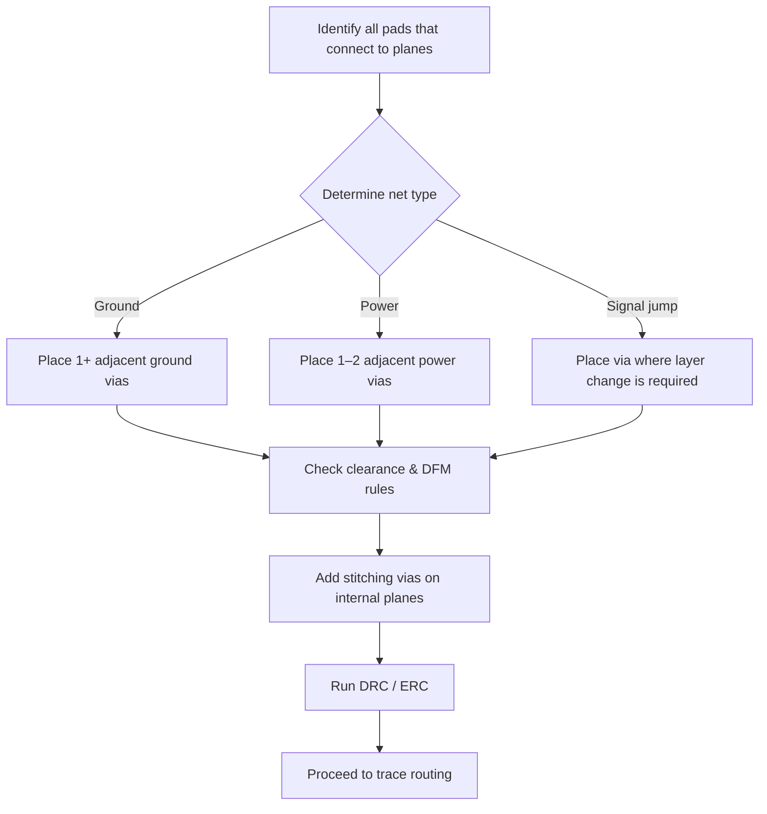

# Via Pre‑Planning & Placement  

Designing a reliable PCB starts long before the first trace is drawn.  
Strategic placement of vias—especially those that connect to reference planes—has a profound impact on signal integrity, power distribution, manufacturability, and later routing freedom. The guidelines below capture a proven workflow and the engineering rationale behind each decision.

---

## 1. Why Pre‑Place Vias?  

* **Routing stability** – Adding vias after routing forces you to reroute tracks, shift components, or even relocate existing vias, which quickly inflates layout time.  
* **Impedance & inductance control** – The distance between a pad and its nearest via determines the loop area of the return path. Shorter loops mean lower inductance and a more stable ground or power reference.  
* **DFM awareness** – Early via placement highlights “no‑go” zones (e.g., keep‑out around fine‑pitch components) and prevents the need for costly additional manufacturing steps such as blind‑ or buried‑via processes.  

> **Rule of thumb:** *For every copper pad that connects to a plane (ground, 3.3 V, etc.), place at least one via adjacent to the pad, not inside the pad.*  [Verified]

---

## 2. Determining Via Count per Pad  

| Pad type | Minimum vias | When to add extras |
|----------|--------------|--------------------|
| **Ground pad** | 1 via adjacent to the pad | • High‑current ground nets   • Critical analog or RF sections where low‑impedance return is essential  • When space permits, parallel vias can halve the effective inductance. |
| **Power pad (e.g., 3.3 V, 5 V)** | 1–2 vias (depending on current) | • High‑current loads (voltage regulators, power ICs)  • Multi‑layer boards where the power plane is on a different layer than the component. |
| **Signal pad that must jump layers** | 1 via placed where the jump is required | • Only when the schematic forces a layer transition; otherwise avoid unnecessary vias. |

> Adding parallel vias “in parallel” reduces the net impedance roughly in proportion to the number of vias, provided the return paths are independent.  [Inference]

---

## 3. Placement Guidelines  

1. **Proximity** – Position the via **as close as possible** to the pad edge (typically 0.1–0.2 mm) while keeping a copper clearance that satisfies the manufacturer’s drill‑to‑pad rule.  
2. **Orientation** – Align the via on the side of the pad that leads to the **shortest loop** to the reference plane. For a ground pin on the bottom side, a via placed directly beneath the pad (but not under the copper) yields the smallest loop area.  
3. **Avoid Sensitive Areas** – Do **not** place vias directly under components that are magnetically or electrically sensitive (e.g., accelerometers, magnetometers). Some datasheets explicitly forbid copper underneath; violating this can degrade sensor performance.  
4. **Grid Settings** – Use a fine placement grid (e.g., 0.25 mm) to achieve the required precision without sacrificing speed. In most CAD tools this is toggled with `N` (grid down) or similar shortcuts.  
5. **Via Size** – Select a standard via size that matches the board house’s default (e.g., 0.7 mm drill with 1.2 mm annular ring). Custom sizes increase cost and may trigger additional DFM checks.  

> **Tip:** When a pad is large (e.g., a power MOSFET drain), consider **multiple** adjacent vias spaced evenly around the pad perimeter to distribute current and reduce thermal stress.  [Inference]

---

## 4. Impact on Routing & Stitching  

* **Routing blockage** – Pre‑placed vias become permanent obstacles. Early placement forces the router to work around them, which can actually *simplify* trace planning by defining natural channel boundaries.  
* **Stitching vias** – After the primary vias are placed, add a grid of **ground stitching vias** (typically 0.5 mm pitch) across the board to tie the ground planes together. This reduces EMI and provides a low‑impedance return path for high‑frequency currents.  
* **Layer transitions** – For four‑layer boards, the internal layers are often dedicated to power and ground planes. The same pre‑placement philosophy applies to the **3.3 V** and **5 V** planes: one via per pad, plus additional stitching as needed.  

---

## 5. Workflow Summary  

The following flowchart captures the recommended pre‑placement process. It can be integrated into any PCB design methodology, from hobbyist projects to high‑volume production boards.

*The diagram reflects a generic, verified workflow; specific board requirements may add extra decision nodes (e.g., high‑frequency shielding).*

---

## 6. Practical Tips & Common Pitfalls  

| Pitfall | Consequence | Mitigation |
|---------|-------------|------------|
| **Via placed inside pad** | Increases pad‑to‑via resistance, may cause solder wicking, and violates many fab house rules. | Keep the via **adjacent**, not inside. |
| **Too many vias under a small component** | Alters magnetic field, can introduce noise into sensors. | Follow component datasheet recommendations; use keep‑outs. |
| **Using non‑standard via sizes** | Raises cost, may require special drill tooling, and can trigger DFM warnings. | Stick to the manufacturer’s default via drill size unless performance demands otherwise. |
| **Neglecting stitching** | Higher EMI, larger loop inductance, especially on high‑speed digital boards. | Add a regular stitching pattern after primary vias are placed. |
| **Late via addition** | Forces track rerouting, component movement, and may lead to design rule violations. | Perform via pre‑placement **before** any trace routing. |

---

## 7. Advanced Considerations  

* **Microvias & High‑Density Interconnect (HDI)** – For very high‑speed or high‑frequency designs, microvias (≤0.15 mm) can be used to further shrink loop area, but they require an HDI stackup and increase cost. Use only when the performance gain justifies the expense.  [Speculation]  
* **Thermal Vias** – When dissipating significant power, embed an array of vias beneath the component to spread heat into internal planes. This is a separate design decision from electrical via placement.  [Inference]  
* **Via‑in‑Pad (VIP)** – Some designs deliberately place a via inside a pad (e.g., for BGA thermal relief). This demands a **via‑in‑pad** process (filled/plugged vias) and is **not** recommended for standard boards unless the fab house offers it as a standard option.  [Verified]

---

## 8. Checklist Before Routing  

1. **All ground and power pads have at least one adjacent via.**  
2. **Sensitive components have a clear keep‑out zone for vias.**  
3. **Via drill size matches the fab house’s default (or approved custom).**  
4. **Stitching via grid defined for internal planes.**  
5. **Design Rule Check (DRC) passes for clearance, annular ring, and drill‑to‑pad tolerances.**  

Completing this checklist ensures that the subsequent routing phase proceeds smoothly, with minimal need for layout revisions.

---

*Prepared by the PCB Design & Manufacturing Team – version 1.0 (2025).*
