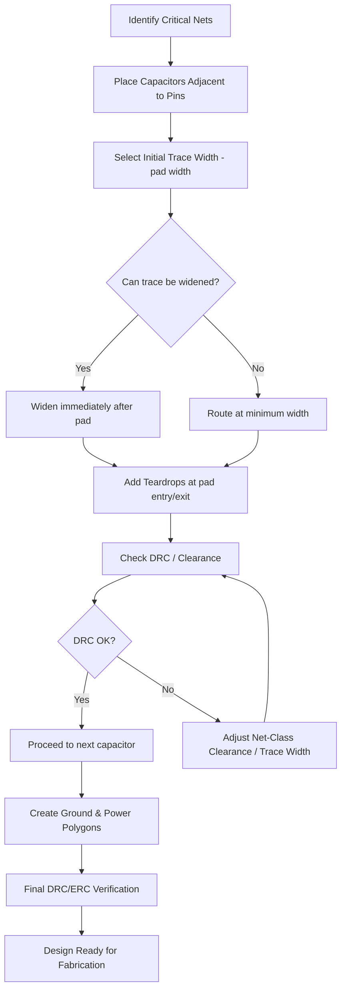

# Routing Decoupling & Bypass Capacitors  

*This section describes a systematic approach to routing power‑decoupling and bypass capacitors, focusing on low‑impedance connections, trace‑width management, clearance compliance, and practical KiCad workflow tips.*  

 

## 1. Overview  

Decoupling and bypass capacitors are the first line of defense against supply‑rail noise and transient current spikes. Their effectiveness is governed primarily by **the physical length and impedance of the connection** between the device pin and the capacitor. A disciplined routing strategy—starting with the most critical nets and progressively handling less critical connections—helps guarantee that every capacitor provides the intended performance without compromising manufacturability.  

 

## 2. Routing Order of Criticality  

| **Priority** | **Typical Nets** | **Rationale** |
|--------------|------------------|---------------|
| 1️⃣ | High‑frequency decoupling (MCU VDD/VSS, crystal pins) | Shortest possible loop area → minimal inductance. |
| 2️⃣ | High‑speed interface supplies (USB 5 V, HDMI, etc.) | Preserve signal integrity and reduce EMI. |
| 3️⃣ | Medium‑speed peripherals (sensor rails, regulator outputs) | Still benefit from low‑impedance paths but tolerate slightly longer traces. |
| 4️⃣ | Global power‑plane pours and ground fills | Completed after all point‑to‑point connections to avoid accidental shorts. |

> **Best practice:** Complete the point‑to‑point routing for the highest‑priority decoupling caps **before** placing polygon pours or large power‑plane fills. This prevents the pours from “stealing” clearance or creating unintended connections.  [Verified]  

 

## 3. Decoupling/Bypass Capacitor Placement  

1. **Proximity to the device pin** – Place the capacitor as close as possible to the power pin it serves. Ideally the capacitor’s pads should be within a few mils of the pin pad.  
2. **Orientation** – Align the capacitor so that the shortest trace can be routed directly from the pin to the capacitor’s **inner** pad (the pad nearest the pin). This reduces the loop area.  
3. **Symmetry** – For differential or dual‑rail supplies (e.g., USB D+ / D‑), mirror the placement of the associated decoupling caps to keep the return paths balanced.  

 

## 4. Trace‑Width Selection & Widening Strategy  

### 4.1. Why Wider Traces Matter  

A wider copper trace reduces both **DC resistance** and **high‑frequency inductance**. For decoupling paths, the goal is to keep the **impedance** as low as possible over the frequency range of interest (typically up to several hundred MHz for MCU digital supplies).  

### 4.2. Practical Width‑Ramp Technique  

1. **Start narrow** – Begin the trace at the exact width of the device pad (often 0.3 mm in 0402/0603 footprints).  
2. **Widen immediately** – As soon as the trace leaves the pad, increase the width to the next available predefined size (e.g., 0.5 mm or 0.6 mm).  
3. **Maintain width** – Keep the widened trace straight to the capacitor pad, then taper back down if the capacitor pad is narrower.  

> **Note:** If the CAD tool automatically forces the entire segment to adopt the new width when snapping to a pad, manually copy‑rotate the segment and adjust the width locally, as described in the workflow below.  [Inference]  

### 4.3. KiCad Work‑around for Width Snapping  

* When a trace is routed **into** a pad, KiCad may propagate the current width to the whole segment.  
* To avoid this, route a short stub at the original width, **stop before the pad**, press **W** to change the width, then continue the trace to the pad.  
* Alternatively, draw the widened segment first, then **copy‑rotate** a short piece of the original width and splice it at the pad entry point.  

 

## 5. Pad Entry, Teardrops, and Stitching  

* **Teardrops** (or “tapered pads”) smooth the transition between a narrow trace and a larger pad, reducing stress concentrations and mitigating the “neck‑in” effect that can increase inductance.  
* Apply teardrops automatically (or manually) on every pad‑entry point for decoupling nets.  
* When routing near a **ground polygon**, leave a small clearance (typically 0.15 mm) to allow the polygon to “stitch” to the pad without creating a short.  

 

## 6. Handling Tight‑Pitch Areas & Clearance Rules  

### 6.1. Clearance Mismatch  

In dense sections (e.g., IMU footprints with pins spaced <0.5 mm), the default **net‑class clearance** may be tighter than the board‑level DRC settings, causing routing violations.  

**Resolution steps:**  

1. Open **Board Setup → Design Rules → Net Classes**.  
2. Adjust the **Clearance** value for the affected net class to match the global clearance (e.g., set to 0.152 mm).  
3. Verify that the updated clearance satisfies both the **manufacturing** constraints and the **electrical** spacing requirements.  

> This alignment eliminates false DRC errors and permits routing of very narrow traces (e.g., 0.15 mm) required for cramped pads.  [Verified]  

### 6.2. Minimum Trace Width  

When the required clearance forces a trace to be narrower than the default rule, add custom trace‑width entries (e.g., 0.15 mm, 0.25 mm) to the **Pre‑defined Sizes** list. This enables quick selection without repeatedly typing values.  

 

## 7. Ground & Power Plane Integration  

* After all point‑to‑point decoupling routes are complete, generate **polygon pours** (or copper fills) for the ground and power planes.  
* Ensure the polygons have **thermal relief** on the decoupling capacitor pads to aid solderability while maintaining a solid electrical connection.  
* Verify that the polygons can **stitch** to all relevant pins (e.g., MCU VSS pins 2 and 7) by leaving a small clearance gap that the pour can bridge.  

 

## 8. KiCad‑Specific Tips & Common Pitfalls  

| **Issue** | **Cause** | **Work‑around** |
|-----------|-----------|-----------------|
| Trace width changes propagate to the whole segment when snapping to a pad. | KiCad’s “track width inheritance” on pad entry. | Route a short stub, change width **before** the pad, then continue; or copy‑rotate a segment of the original width. |
| DRC error “routing start point violates DRC” on tight pads. | Net‑class clearance smaller than board‑level clearance. | Align net‑class clearance with board constraints (Board Setup → Net Classes). |
| Unable to route a trace because the default width exceeds the allowed clearance. | Default trace width too large for the local spacing. | Add smaller predefined widths (e.g., 0.15 mm) and select them before routing. |
| Polygon pour blocks a required connection between two pins. | Insufficient clearance for the pour to stitch. | Reduce polygon clearance locally or add a **via stitch** to bridge the gap. |  

 

## 9. Flowchart – Decoupling Routing Process  

 

## 10. Summary of Best Practices  

1. **Route by criticality** – start with high‑frequency decoupling, then move to lower‑speed supplies.  
2. **Keep connections short and wide** – start at pad width, then widen as soon as possible.  
3. **Use teardrops** on every pad entry to reduce inductance and improve manufacturability.  
4. **Align clearance rules** between net classes and global DRC to avoid false errors in dense areas.  
5. **Add custom trace‑width presets** for tight‑pitch components.  
6. **Complete all point‑to‑point decoupling routes before pouring planes** to guarantee proper stitching.  
7. **Validate with DRC/ERC** after each major step; adjust net‑class parameters as needed.  

Following this disciplined approach yields a robust power distribution network, minimizes EMI, and streamlines the hand‑off to fabrication—all essential for reliable, high‑performance PCB designs.   [Verified]